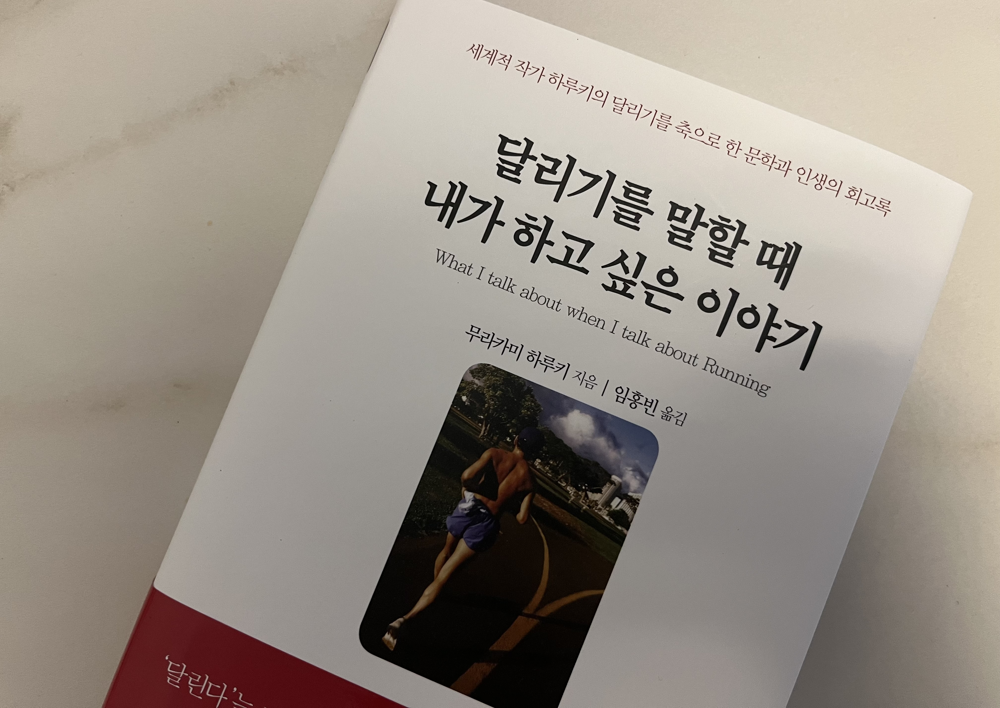

첫 장에서 잠깐 넘어가지 않고 머물렀다.

> 강물을 생각하려 한다. 구름을 생각하려 한다.
> 나는 소박하고 아담한 공백 속을, 정겨운 침묵 속을 그저 계속 달려가고 있다.
> 그 누가 뭐라고 해도, 그것은 여간 멋진 일이 아니다.

첫 장, 하와이에서의 일을 적을 때가 달리기를 시작한지 두 달 반이 된다고 했는데, 딱 그 문장을 읽은 시점이 내가 달리기를 시작한지 두 달 반이 된 시점이었다. 괜히 의미 부여를 하게 되더라.

달리기를 본인이 설정한 기준과 하는 경쟁이라고 설명하면서 이를 일에도 적용할 수 있다는 부분이 참 마음에 와 닿았다. 남에게 인정 받기 위해 일하는 순간 불행해진다.

오히려 가게 경영이 걱정하던 하루키 작가의 지난 이야기를 들으면서 인생 정말 어떻게 될지 모르는구나 하는 생각과 함께 절로 겸손해졌다.

### Pain is inevitable, Suffering is optional
고통은 실존하나 그것을 받아들이는 것은 본인의 몫이다. 한국어로는 고통, 고통을 겪다. 이 고통이란 단오 말고는 다른 표현이 없으니 고통을 받아들일 수 밖에 없는게 아닐까. 힘들다는 사실과 그 고통을 받아들이는 과정을 분리할 수 있는 것인가 생각하게 만드는 문장이었다.

## 문장들
- 더 쓸 만하다고 생각될 때 과감하게 펜을 놓는다. 그렇게 하면 다음 날 집필을 시작할 때 편해진다.
- 그리고 나는 여러 가지 흔해 빠진 일들이 쌓여서 지금 여기에 있다.
- 현재로선 아직 나는 음악과 컴퓨터를 혼동하고 싶지 않다. 우정이나 일과 섹스를 혼동하지 않는 것처럼.
- 나는 원칙적으로는 공백 속을 달리고 있다. 거꾸로 말해 공백을 획득하기 위해서 달리고 있다. 라고 하는 것이 맞을지도 모른다.
- 인간의 정신은 진공을 포용할 만큼 강하지 않고, 또 한결같지도 않다.
- 하나의 풍경 속에 타인과 다른 모습을 파악하고, 타인과 다른 것을 느끼며, 타인과 다른 말을 선택할 수 있는 가능성을 지님으로써, 나만의 이야기를 써나갈 수 있는 것이다.
- 그때 하늘에서 뭔가가 조용히 춤추듯 내려왔는데, 나는 그것을 확실하게 받아들였던 것이다.
- 자신이 흥미를 지닌 분야의 일을 자신에게 맞는 페이스로, 자신이 좋아하는 방법으로 추구해가면 지식이나 기술을 지극히 효율적으로 몸에 익힐 수 있다는 것을 깨달았다.
- 해가 뜰 때 일어나고, 어두워지면 되도록 빨리 자도록 하는 것. 진지하게 살아가는 인간의 생활 방식이었다.
- 모든 사람들의 얼굴에 웃음을 짓게 할 수는 없다. #리더십 
- 열 명 중에 한 명이 단골이 되어 준다면 경영은 이루어진다. 아홉명은 그다지 신경쓰지 않아도 되는 것이다. 그러나 그 한 사람에게는 철저하게 마음에 들게 만들 필요가 있다.
- 거의 노력을 하지 않아도 살이 찌지 않는 체질의 사람은 운동과 식사에 유의할 필요가 있다.
- 마찬가지로 사람은 누군가 권한다고 해서 러너가 되지는 않는다. 사람은 기본적으로 그렇게 될 만해서 러너가 되는 것이다.
- 학교에서 우리가 배우는 가장 중요한 것은 '가장 중요한 것은 학교에서는 배울 수 없다'는 진리다. #교육
- 어떤 종류의 프로세스는 아무리 애를 써도 변경하는 것을 받아들이지 않는다.
- 뭔가 있다는 사실만으로도 고맙다는 생각이 든다. 그와 같은 생각을 하게 되는 것은 나이를 먹어가며 얻게 되는 몇 안 되는 장점 중 하나이다.
- 그곳이 나에게 있어서 지브롤터 해협인 것이다. (지중해와 대서양을 잇는 해협. 15세기 콜럼버스가 이 해협을 지나 대서양 항해에 나서, 아메리카 신대륙을 발견했던 것이다.)
- 더이상 아무도 테이블을 두드리지 않고, 아무도 컵을 던지지 않았다.
