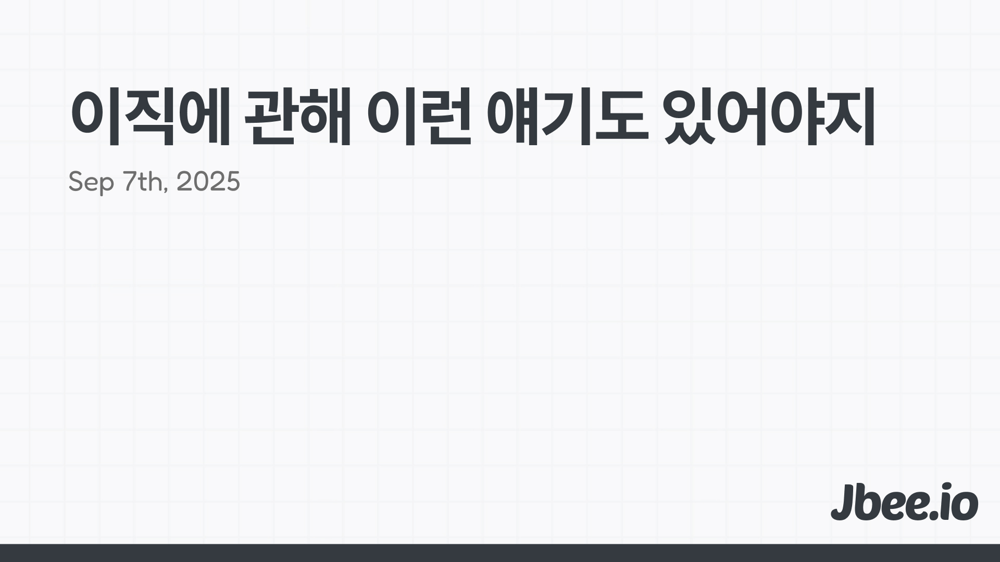

보통 다음과 같은 단계로 이직을 준비하고 있다면 이 글이 도움될 것이다. 
1. 이력서를 쓴다.
2. 지원할 회사를 찾는다.
3. 서류에 통과한다.
4. 인터뷰 준비를 한다.
5. 최종 합격 후 처우를 맞춰본다.

우선 이 순서는 일반적이지만 어떤 면에서 비효율적이며 타율이 높지 않다고 생각한다. 특히 어느 정도 경력이 있는 개발자라면 이렇게 접근하기 보단 좀 더 이직에 대한 관점을 먼저 공유하고 이직을 준비하는 순서와 이직 과정 중에 깨달는 러닝들을 정리해봤다.

## 이직
이직에는 상당히 많은 비용이 들어간다. 인터뷰 준비를 위해 퇴근 후 개인 시간을 꽤 투자해야 하고 채용 프로세스가 진행되는 동안엔 본업에 충실하면서 동시에 여러 검증 과정을 거쳐야 한다.

아무리 경험이 많은 사람에게도 이직하는 과정은 부담스러울 수 밖에 없다. 모든 프로세스가 기대한대로 착착 진행되어도 쉽지 않은 과정인데 이직하는 시점에 재직 중인 회사도 없다면 정말 피말리는 기간이다.

### 이직 이유를 명확히 하기
이직한 이유는 평생 따라 다닌다. 이직을 해야겠다면 납득 가능한 이유가 있어야 한다. 본인에게 불리한 이유면 분명 나중에 발목을 잡힌다. 이직한 이유가 그 팀이 아니었어야 하는 것을 충분히 대변할 수 있어야 한다. 스톡옵션 행사가 끝났어요. 상사로부터 받는 스트레스가 심해요. 이런 책임없는 이유라던가 회피형 이유는 누가봐도 좋지 않은 이직 사유다. 이직 사유가 기존에 있던 팀이 아니라 ==옮기려고== 하는 팀에 있어야 한다.

실제 이유도 이유지만 ==스토리==도 중요하다. 같은 사건이라도 다르게 해석될 수 있듯이 자신만의 명분을 만들어야 한다. 무게 중심을 이동할 팀에 두고 본인만의 이야기를 구성하는 것이 중요하다.

### 박수칠 때 떠나라
개인적인 생각으론 일단 이직을 안 하는게 가장 좋다고 생각한다. 그런데 이 팀에서는 이룰 수 없는 새로운 성취가 필요하다는 전제에서 '박수칠 때 떠나라'는 것이다. 좀 더 정확히는 박수 갈채가 끝나기 전이다.

이직은 어느 팀에 목 메는 순간 쉽지 않게 된다. 아쉬울게 없을수록 이직하기 좋은 시기이다. 물론 팀에서도 신뢰를 받고 있을 테고 이를 기반으로 성과를 만들기 좋은 시기일 수 있다. 그렇기 때문에 결정이 어려울 수 밖에 없다. 그 이상의 무언가를 추구하기 위해 이직을 할 때 행복 이직을 할 수 있다.

다시 한번 얘기하지만 창업이나, 개인 사업을 할 것이 아닌 이상 좀 더 심사숙고 해볼 필요가 있다. 하는 일은 거의 비슷할 것이다.

### 기다림
이직하는 과정은 사람을 지치게 만든다. 기다림의 연속이다. 그때마다 기다릴 수 있는 명분이 필요하다. 잘 기다리는 것이 중요하다. 그래서 바쁠 때 이직하는 것이 좋다. 다들 반대로 하곤 한다. 시간적 여유가 넉넉할 때 그리고 그 시간에 준비할 시간이 많을 때 이직을 하는 게 좋지 않나 생각할 수 있다.

경험들은 틈틈히 정리해두고 인터뷰 때는 ==평소에== 내가 하고 있던 생각과 정리된 경험을 말하는 것이다. 인터뷰 직전에 부랴 부랴 준비한 것으로는 본인을 제대로 드러내기 어렵다.

이직은 한번에 끝나지 않는다. 여러 회사와 전형을 진행할테고 그 전형은 하루에 끝나지 않는다. 또 기다림의 연속이다. 인터뷰를 보고 결과를 기다리고 메일함을 확인하고, 아무리 자신있는 사람이라도 인터뷰를 잘 보고 왔더라도 스트레스 받기 좋은 시기이다.

다른 곳에 집중할 수 있으면 도움이 된다. 일이 바쁠 때는 바쁜 틈에 인터뷰를 보고 와서 다시 일에 집중할 수 있다. 오히려 이것이 정신 건강에 도움이 되며 '그 회사 아니어도 괜찮아'라는 ==쿨한== 자세를 유지할 수 있다.

## 이직 하기
스스로 이유를 명확히 세웠다면 행동으로 옮길 차례다. 이력서를 써야할까? 나에 대해 고민하는 시간으로써 사용한다면 좋겠지만 무작정 쓰기 시작하는 이력서 작성은 말리고 싶다.

### 0. 나에 대해 이해하기
역설적이게도 나에 대해 잘 아는 방법은 사람들을 만나보는 것이다. 혼자서 고민하기 보다는 업계의 많은 사람들을 만나보고 이야기 나눠보면서 본인에 대한 해상도를 높일 수 있다.

또 다른 방법으로는 그동안 내가 거쳐온 경험들을 마인드 맵을 그려보는 것이다. 펼쳐 놓고 보면 전혀 상관없어 보이던 경험들이 선으로 연결되면서 이야기가 만들어 질 수 있다.

### 1. 지원 전, 전략적으로 접근하기
그냥 지원하는 패기는 좋지만 말리고 싶다. 지원하려고 하는 회사의 재직자를 찾아 ==커피챗== 요청하는 것을 추천한다. 링크드인을 통해 쉽게 찾을 수 있다. 다만 메세지를 보내고 실제로 만나기까지는 ==용기==가 꽤 필요한 일이다. 그러나 밑져야 본전이라고 생각하고 그렇게 어렵지도 않은 일이라 꼭 하기를 권장한다. 몇번 해보면 아무것도 아니라는 것을 알게 된다.

개인적인 경험으로는 커피챗을 거절 당한 적도 없고 나 또한 거절한 적도 거의 없다. 정말 시간이 안 된다면 리쿠르터 분께서 대신 시간을 내어 진행해주시기도 한다.

인사권을 가진 사람과 이야기 하는 것이 가장 좋고 약속을 잡기 어렵다면 실무자에게 연락해보는 것도 좋다. 사실상 레퍼럴이 큰 의미는 없지만 있으면 없는 것보단 낫다. 그렇다고 레퍼럴에 목 멜 필요는 없다. 같이 일한 적 없으면 큰 의미는 없다.

커피챗을 요청하거나 레퍼럴을 요청하는 것은 그 자체가 갖는 의미보다 이 회사에 대한 관심을 보이는 것이며 적극적인 자세를 어필할 수 있다는 것이다.

만약 실무자와 이야기를 나눈다면 최대한 많은 정보를 얻어 내야 한다. 어떻게 제품을 개발하는지, 어떤 개발 문화인지, 인터뷰는 어떻게 진행되는지 등은 기본이다. 가장 중요하고 꼭 해야 하는 질문은 '지금 팀에서 어떤 문제가 가장 중요한 문제인지', '그것을 해결하기 위해 어떤 시도들을 하고 있는지'다. 이것으로 그 팀의 상황을 어느 정도 엿볼 수 있다. 그리고 이것과 내가 가진 경험, 장점을 연결지어 스토리를 만들 수 있다.

커피챗을 통해 얻어낸 정보로 내 지원 계기, 내가 가진 강점을 결합해서 내 스토리를 만드는 것이다.

### 2. 면접 기반의 이력서
앞서 이야기를 나눈 회사에 지원하기로 결정했으면 대부분 이력서를 작성한다. 하지만 이력서는 낚시에 사용할 미끼일 뿐이다. 면접 준비가 우선이다. 이력서 작성하고 면접 준비하는게 아니다. 면접을 준비하고 이 질문들을 하게 끔 이력서를 작성하는 것이다.

#### PARIS Framework
우선 내가 '잘한' 경험들을 정리해야 한다. 여기에서 '잘했다'라는 뜻은 Impact가 있어야 한다는 뜻이다. 경험들을 이야기로 정리할 때 유용한 프레임워크를 만들었는데, 앞글자를 따서 ==PARIS==라고 이름을 지었고 다섯 개의 구분으로 경험을 정리할 수 있다.
- Problem (문제 상황)
	- 조직 또는 제품이 마주한 문제
- Action (행동)
	- 문제를 정의하고 접근했던 방법들
- Result (결과)
	- 행동이 만들어낸 결과 또는 결과물
- Impact (만들어낸 영향)
	- 만들어진 결과 또는 결과물이 제품, 조직에 어떤 영향을 미쳤으며 문제 상황을 어떻게 바꾸었는가
- Self-reflection (회고)
	- 의사결정 과정에서 좀 더 잘할 수 있었던 부분은 없는지

이 PARIS 프레임워크에 맞춰서 정리 후 이것들을 인터뷰에서 이야기 할 수 있도록 이력서에 정리하는 것이 순서이다. 이 프레임워크에서 하나의 톱니바퀴라도 빠진 부분이 있다면 면접에서 유효타를 만들기는 어렵다. 자신이 했던 모든 경험을 이력서에 담을 필요가 없다. 덜어내는 것도 중요하다.

개인적으로 이력서는 Google Docs로 작성하고 파일로 제출이 필요할 때 PDF Export 하는 것이 가장 편하다고 생각한다. 이력서 링크에 Google docs 링크를 걸어두면 수정할 때마다 최신화가 자연스럽게 되니 편리하다.

### 3. 인터뷰
가장 중요한 것은 인터뷰 또한 결국 ==대화==라는 것을 인지하는 것이다. 코딩만 잘하는 사람과 일하고 싶은 사람은 없을 것이다. 인터뷰 과정은 결국 함께 일하고 싶은 사람을 뽑는 것이기에 말이 잘 통해야 한다. 인터뷰 과정에서 신경쓰면 좋을 3가지를 소개한다.

첫번째는 질문에 대한 답변을 모르겠으면 깔끔하게 모른다고 답하는 것다. 거짓말을 하거나 비슷한 주제의 다른 얘기를 하면 엉뚱한 소리로 들린다. 모르는 것에 대해선 모를 수도 있지 넘어갈 수 있지만 부정확한 커뮤니케이션은 치명적이다.

두번째는 질문을 정확히 이해하는 것이다. 물어본 것에 대해 답변을 하는 것이 중요하다. 당연한 얘기라고 생각하지만 대부분 자신의 지식을 자랑하기 위해 그 외의 것들도 함께 답변하곤 한다. 자연스럽게 답변이 장황해지는데 커뮤니케이션이 어려워진다. 인터뷰는 대화의 과정이지 일방적인 지식 자랑 시간이 아니다. 인터뷰어가 궁금해 하는 내용을 깔끔하게 답변하는 것이 좋다. 쓸데없는 것을 이야기해서 본인 어필 시간을 스스로 낭비하면 안 된다.

세번째는 질문을 이해하지 못했다면 자신이 이해한 내용이 맞는지 확인하고 나서 답변하는 것이 좋다. 질문에 대한 질문을 어려워 하는데, 오히려 잘못된 답변을 하는 것이 더 낭비다.

## 마무리
이직은 ==항상== 준비하는 것이 좋다. 인터뷰도 가끔 보는 것도 추천하곤 한다. 진짜 이직하라는 것이 아니라 다른 회사는 어떻게 일하는지 어떻게 채용하는지 엿볼 수 있다.

한편으론 항상 외부 기회에 ==열려있는== 것이 중요하다고 생각하는데, 그래야 현재 속해있는 팀에서도 자유를 갖고 일할 수 있다고 생각한다. 외부 기회에 열려있다는 것과 충성심은 다른 얘기라고 생각한다. 회사 일에 몰입하면서 회사가 주는 기회에만 매몰되지 않는 것이 중요하다. 그리고 언제든 떠날 수 있도록 준비하는 사람은 더 많은 성장을 하고 당연하게도 더 많은 인정을 받는다. 그 결과 속한 팀에 더 오래 다닐 수 있다. (라고 생각…)

기회가 된다면 다른 회사의 개발자 분들과 네트워킹을 하는 것도 추천한다. 물론 본인이 매력적인 네트워킹 대상이 되는 것이 먼저다. 용기내어 커피챗을 요청하게 되면 상대방도 감사해 할 것이다.

이 글에서 언급된 마인드 맵 만들기, PARIS 템플릿은 나중에 발간할 전자책을 통해 보다 더 구체적인 내용을 공유할 예정이다. 행복하게 일하기 위해 모두 이직에 성공하길 바란다.
