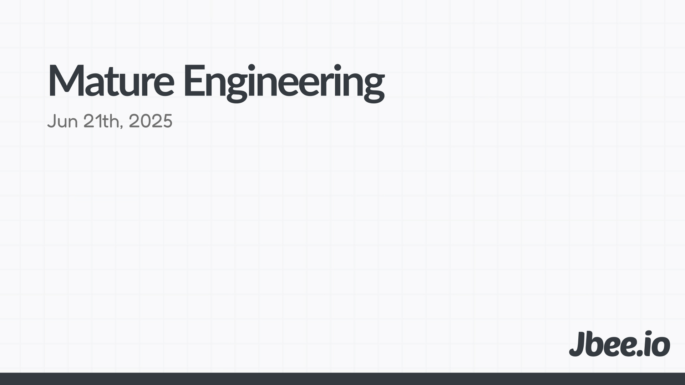

숙련된 엔지니어링에 대한 이야기. 단순히 코딩을 잘하는 것을 넘어서 어느 방향으로 나아가면 좋을지에 대한 이야기.

## 1. 엔지니어링 의사결정
> Best practice를 넘어서 Fit practice를 아는 것

의사결정 역량은 엔지니어링의 '숙련됐음'을 측정하는데 있어서 가장 중요한 역량 아닐까. 여러 요소를 복합적으로 인지하여 트레이드 오프를 계산하고 의사결정을 내리는 것은 예술의 영역이다. 가끔은 정말 정답이 없는 경우가 있기에 경험과 직관에 의존해야 하는 경우도 존재한다. 본질적인 문제를 이해하고 가장 효율적인 의사결정을 내리는 것이 중요하며 자신의 의사결정을 꾸준히 회고하여 날카롭게 다듬어야 한다. 이분법적인 세상에 살고 있지 않다는 것을 인지하고 우리는 이 디자인으로 여기까지 왔고 언젠가는 확장하거나 변경해야 한다는 것을 알고 있었어"라고 말할 수 있어야 한다.

### Fit practice
특정 대상을 위한 Best practice는 널리 공유된다. 그러나 모든 조직에 이것이 통용되진 않는다. 그 조직이 속한 상황, 그들의 역사 그리고 조직에 속한 구성원들이 전부 다르기 때문이다. 그것이 예산일수도 있고 속도일수도 있고 개발 외적인 다양한 요소들이 영향을 미치게 되는데 그것을 고려하면 Best가 맞다고 할 수 없다.
 
## 2. 일정 산정하는 역량
> Estimate is important

일정 없이 비즈니스 없다. 시간 자체도 비용이며 여러 이해관계자가 얽혀있기 때문에 비즈니스는 일정이 중요하다. 제품을 만드는 것만 하더라도 혼자 작업하지 않는다. 해야 하는 작업의 범위와 팀원들의 Co-work을 이해하고 일정을 예측할 수 있어야 한다.

### 일정이 '정수'라는 착각
예측의 본질은 커뮤니케이션이다. 서로 합의한 인터페이스에 맞춰 전달(delivery)하겠다는 일종의 커뮤니케이션인 것이다. 수많은 외부 변수에 맞춰 끊임없이 재조정하고 정렬하며 프로젝트를 이끌어나가는 것이다. 일정은 정수가 아니라 변할 수 있는 확률이며 높은 확률로 합의한 일정을 지키되 지속가능성을 고려하는 것이 Art인 것이다.

### 계획 오류 (Planning)
기본적으로 특정 프로젝트에 소요될 시간을 보다 낙관적으로 예측하는 것을 말한다. 어느 정도의 낙관성은 프로젝트에 도움이 되지만 일정을 산정하는데 있어서는 마이너스가 되곤 한다.

## 3. 일을 마무리 하는 능력
프로젝트가 아무리 흥미롭고 매력적이더라도 지루한 작업은 항상 존재한다. 진행 중에 예측하지 못한 것들이 많고 상황에 따라 대처해야 하는 경우가 생긴다. 그때마다 좌절하기 보단 새로운 문제를 맞이하고 해결해나가는 자세가 중요하다.

물론 시스템 디자인은 중요하다. 제품이 전체적으로 어떻게 만들어져야 할지 숲이 어떤 모습이어야할지 결정하는 것은 복잡하고도 많은 경험을 필요로 한다. 그러나 그 시스템을 끝까지 구현해내는 역량 또한 중요하다.

때로는 과거에 내렸던 결정을 번복하고 다시 결정을 내려야 하는 경우도 생기곤 하는데, 프로젝트에 대한 책임감과 주인의식 없이는 힘든 일이다.

## 4. Sponsorship over mentorship.
> 영향력의 확대

주변 사람들의 기술과 전문성을 끌어올릴 수 있어야 한다. 기술적인 멘토링 뿐만 아니라 그들이 일에 몰입할 수 있도록 지원해야 한다. 몰입은 이유를 아는 것과 성취를 경험하느냐가 영향을 준다.

경험이 부족한 엔지니어들이 자신이 하고 있는 일과 그 일을 하는 이유까지 이해할 수 있도록 시간을 할애해야 한다. 주변 사람들이 배우고 성장하는 것을 넘어 기회를 잡고 성공의 경험을 갖게 한다. 스폰서쉽이라고 하는데 다음과 같은 것들을 말한다.
- 도움이 되거나 흥미로운 다른 사람의 작업을 언급하거나 공유하고 칭찬과 감사를 넘어 존경을 표하기
- 새로운 프로젝트가 생겼을 때, 문제 해결 경험을 바탕으로 좋은 리더가 될 수 있는 사람을 제안하기
- 팀에서 해결한 문제를 엔지니어링 블로그에 게시할 수 있는 사람을 제안하고 이를 지원하기

작은 성과에 대한 인정을 많이 간과하곤 하는데 함께 하는 동료들로부터의 인정은 꽤 중요하다. 이미 인정받고 있다고 하더라도 또 언급되는 것은 집중도를 높이곤 한다. 칭찬은 상하 관계가 내포되어 있는 것 같아서 인정 또는 감사라는 표현을 좋아한다.

## 5. Good Relationship
> 사람이 하는 일

무엇보다 함께 일하고 싶어하는 사람이 되어야 한다. 단순히 좋은(Nice)한 사람이 아니다. 주변에 건설적인 피드백을 주고 받을 수 있는 관계가 있는가? 회사에 본인이 속한 팀에 속 얘기를 터놓고 이야기 할 수 있는가? 라포(rapport)를 형성할 수 있는 관계인지는 생각보다 많이 중요하다. 팀에 속한 이상 커리어는 혼자 만들어가지 않는다. 주변 동료들과 함께 만들어가는 것이다.

본인이 불투명하면서 남에게 투명함을 요구할 수는 없다.

## 마무리
이 글은 4년 전에 내가 생각하는 시니어 엔지니어는 어떤 엔지니어일까? 고민하며 정리하던 글이다. 시니어리티(Seniority)라는 표현 대신 Mature라는 표현으로 바꾸기만 했다. AI 시대에 숙련된 엔지니어링은 무엇일까 고민을 해봤는데, 크게 다르지 않다고 판단하여 따로 추가하진 않았다.
