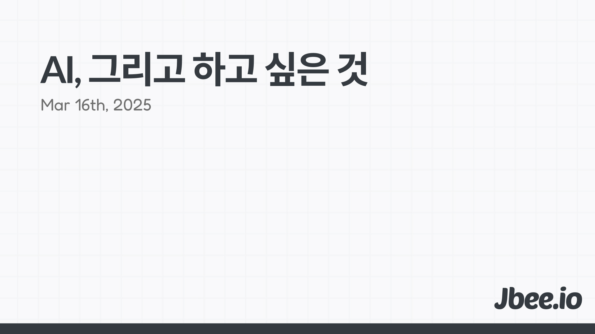

Vibe 코딩 시대다. 생산성을 올리기 위해 AI를 활용하는 것은 적어도 개발자에겐 필수고 당연한 일이 됐다. 그러다 문득 거인의 어깨에 오르면 끝일까 싶었고 그러면 그다음은 무엇일까, 생각했다.

'하고 싶은 것'에 대한 생각은 항상 달라진다. '하고 싶은 것'이라는 표현에 많은 것이 함축되어 있다. '하고 싶은 것을 하세요.'라는 말에 동의하기도 했고 그러지 않았기도 했으며 지금은 또 동의한다. 단순히 열정을 좇으라는 무책임한 생각은 아니다.

### 동기(Motivation)
무언가 하는 데 있어서 가장 중요한 것은 동기라고 생각한다. 그 중에서도 내적 동기를 얘기하고 싶다. 자율적으로 수행하지 않는 작업은 자율적으로 수행하는 일에 비해 생산성이 떨어진다는 것을 기본 전제로 한다. 그리고 높은 생산성이 좋은 결과물을 만든다고 생각한다.

내적 동기는 자율성에 기반한다. 스스로 선택한 것과 그렇지 않은 것은 완전히 다르다. 궁극적으로 스스로 내린 결정만이 동인 요소가 될 수 있다. 원하지 않는 것을 억지로 하면 자율성이 떨어지고 생산성이 낮아진다.

### 결과물(Outcome)
결국 하고 싶은 것을 해야 결과물도 괜찮게 나왔다. 몰입의 정도가 다르기 때문이다. 문제에 공감할 수 있어야 본질적인 이해가 가능하다. 관심이 없다면 공감할 수 없고 관찰이 없다면 이해할 수 없다. 문제를 제대로 이해하지 못하면 결과물이 좋을 수 없다.

## How
그렇다면 하고 싶은 것은 어떻게 할 수 있을까? 하고 싶은 것을 한다는 것은 그렇게 만만치 않다. 먹고 살기 위해 딱히 하고 싶지 않은 일을 하는 경우가 더 많다. 또 하고 싶은 일로 먹고 살 수 있을지 확신하기 어렵다. 그리고 당연하게도 하고 싶은 것이 없기도 하다.

### 용기
현재 누리고 있는 것들을 많이 내려놓아야 하고 싶은 것을 할 수 있다. 손에 쥔 것이 많을수록 쉽지 않다. 하고 싶은 것을 하기 위해선 더하기가 아니라 빼기가 필요하다. 내려놓을 용기부터 찾아야 한다.

내 경험을 되돌아보면 그동안 함께 했던 팀은 참 훌륭한 팀이었다. 계산기 두드려보면 떠날 이유가 없는 팀이었다. 그렇기에 머리의 '판단'은 참고 정도로만 여겨야 한는 것을 깨달았다. 새로운 도전을 하기 위해 대학교를 자퇴하거나 함께하던 팀을 떠나거나 내려놓을 용기가 필요하다.

### 탐색
사실 하고 싶은 것이 있다는 것 자체가 축복이다. 없다면 없는 대로 살아도 그만이지만 일을 통해 의미를 찾고 싶다면 어느 정도의 탐색이 필요하다. 이 역시 용기가 필요하다. 자신의 활동 범위를 넓히고 새로운 것을 해보고 만나지 않던 사람을 만나야 한다. 직접 경험해보기 전까진 모르기 때문이다. 막상 해보고 나니 하고 싶었던 것이 하기 싫어지는 경우도 있다.

커피챗을 통해 업계 사람들과 이야기를 나누고 색다른 취미를 통해 새로운 사람들을 만나는 것이 탐색에 큰 도움이 됐다.

### 전환
'일체유심조(一切唯心造)'라는 옛말에 이르길 모든 일은 마음먹기 마련이다. '정신 승리'라고도 비꼬기도 하는데 아예 틀린 말은 아니라고 생각한다. 하고 있는 일을 하고 싶은 일로 인식을 전환하는 것이 대안이 될 수 있다. 또는 하고 싶은 일로 가는 길, 그 일부라고 생각하면 조금은 다르게 접근할 수 있다.

이런 의미 부여는 꽤 유의미하다. 환경 문제를 해결하고 싶은데, 현실적으로 환경 단체에 들어가기 힘들다면 간접적으로 환경 문제를 해결하면 된다. 중고 거래를 보다 잘 이뤄지게 하여 새로운 소비를 줄이고 이에 따라 생산을 줄인다면 환경 문제에 조금이나마 기여할 수 있다. 자신이 하는 일이 직접적으로 환경 문제를 해결하진 않지만, 간접적으로 영향을 줄 수 있는 것이다. 이런 인식의 전환으로 동기 부여와 집중력을 끌어올려 본인의 생산성을 올릴 수 있다.

자신이 하는 일이 어떤 결과를 만들고 어떤 영향을 미치는지 고민해 봐야 하지 않을까.

## 마무리
온 세상이 AI에 집중하는 중 내면의 무언가에 초점을 맞춰봤다. AI 덕분에 반복되는 작업, 귀찮은 작업이 점점 사라지고 있다. 귀찮은 것들은 전부 시키고 인간은 하고 싶은 일에 집중할 수 있을까? 그러면 일이 지금보다 더 즐거워질 수 있지 않을까?
