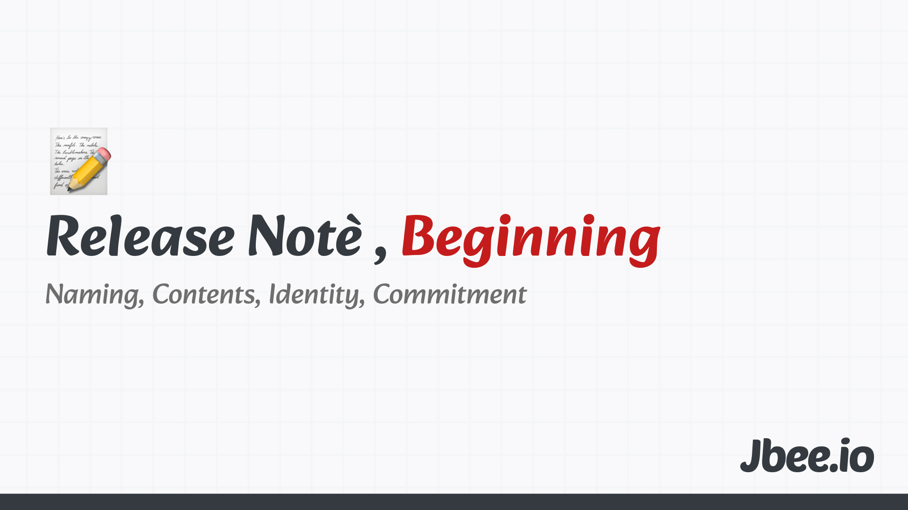

월을 되돌아 보기 시작한 것은 작년이었다. 1달 1러닝이라는 활동을 하면서 새로운 것을 학습했다. 자연스럽게 내용을 정리하면서 어떤 일이 있었는지 회고했다. 많이 회고한 달도 있었고 그렇지 않은 달도 있었다. 회고 자체보다 회고를 할 것이기 때문에 틈틈히 기록하는 것이 더 도움됐다.

아쉬운 점도 있었다. 연말 회고 때 월간 회고를 살펴보면서 좀 더 잘 정리했으면 좋았을 내용이 많았다. 외부에 공개해도 좋았을 내용도 있고 그 때의 감정이나 깨달음을 좀 더 잘 남겼으면 하는 아쉬움도 있었다. 그래서 올해부터는 외부에 공개하는 월간 회고를 작성하기로 했다.

## 이름
월간 회고라는 딱딱한 이름을 사용하고 싶진 않았다. 월간 OO은 이미 많았다. 일종의 시리즈 글이 될 것이고 앞으로도 꾸준히 하고 싶은 마음에 마음에 드는 이름을 붙여주고 싶었다. 이름을 부여한다는 것은 어느 정도의 애정을 전제로 하는 것 같다.

한편으론 뭐 대단한가 싶은 마음에 그냥 월간 회고라고 할까 싶다가도 다른 이름을 고민하곤 했다. 일기는 매일 기록하는 무언가니 월기라고 할까, 월은 한자이니 달기라고 할까. 딸기를 떠올리는 듯하면서 재밌는 이름이다 싶었는데, 성에 차지 않았다. 영어로 할까 싶다가도 내 정체성을 조금이나마 남기면 좋지 않을까 싶었다. 아마 이 회고 내용에 기술적인 내용이 많진 않겠지만 한 방울은 남기고 싶었달까. 커밋, 트레이스, 태그, 이터레이션 등 다양한 용어들이 떠올랐는데, '릴리즈 노트'라는 이름을 붙였다. (로그라는 이름은 이미 연말 회고에서 사용하고 있어서 제외했다.)

## 알맹이
무언가를 시작할 때, 포장지부터 고민하는 좋지 않은 습관이 있다. 오픈소스를 한다 하더라도 실제로 구현하기 전에 이름을 먼저 고민하곤 했다.

이 릴리즈 노트는 틀이 있으면서도 없을 것 같다. 어느 달부터 불쑥 추가하고 싶은 것이 생기면 추가할 것이고 빼고 싶은 구성이 생기거나 딱히 공유할 무언가가 없다면 과감히 제거할 것이다. 다만 한달이 다 갔을 즈음에 정리하여 공유하는 것 그리고 일정 분량을 맞출 것. 두 가지는 꼭 지키려고 한다.

올해도 1달 1러닝을 하고 있긴 하지만 조금 다른 방식으로 하고 있다. 작년엔 실생활과 직접적으로 관련있는 재테크, 보험, 건강 등 정보를 수집하는 것이었다면 올해 1분기는 나에 대해 질문하고 사유의 과정을 담았다. 그러다보니 자연스럽게 철학이라는 분야에 대해 학습하게 되었고 꾸준히 해 나가고 있다.

한 편의 블로그 글로는 부족하지만 한 단락, 한 문장으로 가치있는 내용들을 담아보려고 한다. 읽었던 책 중에서 만난 문장들이나 영화에서 들은 대사라던가. 물론 소개할만한 책과 영화가 있다면 함께 소개하려고 한다.

#### Worth the click
최근 꽤많은 뉴스레터를 정리했다. 엄청난 양의 뉴스레터를 구독하고 있었는데, 대부분 깊게 읽지 못했다. 선택과 집중이 필요하다고 판단했고 10개 미만으로 뉴스레터를 정리했다. 그 중에서도 꽤나 인상깊은 링크를 짤막한 생각과 함께 공유해보려고 한다. 글일 수도 있고 영상일 수도 있고 SNS 글일 수도 있겠다. 이런 목적을 두면 읽을 때 좀 더 집중해서 읽게 되더라.

## 마무리
사실 글의 제목은 '시작하며'이지만 이 글은 세번째 회고, 그러니까 3월을 보내는 중에 방향성이 잡혔고 좀 더 잘해보자는 의미에서 쓰기 시작했다. 일종의 공개 선언 효과랄까. 
