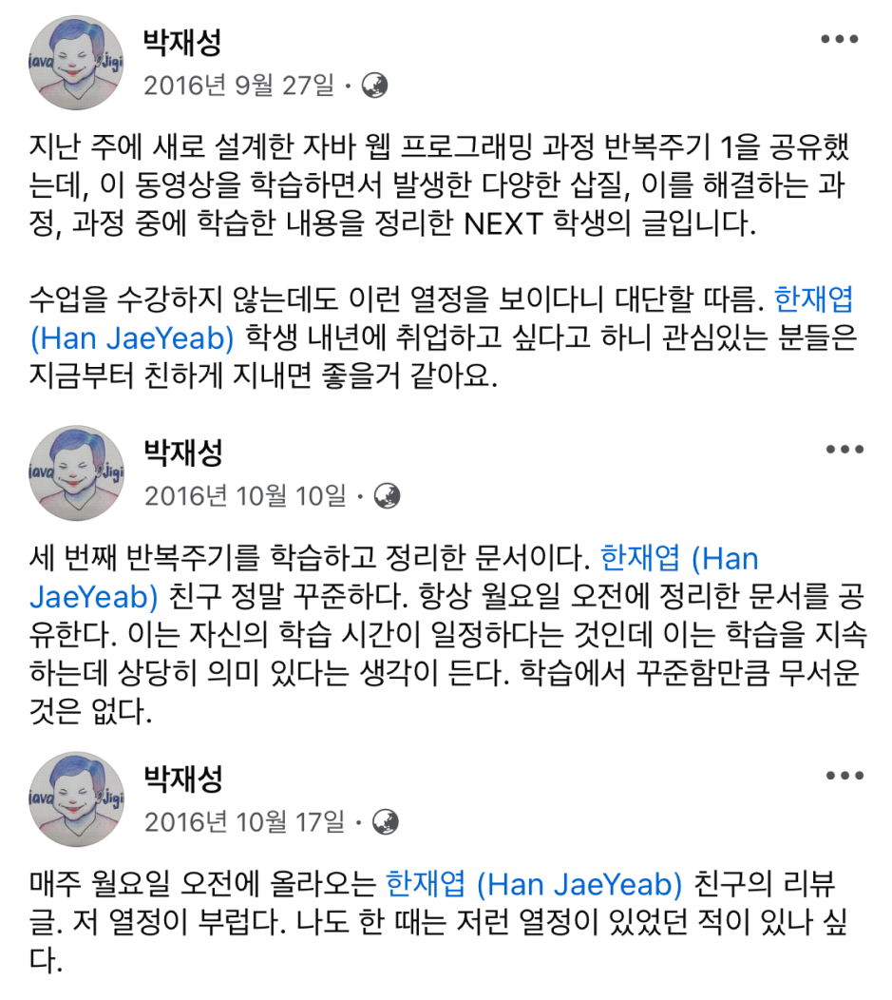

최근 재능에 대한 질문을 많이 받았다. 코딩을 잘 못하는 것 같다며 개발을 더 해야 하는지 모르겠다는 이야기다. 생각보다 많은 분들이 이런 얘길 하는데 성취를 하기 어려운 시기이다 보니 더 그런 것 같다. 그래서 이 글에선 이 정도까지 사적인 내용을 블로그에 쓴다고? 할 정도로 개인적인 이야기를 해보려고 한다.

## 재능에 대한 이야기

> "재능이 있다고 생각하고 시작하셨나요?"

이 질문에 난 개발을 못하는 축에 속한다고 얘기하면 다들 믿지 않거나 웃어 넘긴다. 그럴 수 있는 것이 좋은 커리어를 갖고 있으니 내 대답이 기만이나 단순한 위로로 들릴 수 있다.

조금 더 정확히 이야기 하자면 코딩을 잘하는 편은 아니다. 코딩 능력이 뛰어나기 보다는 ==개발==의 여러 과정을 비교적 능숙하게 다룬다고 생각한다. '코딩 수저'라는 표현을 사용하는데, 어렸을 때부터 코딩과 함께 자라 뇌 자체가 컴파일러인 친구들이 코딩을 잘한다고 생각한다. 그에 비해 난 평범한 뇌를 가졌고 코딩을 잘한다고 얘기하진 않는다.

내가 속해있던 NHN NEXT라는 교육 기관은 내 기준 정말 똑똑한 사람들이 모인 집단이었다. 앞서 표현한 '코딩 수저'가 내 옆에 앉아서 같이 수업을 들었다. 아직도 기억이 나는게 알고리즘 시험을 볼 때 나는 어떻게 하면 컨닝을 해서 넘어갈 수 없을까 고민하고 있는데 벌써 다 풀고 나가는 형을 봤다. 단순히 정답을 따라 쓰기만 해도 형보다 느리겠는데. 하는 생각을 했다. 어린 나는 당연히 재능을 고민할 수 밖에 없었다.

### 그냥 하는 거지 뭐
그러나 대부분의 사람들보다 비교적 많은 시간을 개발에 투자했고 그 시간에 조금씩 더 배웠다. 매일 아침 글을 쓰며 시작했고 늦은 시간에 고시원으로 돌아갔다. 그리고 그것을 꾸준하게 했다. 어느 정도 성장하고 나서는 그 다음의 좋은 환경에서 성장할 수 있었다. 그 시절엔 좋은 기회가 상당히 많았다. ([운의 표면적](https://jbee.io/articles/essay/fortune))

오히려 이런 환경이었기에 나의 평벙함을 더 겸허히 받아들일 수 있었다. [최성운의 사고실험](https://www.youtube.com/@think_experiment)이라는 YouTube 채널에서 이종범 작가님이 나오셔서 하신 말씀이 인상 깊었다. 세계 최고가 되고 싶다면 얘기가 달라지지만 그게 아니라면 재능은 그렇게 크게 중요하지 않다.

## 실패에 대한 이야기
내 학창 시절은 ==실패==의 연속이었다. 이제서야 조금씩 작은 성공을 하고 있을 뿐인데, 온통 성공 뿐인 것으로 안다. 이면에는 실패도 많은데 성공만 비추는 것도 한 몫 한다.

최근 실패는 나조차도 부끄러우니 과거 실패 이야기를 해보려고 한다. 초등학교 시절 학원이나 과외 같은 사교육을 받지 않았고 공부에 흥미도 없던 터라 공부를 잘하는 편이 아니었다. 그러다 중학교 시절 우연히 시험을 잘 봐서 영재 취급을 받았다. 이 때부터 악몽이 시작되는데, 각종 올림피아드를 준비했고 시험보는 것마다 입상하지 못했다. 마지막 화학 올림피아드에서 장려상을 받았지만 이것 가지곤 과학고에 진학할 수 없었다. 학원만 전전하던 내 중학교 시절은 실패로 가득찼다. 학교에선 거의 잠만 잤기 때문에 이렇다 할 친구도 없었고 추억도 딱히 없었다. 고등학교 때도 마찬가지 였다. 기숙 생활이었지만 신나게 놀지도 못하고 공부에 몰입하지도 못했다. 중학교 시절의 패배감이 이어졌고 수능 결과로도 고스란히 전해졌다. 대학을 가야 하는데 가고 싶었던 학과, 학교가 있었던 것도 아니었고 일종의 도피를 했던 것 같다. 이렇게 진학한 대학을 잘 다녔을리 없다. 1년하고 한 학기 정말 신나게 놀았고 휴학을 했다. 20대의 숙제인 군대를 다녀와서는 쿨하게 자퇴를 했다.

성공으로 가득 찬 학창 시절을 보내진 않았다. 여러 실패를 해봤기 때문에 남들보다 실패에 대한 두려움이 적은게 아닐까? 생각한다. 나보다 훌륭한 학창 시절을 보내고 교육 잘 받고 좋은 대학 간 친구들이 나에게 고민을 상담하고 재능을 논하고 있으니 이질적인 느낌이 든다.

### 아니면 아닌 거지 뭐

> 네, 근데 그래서 이제 어떡하라는 거죠?

내 이야기를 짧게 들려주고 나면 가끔 그래서 난 이제 뭘 해야 하는지 구체적인 방향 제시를 원하는 분도 있다. 이 정답을 바라고 꿀팁을 바라는 것이 실패하고 싶지 않은 태도에서 비롯되는 것 같다. 성공 궤도를 달리던 사람이 '아니면 아닌거지.' 라는 쿨한 태도를 갖는다는 것이 힘들 수 있겠다는 생각을 했다. 성공만 멋진 것이 아니라 실패를 통해서 배우고 그 다음 성공했을 때가 더 멋있다는 것을 알면 좋겠다.

## 타고 나는 것에 대한 이야기

과거에 내가 개발 공부를 어떻게 했는지 주제로 글을 썼다. 아래 두 글은 무려 8년 전 글이다. 구성도 엉망이고 별 내용도 없다.
- [나는 어떻게 개발 공부를 했나, 2편](https://jbee.io/articles/essay/%EB%82%98%EB%8A%94%20%EC%96%B4%EB%96%BB%EA%B2%8C%20%EA%B0%9C%EB%B0%9C%20%EA%B3%B5%EB%B6%80%EB%A5%BC%20%ED%96%88%EB%82%98,%202%ED%8E%B8)
- [나는 어떻게 개발 공부를 했나, 1편](https://jbee.io/articles/essay/%EB%82%98%EB%8A%94%20%EC%96%B4%EB%96%BB%EA%B2%8C%20%EA%B0%9C%EB%B0%9C%20%EA%B3%B5%EB%B6%80%EB%A5%BC%20%ED%96%88%EB%82%98,%201%ED%8E%B8)

그럼에도 굳이 소개하는 이유는 여태까지 꾸준히 글을 써왔다는 것이다. 내가 남들보다 조금 더 잘하는 것 중 하나는 무언가를 꾸준히 한다는 것 같다.

주변에도 보면 타고난 것들이 하나씩 있는 것 같다. 그리고 난 이것을 타고 나는 것, 기프트(Gift)라는 표현을 쓰곤 하며 발견할 때마다 말해주곤 한다. 좌절을 겪더라도 목표한 바는 끝까지 이루고 마는 집념, 상대방을 배려하는 마음, 어른을 공경하고 불편하더라도 상냥하게 대하는 자세, 상대방과의 대화를 유쾌하게 이끌어 갈 수 있는 분위기 파악 능력, 난 이런 것들이 전부 타고 나는 것이라고 생각한다. 이런 기질은 배울 수 없는 것이기 때문이다.

재능(Talent)과는 조금 다른 것 같다. 기질이라는 표현도 그래서 쓴 것인데, 잘하는 무언가를 재능이라 표현하는 것 같고 그 사람이 은은하게 가지고 있는 특성, 그리고 그것을 알아차려야 타고난 것이라고 인지할 수 있는 어떤 것을 Gift라고 생각한다.

## 마무리

> 반짝이는 것들은 그렇다. 애쓰지 않아도 빛의 굴절이 달라 반드시 타인의 눈에 들어오는 것

'료의 생각없는 생각'이라는 책에서 가져온 구절이다. 누구나 반짝이는 기질, 재능이 있지 않을까?

최근 오랜만에 페이스북에 들어갈 일이 있었는데, 존경하는 박재성 교수님의 샤라웃 글이 있어서 너무 반가웠다. 교수님의 응원 덕분에 꾸준히 할 수 있었던 게 아닐까 라는 생각과 함께 이런 어설픈 글이 누군가에겐 위로이자 응원이 될 수 있지 않을까 생각하며 개인적인 이야기를 글로 옮겨봤다.

