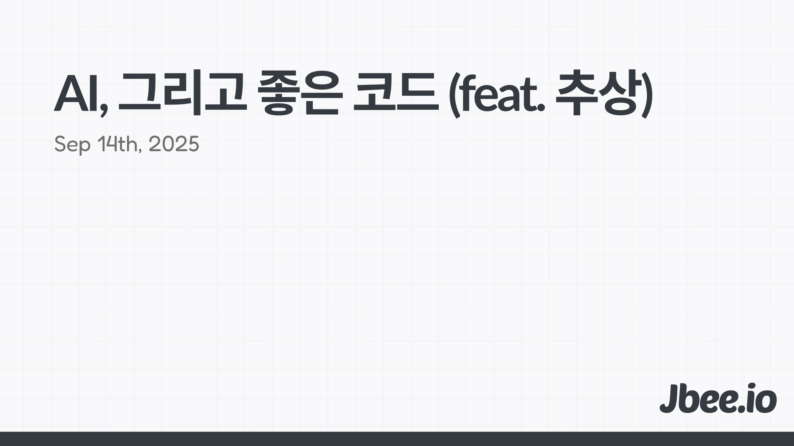

> 프로그램은 사람이 읽을 수 있도록 작성해야만 한다. 기계가 실행하는 것은 부차적인 일이다. - 컴퓨터 프로그램의 구조와 해석

소프트웨어는 복잡하다. 시간이 지나면서 더 복잡해진다. 원래도 복잡한데 변경되는 과정에서 더 복잡해진다. 이 복잡도(complexity)는 소프트웨어의 ==지속성==을 위해 반드시 해결해야 하는 문제다.

## 추상
'추상'을 활용한다. 중요한 것을 드러내고 중요하지 않은 것을 감춘다. 복잡도를 관리하기 위해선 무엇이 중요한 것인지 정의(Definition)가 필요하다.

무엇이 중요한지는 같은 대상이라도 목적에 따라 다를 수 있다. 그러므로 목적, 즉 문제를 명확히 해야 한다.
- 이상과 현실의 차이는 무엇인지
- 누구의 문제인지
- 그래서 무엇이 중요한지

간단하게 지도를 예로 들어보자.
- 네비게이션에 사용되는 지도
- 지구본
- 지하철 노선도

분명에 셋 다 현실을 도식화한 것인데 모습이 다르다.

네비게이션에 사용되는 지도는 운전자를 위한 지도이다. 운전할 때는 차가 다닐 수 있는 도로가 중요하며 과속 카메라, 표지판 등이 중요하다. 그러나 현실은 그 외의 것들이 너무 많아서 운전할 때 중요한 것들 위주로 구성한다. 지구본은 완전한 구 형태로 높은 수준에서의 시야를 제공한다. 각 나라 간의 지정학적 위치를 살펴보거나 위도 경도를 살펴보기 좋다. 지하철 노선도에는 아무것도 없고 지하철역과 노선만 표시되어 있다. 그 역 근처에 어떤 건물이 있는지, 버스 정류장은 없는지 등 지하철 외의 것은 필요 없는 것이다.

우린 모두 '지도'라고 부를 수 있으며 모두 이 세상을 추상한 것이지만 서로 다른 문제를 해결하고 있고 다른 맥락을 갖고 있다. 문제가 무엇인지에 따라 같은 대상에 대한 추상도 달라진다. 추상은 새로운 의미 수준을 만들고 합의하는 것이라는 말에 동의한다.

### 좋은 코드
본질적으로 코드는 제품으로 현현해야 하며 궁극적으로 돈을 벌어와야 한다. 기본적인 목적을 달성해야 한다. 아무리 제대로 작성된 코드라도 비즈니스에 기여할 수 없다면 좋은 코드가 아니다. 이 말은 제품 일부로써 정상적으로 기능해야 하며 컴퓨터가 버그 없이 실행 가능해야 함을 의미한다.

더 좋은 코드를 이야기하자면 지속  가능한 코드이다. 지속 가능하게 돈을 벌어다주는 코드가 더 좋은 코드이다. 지속 가능해지려면 복잡도를 잘 다룰 수 있도록 구성해야 한다. 인간이 읽고 변경하기 쉬워야 한다. 컴퓨터가 실행할 수 있으면서 인간이 이해하기 쉬운 코드여야 한다.

## 추상화
이해하기 쉬운 코드는 적절한 추상화로 이루어져 있다. 함수를 만들어보면서 적절한 추상을 이야기해보자.

```ts
const totalA = arrA.reduce((acc, val) => {
  acc + val
}, 0);

const totalB = arrB.reduce((acc, val) => {
  acc + val
}, 0);
```
두 개의 `arrA`, `arrB` 배열이 있고 두 배열을 순회하면서 합계를 구하는 간단한 로직이다. 중복되는 코드가 보여 이를 함수로 분리하려고 한다.

리듀스(reduce)를 통해 `total` 값을 구하는 것이니 `getTotalByReduce`는 어떨까?
```ts
const totalA = getTotalByReduce(arrA);
const totalB = getTotalByReduce(arrB);

function getTotalByReduce(arr: number[]): number
```
중복이 잘 제거된 것 같다. 시그니처를 통해 내부가 어떻게 동작하는지 훤히 알 수 있다. 근데 여기에서 `totalA`라는 변수가 아니라 `sum`으로 바꾸고 싶어지면 어떨까?
```ts
const sum = getTotalByReduce(arrA); // getTotal이 어색해졌다.
```

그대로 '추출(extract)'하면서 시그니처를 정의했기 때문에 사용처에 의존하고 있는 시그니처가 만들어졌다. 함수 내부를 `reduce`가 아닌 `for-of` 문법으로 바꾸면 어떨까?
```ts
// ByReduce라는 이름이 어색해졌다.
function getTotalByReduce(arr: number[]): number {
  const result = 0;
  for (const val of arr) {
    result += val;
  }
}
```

### Signature
함수의 시그니처(Signature)는 드러나 있는 것이고 함수의 구현은 드러나지 않는 것이다. 그렇기 때문에 시그니처에는 중요한 것을 남기고 동작은 숨긴다. 시그니처에는 What을 남기고 How는 노출하지 않는다.

`getTotalByReduce`의 기능은 합계를 구하는 것이다. What은 합계를 구하는 것이다. 합계를 구한다는 것을 노출하면 된다. 숫자 배열을 인자로 받아 합계를 구하고 반환하는 것. 여기까지가 함수 시그니처에 드러나야 하는 것들이다. 나머진 시그니처에 드러나지 않아야 하는 구현, How인 것이다.

```ts
function sum(arr: number[]): number
```

그래서 우리가 이미 익숙하게 사용하고 있는 `sum`이라는 함수가 만들어진 것이다. 내부 구현이 무엇인지 몰라도 숫자 배열을 인자로 넘기면 그 배열의 값들의 합을 얻을 수 있다는 것을 우리는 알고 있다. 내부가 for-of 구문으로 되어 있는지 reduce를 통해 구현되어 있는지는 중요하지 않다. 이 함수를 사용하는 입장에서는 오로지 인자, 반환 타입 그리고 이 함수가 어떤 역할인지가 중요하다.

함수 시그니처로 이 함수의 역할을 다 드러낼 수 없다고 판단하는 경우는 함수를 나눠한다. 역할이 2개 이상이라서 시그니처를 구성하기 어려운 것이다. 흔히 변수명을 짓기 어렵다, 함수명을 짓기 어렵다고 하는데 함수의 경우 이름 뿐만 아니라 인자도 어떤 역할을 하는지 드러낼 수 있기 때문에 함께 고려해야 한다.

#### 드러내는 것
- 중요한 것
- What
- 기능

#### 드러내지 않는 것
- 중요하지 않은 것
- How
- 구현

`sum`이라는 간단한 코드 조각으로 예시를 들었지만 사용되는 곳과 의존 관계가 생기도록 그대로 추출한다던가, 내부 구현이 노출된다던가 등의 일은 흔히 발생한다. 컴포넌트를 분리할 때에도 동일하게 발생하는 실수다. 노출된 구현이 변경을 어렵게 만들기 때문에 추출이 아닌 추상화를 해야 하는 것이다. 

## AI
LLM을 통한 코드 생산이 새로운 추상을 제공하는 것일까? 우리는 좋은 코드에 대한 새로운 정의가 필요한 것일까?
### High Level Language
고수준의 프로그래밍 언어는 다른 차원의 추상화를 제공했다. 다른 언어를 만들어 중요하지 않은 부분을 숨기고 문제를 해결하는 데 필요한 것들을 문법으로 공개했다. 우리는 10001010100011011001을 이해하지 못해도 프로그래밍을 할 수 있다. 기계어, Assembly를 몰라도 된다. 고수준의 프로그래밍 언어가 이들의 동작을 모두 추상화했기 때문이다.

### 자연어 프로그래밍
LLM에 목표하고자 하는 바를 이야기하면 코드가 생성된다. 에러가 발생하는 부분도 해결해 준다. 결국 동작하는 코드가 만들어지고 제품이 만들어진다. 자연어만으로 컴퓨터가 실행할 수 있는 코드가 만들어진 것이다. 돈까지 버는 제품이라면 정말 좋은 코드이기도 하다.

이제 자연어를 새로운 프로그래밍 언어라고 볼 수 있을까? 인간이 사용하는 언어를 통해 제품을 만들 수 있게 됐으니, 프로그래밍 언어는 다른 차원의 추상을 맞이한 것일까?

### 비결정론적, 결정론적, 그리고 기능으로써 환각
 LLM(대형 언어 모델)은 비결정론적 추상화를 제공한다. 새로운 추상화의 기준이 되려면 즉 프로그래밍 언어로써 자연어를 활용할 수 있다면 결정론적인지가 중요했다. 그러다 보니 그 확률이 90%냐, 99%냐, 100%냐 이야기가 많다.
 
 프로그래밍 언어냐 아니냐의 논쟁을 떠나서 새로운 도구가 생겼다는 것에 집중하면 어떨까. 1-10%를 제어할 원조 프로그래밍 언어를 제어할 수 있다면 자연어 프로그래밍 언어라는 새로운 도구를 활용하여 생산성을 높일 수 있는 것이다.

## 컴퓨터, 인간, 그리고 AI
이제 프로그래밍에 참여하는 주체가 1명 더 늘어났다. 태초에는 컴퓨터가 실행할 수 있는 코드를 작성하면 그만이었다. 그러나 지속성을 위해 인간이 읽을 수 있는, 인간에게 잘 읽히는 코드를 작성해야 했다. 프로그래밍은 이해관계자가 1+1이었던 활동이었다.

이젠 AI라는 부분도 신경 써야 한다. 컴퓨터가 실행할 수 있는 코드이자 인간이 편하게 읽을 수 있는 코드이자 AI가 이해할 수 있는 코드를 작성해야 한다. 어떻게 하면 AI가 우리 제품을 더 잘 이해할 수 있을까? Context Engineering을 넘어 조금 더 고민해 봐야 하는 주제인 것 같다. ([LLM Friendly Code에 대한 짧은 생각](https://jbee.io/articles/developments/about-file-based-routing#llm-friendly))

### 공존
결론부터 이야기하자면 인터페이스는 직접 정의하고 구현은 AI에게 맡긴다. 인터페이스를 직접 정의한다는 것은 추상화 레벨을 결정한다는 것을 의미한다. LLM이 학습한 코드에는 경계가 무너져있거나 잘못 작성된 코드들이 많다. 그리고 구체적으로 어떤 문제를 풀고 있는지 신경 쓰며 생성하지 않는다.

앞서 말했듯이 추상의 정도는 문제를 어떻게 정의하느냐에 따라 다르고 도메인이 무엇이냐에 따라 다르다. 기술의 영역을 넓히는 것도 중요하지만 도메인에 대한 깊은 이해를 바탕으로 문제를 어떻게 추상화하느냐가 중요해졌다. 도메인 문제를 내가 가진 깊은 전문성으로 해결할 수 있어야 한다. ([AI, 그리고 Frontend](https://jbee.io/articles/essay/ai-and-frontend#%EC%A7%81%EA%B5%B0%EC%9D%98-%EC%84%B8%EB%B6%84%ED%99%94), [AI, 그리고 Engineer](https://jbee.io/articles/essay/ai-and-engineer#%ED%92%88%EC%A7%88))

## 결론
추상을 제대로 이해하고 코드 덩어리에 경계를 긋고 LLM이 생성되는 코드를 정확히 이해한다면 빠르게 좋은 코드를 만들 수 있는 시대가 되었다. 코드가 생성되는 시간이 그 코드가 어떤 논리로 생성되는지 잘 살펴봐야 한다. 잘못된 부분은 없는지 그 코드를 이해하고 감시자가 되어야 한다. 자연어가 다음 프로그래밍 언어가 될 수도 있겠지만 개발자의 역할은 궁극적으로 문제를 정의하고 이를 플랫폼 위에서 적절하게 해결할 방법을 찾는 것이라 생각한다.

성능이 좋은 새로운 무기를 주면, 그 무기가 익숙해지도록 숙련해야 한다. 낯설고 익숙하지 않다는 이유로 계속 활을 고집할 수 없지 않은가.

### References
- https://evan-moon.github.io/2025/09/07/declarative-programming-misconceptions-and-essence/
- https://tymzap.com/blog/the-magic-of-keeping-one-abstraction-level-per-function
- https://sangminpark.blog/2021/05/28/%ec%a2%8b%ec%9d%80-%ec%bd%94%eb%93%9c/
- https://martinfowler.com/articles/2025-nature-abstraction.html

### AI와 관련된 글들
- [AI, 그리고 학습](https://jbee.io/articles/essay/ai-and-learning)
- [AI, 그리고 Frontend](https://jbee.io/articles/essay/ai-and-frontend)
- [AI, 그리고 Engineer](https://jbee.io/articles/essay/ai-and-engineer)
- [AI, 그리고 하고 싶은 것](https://jbee.io/articles/essay/what-i-want-to-do-and-ai)
