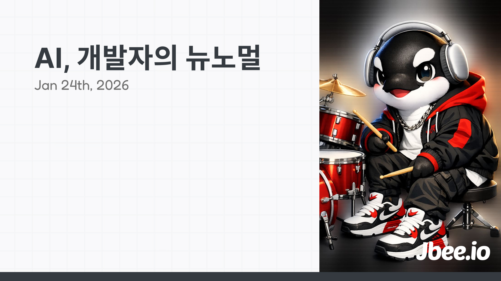

이런 말은 이제 조금 지겹게 느껴질 정도로 많이 들린다.
- 개발자는 이제 더 이상 필요없다.
- 사람이 코딩하던 시대는 끝났다.
- 실행이 가장 싼 시대가 도래했다.
- 아니다. 개발자는 없어지지 않는다. 개발자의 역할이 달라질 뿐이다.

다양한 의견이 오고 가는 가운데, 개발자는 어떤 입장을 취해야 할까? 개발자의 역할은 어떻게 대체될까? 왜 들리는 이야기와 내 실제 업무와의 여전히 괴리가 있을까?

개발자 N과 S가 이야기하는 '개발자의 뉴노멀'에 대해 얘기해보려고 한다.

## N. 1년 뒤, 개발자는 어떻게 일하고 있을까?
직접 코딩하는 일이 점점 줄어드는 것은 사실이다. 그렇다면 만약에 코드를 아예 작성하지 않는 극한의 상황으로 간다면 어떻게 일하게 될까?
1. 요구사항을 해체하여 이슈로 정리한다.
2. 정리한 내용을
	1. 구현하는 데 필요한 것들을 Sub Issue로 정리한다.
	2. 검증하는 데 필요한 것들을 Sub Issue로 정리한다.
3. 각각의 Issue들을 의존 관계에 따라 정리한다. (예: A 이슈는 B 이슈를 Blocking 한다.)
4. Agent가 2-2 이슈를 기반으로 테스트 시나리오를 생성하면 이를 검토한다.
5. 작업을 지시한다.
    1. Product Agent에게는 2-1 이슈를 기반으로 코드를 작성하게 한다.
    2. Test Agent에게는 4의 테스트 시나리오로 테스트를 작성하게 한다.
  6. 누락된 테스트 케이스를 추가하여 5-1을 반복하고 모든 테스트 케이스가 통과할 때까지 5-1을 반복한다.
  7. 배포 후 지표를 지속적으로 모니터링하는 Agent로부터 이슈를 생성한다.
  8. 다시 2번으로 돌아간다.

Agent가 직접 하지 않는 사람이 해야 하는 영역에서조차 Agent의 도움을 받을 것이다. 이슈로 정리한다던가 의존 관계를 분석하는 일조차도 검토는 하겠지만 Agent의 도움을 받을 것이다. 그러나 생성된 코드와 테스트 코드도 검토가 필요할까?

마치 어떤 유틸리티 함수를 작성할 때, Input과 Output을 정의하고 기대하는 케이스들을 나열한 다음, 구현을 채워 넣는 과정과 비슷하다. 중요한 것은 인터페이스지, 구현이 아니다. 우리가 개발할 때 항상 고민했던 인터페이스/구현의 구분이다. 추상화. 같은 코드더라도 인터페이스와 구현이 구분됐는데, 이 워크플로우대로라면 이젠 코드 자체가 구현됐다.

기대한 대로 동작하는 것은 항상 중요했다. 달라진 것은 단순했던 Input/Output이 실제 제품이 존재하는 복잡계의 요구사항으로 격상됐다는 것이다.

## S. 품질이 좀 떨어지던데,
제품의 퀄리티 이야기를 해야 한다. 사실 지금도 보통 수준의 제품을 만들기 위해서는 내부 구현을 깊게 들여다볼 필요가 없다. 추상화가 잘 되어 있기 때문이다. 그러나 조금 더 나아가기 위해선 내부를 들여다보곤 한다. 패킷 단위로 분석한다던가 브라우저의 동작 원리에 기반하여 성능을 개선한다던가 보통 이상의 결과물을 만들기 위해서는 추상화 레이어를 넘나드는 탐구를 동반한다.

Agentic 코딩이 특정 퀄리티 이하의 레벨에선 새로운 추상화 레이어가 맞다고 생각한다. 즉 코드를 읽지 않고 수정하지 않아도 어느 정도 수준의 제품은 만들 수 있다. 그러나 특정 퀄리티 이상으로 가기 위해선 결국 내부를 들여다 봐야 할 것이며 코드를 수정하거나 직접 작성해야 하는 경우가 발생할 것이다. 다만 지금 저수준 레벨의 코드를 보는 경우보다 더 많을 것으로 생각된다. AI 레이어는 필연적으로 비결정적이다. 다른 추상화 레이어와는 태생이 다르기 때문이다. Programatic하게 정의됐던 프로그래밍 언어, 프레임워크와는 다르게 이번 AI 레이어는 LLM을 통한 생산이기 때문이다.

## N. 앞으로 더 많은 문제를 해결할 거야.
널리 사용되는 도구는 일반적으로 올바른 추상화를 제공했다. 올바른 추상화는 생산성을 높인다. 높아진 생산성은 여유를 만들고 다양한 영역으로 확장할 여지를 만든다. 농업 혁명을 통해 잉여자본이 만들어졌고, 사람들이 농사 이외의 것들에 관심을 두게 된 것도 같은 이치이며 프로그래밍 언어의 발전으로 인해 특정 분야에서만 사용되던 코딩이 다양한 분야로 확장한 것과 동일한 흐름이다.

ROI(비용 투자 대비 효익)가 나오지 않아 아직 '프로그래밍'의 손길이 닿지 않은 영역이 매우 많다. 일상생활에서도 자동화하거나 개선할 수 있는 여지가 많고 다른 산업 직군에서도 충분히 발전할 여지가 많다고 생각한다. 이미 연구 분야에선 적극적으로 도입되고 있으며 더 나아가선 해양 생태계를 복원하는 일이나 자연을 보호하는 일에서도 소프트웨어 엔지니어에게 기대하는 역할이 생기지 않을까.

다양한 분야로 확장한다는 것은 더 많은 기회가 생겨나는 것을 의미한다. 코딩의 민주화를 통해 더 많은 문제를 해결할 수 있게 된 것이 아닐까? 물론 코딩할 수 있는 사람의 희소성 또는 중요성이 그만큼 낮아질 수도 있겠다.

## S. 그래도 여전히 못 해!
왜 들리는 이야기와 현실은 다를까? 내 실제 업무와는 왜 여전히 괴리가 있을까? 가만히 들여다보면 자신이 전문으로 하는 영역에 대해선 아직 멀었다고 얘기하며 자기와 인접한 영역이지만 잘 모르는 영역에 대해선 정말 잘 한다고 판단한다. 판단에 있어서 객관적으로 판단하고 있는지 되물어 볼 필요가 있다.

내 업무에서 암묵적으로 하는 것들이 생각보다 많다. 어려운 작업을 척척 해내는 에이전트가 정말 단순한 작업을 못 하는 경우도 존재한다. 가능하더라도 아직은 비용이 많이 들어가거나 사용하지 못할 정도로 속도가 느린 경우도 존재한다. 이러한 것들을 Agent가 잘 접근할 수 있도록 디지털화하는 작업과 똑똑하게 읽을 수 있도록 최적화하는 작업이 필요하다.

이런 간극은 성능이 좋아지면서 많이 채워지겠지만 AI는 모든 문제를 딸깍 한 번으로 해결하는 초능력이 아니다. 분명 생산성을 높여줄 도구임은 틀림없다. 잘 활용할 수 있도록 기반 작업과 연구가 필요하다.

## N. 불확실성을 대하는 자세
발전의 속도가 점점 가속화되고 있다. 혁명의 각 단계도 짧아지고 있다. 첫 농업혁명은 5천 년 이상 지속되었지만, 산업 혁명은 길어야 100년 동안 이뤄졌고, 정보 혁명은 70년이 채 되지 않는다. 빅데이터로 인한 4차 산업 혁명은 그보다 더 짧을 것이며 AI로 인한 혁명은 지금 보다시피 엄청난 속도로 발전해 나가고 있다. 불과 6개월 전과 지금의 모델 성능이 다른 것처럼 말이다.

예측이 하루 멀다 하고 갱신되는 요즘이기 때문에 확신을 갖고 대처하기보단 이런 불확실성에 어떻게 대응할 것인가 고민하는 것이 필요하다. 확실한 것은 AI와 친해지고 AI를 익숙하게 다룰 정도로 많이 가지고 놀아야 한다는 것이다. 또한 지금까지의 각자가 쌓아온 경험은 무시할 수 없다. 그 경험을 레버리지 삼아 무엇이든 할 수 있다는 낙관적인 자세도 중요하지 않을까?

## S. 그래서 이제 어떤 것이 중요할까?
'코딩'은 개발자, 엔지니어가 가지고 있는 도구 중 하나일 뿐이다. 라는 말은 과거부터 정말 많이 말해왔다. 하지만, 이 말을 얼마나 진실되게 받아들였을지는 의문이다. 개발자가 되기 위해 코딩은 필수적으로 알아야 하는 지식으로 취급하면서 문제를 정의하고 근본 원인을 파악하려 하고 이를 기반으로 요구사항을 정리하는 역량은 상대적으로 덜 중요하게 여겨졌다.

원래 개발자의 역할 중에서 문제를 잘 정의하는 것이 제일 중요했는데, 코딩이라는 수단이 지나치게 주목받았던 것 같다. 도구를 통해 코딩을 조금 자동화할 수 있게 되니 이제서야 문제를 잘 정의하는 것이 눈에 들어오는 게 아닐까.

### 연습: 티켓 잘 만들기
제품 개발 워크플로우를 개선하려고 잘 들여다보면 결국 티켓을 잘 만드는 것이 중요하다. 무조건 작게 만드는 것이 아니라 작업 간의 의존 관계를 파악하고 하지 않을 작업을 분류하는 것이 먼저여야 한다. '티켓을 만드는 것'이라고 표현했는데, 사실 이것은 요구사항을 조금 더 자세히 파악하는 과정이다. 요구사항을 정리하기 위한 문서를 먼저 작성하고 이를 기반으로 티켓을 생성할 수도 있고 그 방법은 다양할 것이며 이 과정에서 또한 Agent의 도움을 받을 수 있을 것이다.

### 탐색: 변하지 않는 것
이미 많은 공정이 로봇에 의해 자동화된 제조업에서도 여전히 필요한 작업이 무엇일까? 여전히 없어지지 않는 부분은 QA. 즉 품질 보장 단계이다. 그래서 생산된 결과물을 신뢰할 수 있는가. 우리가 기대한 만큼의 품질로 생산이 되었는가 검증하고 보장하는 단계는 아직 존재한다.

코드가 생산되는 속도에 비해 생산된 코드로 구성된 제품의 품질이 그래서 신뢰할 만한지 검증하는 부분에서 시간이 오래 걸린다. 이 부분을 개선해야 궁극적으로 생산성이 증대될 수 있다.

제품은 사용자에게 어떠한 가치를 준다. 그것이 소프트웨어든, 하드웨어든 동일한 목적을 지닌다. 생산된 소프트웨어가 제품이 의도했던 가치를 주는지는 여전히 확인이 필요할 것이다. 그 가치 중심으로 우리는 어떤 의도를 가져야 할지 탐색이 필요하다.

### 학습: 스페셜리스트
꾸준히 밀고 있지만 특정 한 분야에 장인정신을 갖고 전문가가 되어야 한다. 판단이 중요한 영역에서 내 판단의 유효한 가치를 만들 수 있어야 한다. 의사가 대체되기 어려운 이유는 아무리 AI가 발전한다고 하더라도 그 결과를 책임지고 검토할 사람이 필요하기 때문이다. 제너럴리스트 또한 나름의 역할이 있겠지만 아무리 널리 안다고 하더라도 그 정도의 깊이만큼은 AI가 훨씬 더 잘할 것으로 생각한다. 모든 제너럴리스트 역할을 AI가 대체할 수는 없겠지만 AI는 슈퍼 제너럴리스트라고 할 수 있을 정도로 웬만해서는 AI가 더 잘한다.

### 학습: 언러닝
언러닝. 지금까지 몸에 익은 것들, 관성들을 의심하고 새로운 습관을 익혀야 한다. 가득 찬 병에는 새로운 물이 차오를 수 없다. 단순히 질문하고 답변받는 정도의 활용이 아니라 토론의 대상으로 사용하거나 내 논리의 허점을 찾는 목적으로 사용한다던가 여러 활용 방안을 고민해 봐야 할 때이지 않을까.

## 마무리
인간이 가진 강점은 인간이라는 동류성이다. 인간이기 때문에 인간에게 어필할 수 있다. 같은 게임 방송을 보더라도 누가 게임을 하느냐에 따라 시청률이 다르다. 같은 기능을 하는 소프트웨어라도 누가 만들었느냐에 따라 달라지지 않을까. 잘 만든 앱 하나가 독점하는 시대가 저물어가는 것이 아닐까? 다양한 취향이 존중받는 시대가 오지 않을까?

- [AI, 그리고 좋은 코드 (feat. 추상)](https://jbee.io/articles/essay/ai-and-good-code)
- [AI, 그리고 학습](https://jbee.io/articles/essay/ai-and-learning)
- [AI, 그리고 Frontend](https://jbee.io/articles/essay/ai-and-frontend)
- [AI, 그리고 Engineer](https://jbee.io/articles/essay/ai-and-engineer)
- [AI, 그리고 하고 싶은 것](https://jbee.io/articles/essay/what-i-want-to-do-and-ai)

그 외 다른 좋은 글
- [개발자는 AI에게 대체될 것인가](https://toss.tech/article/44377)
