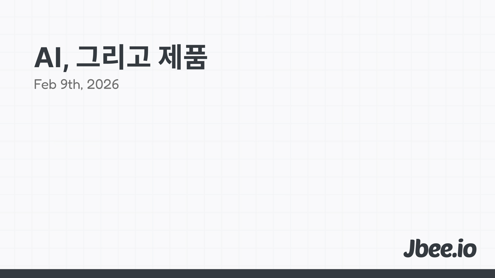

백엔드는 기능을 만들고 프론트엔드는 사용자를 만든다. 그리고 잘하는 프론트엔드는 ==팬==을 만든다.

## 잉여시간

AI로 인해 개발자의 생산성이 올라갔다. 이제는 꽤 그럴듯한 제품을 혼자서도 만들 수 있다. 이 이야기가 새로울 건 없다. 인류는 늘 이런 식으로 발전해 왔다.

농업혁명은 인류에게 잉여자본을 만들어줬다. 먹고사는 문제에서 벗어나니 사람들은 다른 것에 관심을 갖기 시작했다. 누군가는 도자기를 빚었고 누군가는 글을 썼다. 전문화가 시작된 것이다. 모두가 농사를 짓지 않아도 되는 세상이 되니 각자가 잘하는 것에 집중할 수 있게 됐다.

지금 일어나고 있는 일도 비슷하다. AI가 만들어준 ==잉여시간==에 우리는 무엇을 할 것인가. 이 질문이 중요하다. 기존에 코드를 타이핑하는 데 쓰던 시간이 확보됐다. 그 시간을 어디에 쓸 것인가에 따라 만들어지는 제품의 수준이 달라진다.

## 기술이 비즈니스를 이끈다.

기술적 가능성이 비즈니스 모델을 주도하는 사례가 점점 많아지고 있다. 수요가 기술을 이끄는 전통적인 흐름과는 결이 다르다. 기술이 먼저 가능해지니 그것을 기반으로 새로운 경험이, 새로운 시장이 만들어지는 것이다.

Netflix의 프리뷰를 생각해보자. 썸네일 위에 마우스를 올리면 짧은 영상이 자동으로 재생된다. 이 기능 하나가 사용자의 콘텐츠 탐색 방식을 완전히 바꿨다. 기획자가 "이런 거 해주세요"라고 요청한 게 아니라 기술적으로 가능해지니 자연스럽게 제품에 녹아든 것이다.

Figma의 동시 편집도 마찬가지다. CRDT(Conflict-free Replicated Data Type)라는 기술이 성숙해지면서 여러 사람이 하나의 캔버스 위에서 실시간으로 작업할 수 있게 됐다. 이 기술적 가능성이 디자인 협업이라는 완전히 새로운 시장을 만들었다. 디자이너들이 "동시 편집 해주세요"라고 요청한 적은 없다. 그런데 한번 경험하고 나니 이전으로 돌아갈 수 없게 됐다.

Linear의 Sync Engine도 빼놓을 수 없다. 로컬 데이터와 서버 데이터를 실시간으로 동기화하는 엔진 덕분에 Linear는 놀라울 정도로 빠르다. 이슈 트래커가 이렇게까지 빨라야 하나 싶지만 한번 이 속도를 경험하면 Jira로 돌아가기 어렵다. 기술이 경험의 기준을 올린 것이다.

이 사례들의 공통점은 기술이 단순히 기능을 구현하는 데 그치지 않고 ==사용자의 기대 수준 자체를 바꿨다==는 것이다. 프론트엔드 엔지니어가 이런 기술적 가능성을 탐색하고 제안할 수 있다면 그것은 단순한 구현 이상의 가치를 지닌다.

## 맛있는 경험

앱스토어를 열어보자. 천편일률적인 화면들이 보인다. 상단에 탭, 하단에 네비게이션 바, 중앙에 카드 리스트. 왜 다들 비슷할까?

이유는 간단하다. 빠르게 시장성을 검증해야 하니까. MVP를 만들고 PMF를 찾는 과정에서 간결하고 이미 잘 나가는 앱의 UI를 참고하는 것이 합리적이었다. 처음부터 화려한 인터랙션에 공을 들이다가 시장에서 외면받으면 그만큼 낭비되는 것도 없다. 지금까지 이 전략은 유효했다.

그런데 상황이 바뀌었다. AI 덕분에 그 정도 수준의 앱을 만드는 ==속도는 이미 보장==되어 있다. 천편일률적인 화면을 빠르게 만드는 것은 더 이상 경쟁력이 아닌 것이다. 누구나 할 수 있는 일이 되었다.

속도가 보장된 세상에서 중요해지는 것은 ==맛==이다. 같은 기능을 하는 앱이라도 터치했을 때 미세하게 반응하는 애니메이션, 스크롤할 때 자연스럽게 따라오는 헤더, 로딩 상태를 지루하지 않게 만드는 스켈레톤 UI. 이런 디테일들이 쌓여서 '이 앱 뭔가 좋다'는 감각을 만든다.

사람들은 이 감각을 정확히 설명하지 못하지만 분명히 느낀다. 그리고 그 느낌이 좋으면 머무른다. 잘 만든 프론트엔드는 사용자를 ==팬==으로 만든다.

## 그래서 무엇이 가능해지는가

잉여시간이 확보되고 구현의 난이도가 낮아진 세상에서 어떤 제품들이 만들어질 수 있을까? 몇 가지 방향이 보인다.

### 기존 제품을 더 잘 만든다.
이미 시장에 있는 제품이라도 경험의 밀도를 높일 여유가 생겼다. 기능은 동일하지만 인터랙션이 더 자연스럽고, 성능이 눈에 띄게 빠르고, 엣지 케이스까지 섬세하게 처리된 제품. 예전에는 '나중에 개선하자'며 미뤄뒀던 것들을 지금은 처음부터 챙길 수 있다. 같은 기능인데 더 잘 만든 제품이 이기는 시대가 오고 있다.

### 특정 페르소나를 공략한 제품이 나온다.
하나의 앱이 모든 사용자를 만족시키려던 시대가 있었다. 다양한 페르소나가 공존하는 제품은 결국 누구도 만족시키지 못하는 경우가 많다. 만드는 비용이 높았기 때문에 하나의 제품에 최대한 많은 사용자를 담아야 했던 것이다. 이제 그 비용이 낮아졌다. 특정 세그먼트의 사용자만을 위한, ==뾰족한== 제품이 가능해진다. 모두를 위한 메모 앱 대신 변호사를 위한 메모 앱, 연구자를 위한 메모 앱이 각각 나오는 것이다.

### 새로운 기술 영역이 제품이 된다.
Sync Engine, WebGPU, Local-first Architecture 같은 기술들은 예전에는 소수의 팀만 도전할 수 있었다. 구현 비용이 높았기 때문이다. 이제 이런 기술들에 접근하는 비용이 낮아지면서 이를 기반으로 한 제품이 나올 수 있다. 기술적 가능성이 제품의 출발점이 되는 사례가 더 많아질 것이다.

### 익숙한 UI가 재정의된다.
지금까지 당연하게 여겨왔던 UI가 있다. 검색은 돋보기 아이콘을 누르고 텍스트를 입력하는 것, 설정은 톱니바퀴를 눌러 깊숙한 페이지로 들어가는 것. 이런 관성적인 UI가 재정의될 수 있다. 더 편한 경험이 기술적으로 가능해졌는데 굳이 기존 방식을 고수할 이유가 있을까? 음성, 제스처, 컨텍스트 기반 UI 등 사용자가 의도를 더 적은 노력으로 전달할 수 있는 인터페이스가 등장할 것이다.

이 모든 것의 공통점은 ==만드는 비용이 낮아졌기 때문에 가능해진 것==이라는 점이다. 비용이 낮아지면 시도할 수 있는 실험의 수가 늘어난다. 실험이 늘어나면 더 좋은 제품이 나올 확률이 높아진다.

## '오늘도 개발자가 안된다고 했다.'는 이제 옛말

기획자들 사이에서 유명했던 밈이 있다. '오늘도 개발자가 안된다고 했다.' 기술적으로 불가능하다는 이유로 기획이 좌절되는 상황을 비꼬는 말이다.

근데 이제 정말 옛말이 됐다. AI로 인해 구현의 난이도가 낮아졌고 이전에는 "그건 좀..." 했던 것들이 이제는 "해볼게요"가 됐다. Sync Engine을 직접 구현하는 것도, 복잡한 애니메이션을 넣는 것도, 오프라인 지원을 추가하는 것도 예전보다 훨씬 접근 가능해졌다.

개발자가 안된다고 할 수 있는 영역이 줄어들었다는 것은 반대로 개발자가 ==제안할 수 있는 영역==이 넓어졌다는 뜻이기도 하다. "이렇게 하면 어떨까요?"라고 먼저 이야기할 수 있는 개발자. 기술적 가능성을 먼저 보여주고 제품의 방향을 함께 고민하는 개발자. 그런 프론트엔드 엔지니어의 가치는 더 높아질 것이다.

## 마무리

프론트엔드 엔지니어는 사용자 경험의 ==상방==을 뚫고 혁신하는 주체가 될 것이다. 기존 제품을 더 잘 만들고, 특정 페르소나를 깊이 파고들고, 새로운 기술로 새로운 시장을 열고, 익숙한 UI를 재정의하는 것. 이 모든 것이 프론트엔드의 영역이다. AI가 만들어준 잉여시간을 어디에 쓸 것인가. 그 답이 제품의 수준을 결정한다.

- [AI, 개발자의 뉴노멀](https://jbee.io/articles/essay/ai-and-new-normal)
- [AI, 그리고 좋은 코드 (feat. 추상)](https://jbee.io/articles/essay/ai-and-good-code)
- [AI, 그리고 학습](https://jbee.io/articles/essay/ai-and-learning)
- [AI, 그리고 Frontend](https://jbee.io/articles/essay/ai-and-frontend)
- [AI, 그리고 Engineer](https://jbee.io/articles/essay/ai-and-engineer)
- [AI, 그리고 하고 싶은 것](https://jbee.io/articles/essay/what-i-want-to-do-and-ai)
