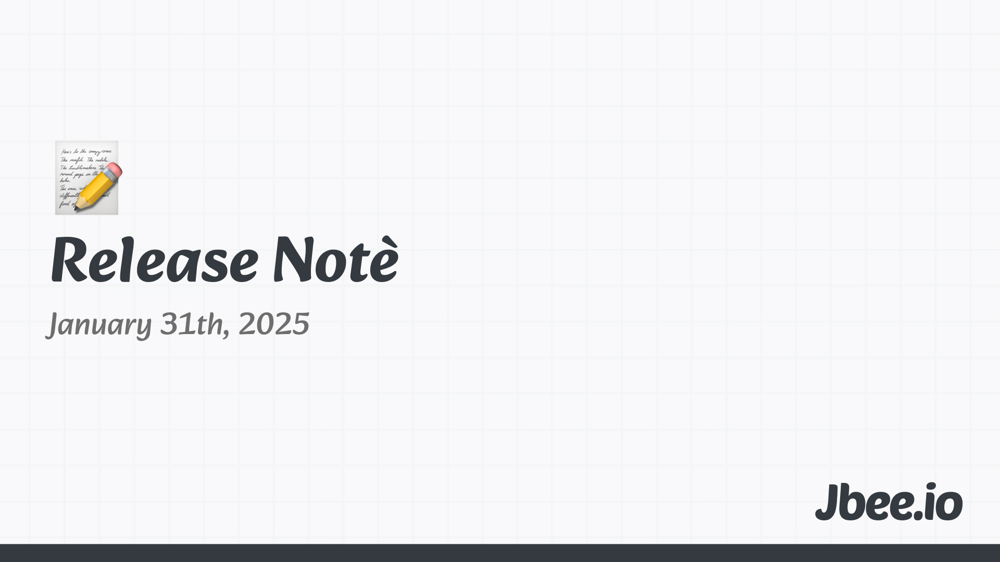

## 1월 Release Note: 영어, 기부, 니체

### 애증의 English
작년 말부터 영어에 꽤 많은 시간을 투자하고 있다. 영어 공부로 소개된 거의 모든 것을 하고 있는 것 같다. 간단하게는 스픽 앱부터 시작해서 화상영어, 미드 보기, 책 읽기, 영어 일기 쓰기 그리고 영어로 주변 환경 구성하기 까지. 언어는 참 여느 학문과 같은 것 같으면서도 다르다. 매력을 느끼면서도 현타가 오는 그런 시간이다. 왜 성인 영어 교육 시장이 이렇게 크며 '스픽' 앱이 유니콘이 됐는지 알 것도 같다. 영어 공부 내용을 올리는 스레드 계정은 꾸준히 유지하고 있다. 인풋이 많으니 컨텐츠가 마르지 않는다. 1월 31일 기준, 팔로워 2,100명이다. Stick with it!

## 기부
이사 준비를 하고 있다. 작은 집으로 이동할 예정이다. 짐을 정리하면서 사용하지 않게 된 물건들을 전부 당근에서 나눔하고 있다. 정말 순식간에 가져가신다. 더이상 입지 않는 옷도 정리했다. 버리려고 정리했더니 큰 재활용 봉투로 4봉지나 나왔다. 너무 버리기 귀찮았는데 숲스토리라는 곳에 기부를 하면 와서 가져간다고 한다. 신청하고했더니 바로 가져 가셨고 얼마 후 14만 7천원 기부했다고 연락이 왔다. 정말 너무 좋다. 책도 꽤 많은데 전부 기부할 예정이다.

## 블로그 글
그동안 글을 많이 못 썼다. 잘 써야 한다는 부담이 컸다. 남들에게 보여지는 글을 쓰려고 했던 것 같다. 뭐라도 된 것 마냥 착각했다. 다시 되돌아가 글을 쓸 예정이다. 길게 쓰려고 하지도 않고 너무 힘을 들이지도 않은 짧고 담백한 글을 쓰려고 한다. 기술에 대한 글을 거의 쓰지 않게 되었다. 생각에 대한 글과 회고 글들이 대부분 일 것 같다. 한달에 최소 2-3개의 글을 작성하는 것이 목표다. 작년부터 시작한 월간 회고는 공개하지 않았다면 올해 월간 회고부터는 공개할 예정이다. Release note라는 이름으로. 세스 고딘 작가가 글의 퀄리티가 별로더라도 꾸준히 글을 쓴다는 것에서 영향을 받은 듯 하다.

## 1월의 철학자, 니체
한달에 철학자 한명씩 살펴보고 짧게 생각을 정리하기로 했다. 첫 철학자로 니체를 고른 것은 특별한 이유는 없다. GD의 POWER라는 곡에서 우버메쉬(Ubermensch)라는 단어가 자주 들려 니체를 선택했다. 예전에 잠깐 철학책을 읽었을 때 니체를 좋아하기도 했었다.

### God is dead
'신은 죽었다'라는 선언을 한 것으로 유명하다. 이 메세지를 이해하려면 니체의 시대적 배경을 이해하는 것이 중요한데, 19세기 유럽은 기독교의 영향력이 약해지는 시기였다. 다윈의 진화론과 더불어 산업혁명이 일어나면서 사람들에게 신이 더이상 절대적이지 않게 된 것이다. 즉 단순히 무신론적 주장이라기 보단 기존 가치 체계의 붕괴를 의미한다. 특정 한 사람이 신을 죽였다는게 아니라 인간이 신을 믿지 않게 되었고 이를 죽었다고 표현했다.

그리고 이 공백과 허무주의(Nihilismus)를 극복하는 초인(Übermensch)이라는 개념을 제시한다.

### Übermensch
니체가 말하는 초인은 자신만의 가치를 창조하는 인간을 말한다. 기존의 종교, 전통, 규칙에 얽매이지 않으면서 자신만의 가치관을 만들어 삶을 주체적으로 창조하는 사람을 초인이라 말한다. 당연히 본인도 포함이다. 종교를 깨고 새로운 철학을 창조하려 했다는 점에서.

기존의 틀을 깨는 것부터 도전이고 쉽지 않은 과정일텐데 이런 불확실성을 극복하는 태도 또한 초인이 갖추어야 하는 태도라고 한다.

### Eternal Recurrence

> "네가 지금 살고 있는 이 삶이 무한히 반복된다면, 너는 그것을 기꺼이 받아들일 수 있겠는가?"

영원 회귀는 자신의 삶이 영원이 반복되는 것을 말하며 일종의 사고 실험이다. 마치 슈뢰딩거의 고양이 처럼. 이 철학적 사고 실험은 현재에 집중하게 한다. 이 선택이 영원히 계속된다면 어떤 선택을 할 것인가, 후회없는 선택은 무엇인가 고민하게 한다.

'이 순간이 마지막이라면?'이라는 물음은 스티브잡스 연설을 떠올리게 한다.

### 니체가 주는 질문
처음 떠올린 질문은 '긍정'이다. 내 삶을 온전히 긍정하기 위해 무엇을 시도해볼 수 있을까? 이에 대해 'Amor Fati',  인식의 전환, Reframing이라고 스스로 답을 내렸다. 나에게 주어진 시련을 Reframing 한다면? '아 너무 성장해버렸더니 밸런스 패치가 이뤄졌다. 피버타임!'. 무언가에 실패한 것을 Reframing 한다면? '실패로부터 배울게 아직 남아서 실패했구나!'

나만의 삶의 의미는 어떻게 찾을 수 있을까? 두번째 질문이고 세 가지 가설로 정리했다.
1. 의심 - 기존에 추구하던 것들이 남들이 원하는 것은 아닌지 진정 내가 원하는 것인지 의심하기
2. 경험 - 충분히 새로운 경험을 위한 시도를 하고 있는지 살펴보기
3. 흥미 - 내가 원하는 것을 잘 알고 있는지 더 없는지 찾아보기

## 마무리
어쩌다 보니 새해와 잘 어울리고 AI 혁명(?) 시대와 잘 어울리는 철학자를 선택했다. 내가 정리한 이 내용이 얼마나 정확한지 딱히 중요하지 않은 것 같다. 니체의 철학에 대해 알아가면서 영향을 받은 부분이 조금이라도 있었다면 의미있다고 생각한다. 삶의 의미를 고민하거나 인생의 전환점을 맞이했다고 생각하는 사람들에게 니체를 추천하고 싶다.

그나저나 1월이 너무 빠르게 지나간 것 같은데, 작년 회고에도 똑같이 쓰여져 있더라.
