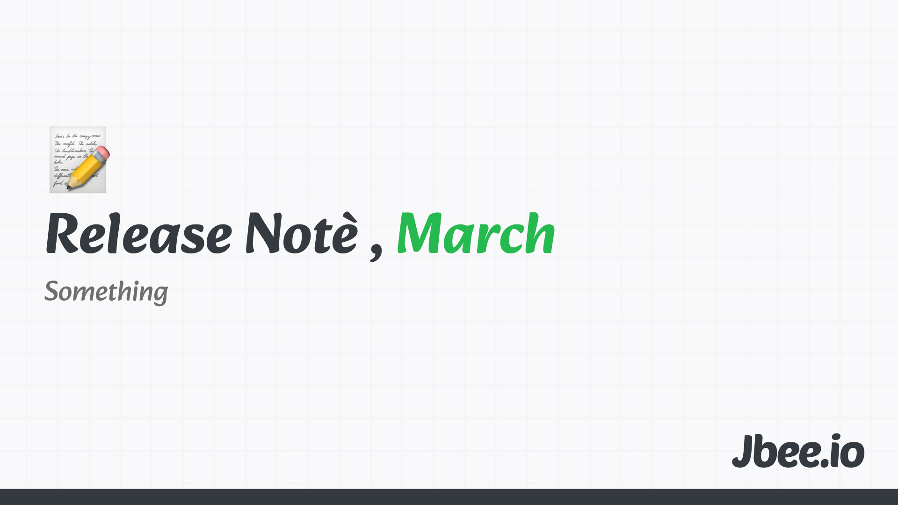

>3월, March. March라는 단어는 로마 전쟁의 신, 마르스(Mars)에서 유래한다. 로마의 3월은 한해의 첫번째 달이었다. 봄이 시작되며 전쟁을 준비하는 시기였다. 그래서 전쟁의 신의 이름을 따와 'Martius'라고 명명했고 이것이 March로 바뀌었다.
 
얼었던 공기가 녹으면서 괜히 걷고 싶게 했다. 금방 더워지고 짧았던 계절인데, 올해 3월은 유독 사건이 많다.

### 3월의 철학자, 한나 아렌트

이번 달엔 [Hannah Arendt, Action 한나 아렌트](https://jbee.io/articles/philosophy/hannah-arendt)에 대해 정리했다. 어설프게 하고 있던 생각이 어떤 철학자에 의해 정리될 때 약간의 희열을 느끼는 것 같다. [AI, 그리고 하고 싶은 것](https://jbee.io/articles/essay/what-i-want-to-do-and-ai) 글에서 의미에 대한 이야기를 했는데 조금 더 구체화됐다.

### 3월의 영화, 미키17
봉준호 감독님의 [Mickey 17](https://en.wikipedia.org/wiki/Mickey_17)을 봤다. 비판적인 요소들이 나에겐 ==스타트업== 같았다. Mickey 17은 우리에게 필요한 정신과 경계해야 하는 것을 알려줬다.

17의 회복탄력성과 다정함, 18의 희생 정신과 강인함, 나샤의 저항 정신과 용맹함이 필요한 정신이다. 마샬이라는 독재자는 시종일관 보여지는 것에 집중한다. 그의 아내는 음식이라는 본질이 아닌 소스라는 부수적인 것에 집중한다. 이 두 모습을 통해 우리가 무엇을 경계해야 하는지 얘기한다.

혼자서 달성할 수 있는 임팩트와 팀을 이뤄 달성하는 임팩트는 다르다. 함께 가야 멀리 간다는 말, 참 말이다.

### 생각 1. 위기
> 위기=위험+기회

위기는 '위험'이면서 동시에 기회라는 말은 단순히 격려나 동기 부여를 위한 말이 아니다. 어떻게 하느냐에 따라 다르니 똑바로 하라는 얘기다. 진짜 위험에 빠지느냐 이것을 기회로 살릴 수 있느냐 ==역량==에 대한 말이다.

3월이 되자 마자 제품에 반갑지 않은 사건이 생겼다. 수익과 직결되는 위기였다. 그러나 이 위기는 우리만의 위기가 아니라 경쟁사에게도 위기였다. 이 기회를 잘 살리면 우리는 살아남고 경쟁사는 정리될 수 있는 것이다.

### 생각 2. 잘 만들기
> 이젠 무엇을 해야 할까.

온 세상이 AI로 생산성 증대에 집중한다. 그 결과 비약적으로 증가했다. 프로토타이핑은 말도 안 되게 빠르게 만들 수 있게 되었다. 초기 단계 제품의 마켓 fit 을 검증하기 위한 이터레이션은 한 두명의 개발자로 빠르게 진행할 수 있다. 그렇다면 앞으로는 무엇에 집중해야 할지 고민해야 한다. 생산성 증대는 이미 이뤄지고 있고 모두가 제품을 빠르게 만들 수 있는 소프트웨어 양산형 시대가 됐다면 이젠 무엇을 해야 할까. 잘 만들어야 한다. 이와 관련해선 [AI, 그리고 Engineer](https://jbee.io/articles/essay/ai-and-engineer)글에서 정리했다.

## Worth the click

3개의 아티클.

### Great movie theory
본문: https://www.workingtheorys.com/p/great-movie-theory

글에선 이 세상을 움직이는 것이 영화라고 한다. 위대한(Great) 사람들이 영화에 영향을 받고 비전을 만들고 회사를 세웠기 때문이다. 어느 정도 일리가 있다고 생각한다. 나는 여기에서 '영화'라는 부분을 ==이야기==로 대체하고 싶다. 이 세상은 이야기로 구성되어 있다. 개개인도 어떤 이야기의 집합이다. 역사가 영어로 history인 것부터 story가 얼마나 중요한지 말하고 있다. 실제로 영화도 어떤 이야기로 구성된다. 나도 나만의 이야기를 쌓아가고 있다. 언젠가 내 이야기를 글로 쓰고 싶다.

### Thinking in react-lynx
본문: https://lynxjs.org/react/thinking-in-reactlynx.html

Cross platform 쪽에 여러 가지 변경사항이 있다. [Fernando](https://github.com/nandorojo)가 Vercel에 합류하는가 하면 ByteDance 팀에서 [Lynx](https://github.com/lynx-family/lynx)를 오픈소스로 공개했다. RN, Flutter, KMP 등 이미 여러 플레이어가 있는 Cross platform에 새로운 대안이 등장한 것이다.

thinking something 글은 해당 프레임워크가 무엇을 지향하는지 잘 드러내고 있다. Main thread와 Background Thread를 나눴다. 'background-only'라는 directive도 있다. 낯섬 예산을 최소화하기 위해 React를 내세우기도 했다.

[AI, 그리고 Engineer](https://jbee.io/articles/essay/ai-and-engineer) 글에서도 얘기했는데, Quality가 중요해질수록 Cross platform 보단 Native가 중요해지지 않을까 싶은데, 어떤 추세로 움직일지 기대되는 분야이다.

### 10 rues for crafting products that stand out
본문: https://www.figma.com/blog/karri-saarinens-10-rules-for-crafting-products-that-stand-out/

이 글을 읽고 문화는 Top-down이란 생각이 더 견고해졌다. Quality를 제대로 정의하는 것이 중요할 것 같은데 이것이 제품에 따라 다르게 정의되지 않을까 하는 생각도 든다.

### 지난 회고
- [2025.02 Release Note](https://jbee.io/articles/essay/release-note-2025-02)
- [2025.01 Release Note](https://jbee.io/articles/essay/release-note-2025-01)
- [Release Note Beginning](https://jbee.io/articles/essay/about-release-note)
