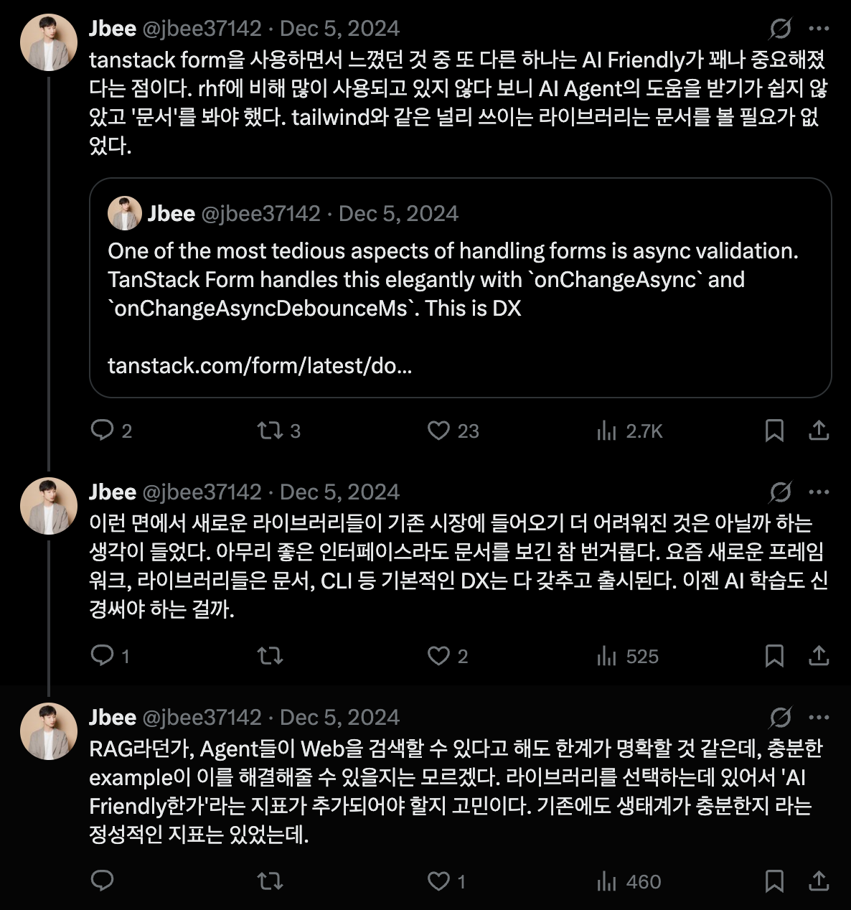
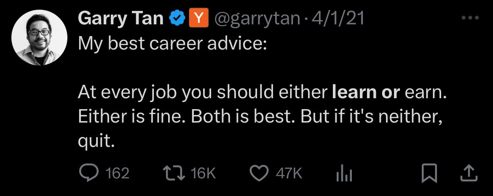

> 5월, May는 Maia라는 로마 신화 여신에서 유래했다고 한다. 봄과 성장, 풍요의 여신이라는데 별의별 신이 다있다.

5월 초 연휴동안 샌프란시스코에 다녀왔다. [Figma가 주최하는 컨퍼런스 Config](https://jbee.io/articles/etc/config2025)에 참석하고 Google, Meta, Vercel 등 몇몇 회사들을 방문했다. 자극 많이 받고 돌아왔다. (영어 자극...) 이를 두개나 뽑았다. 만들고 있는 제품에선 정산 지옥을 겪었다. 돈을 직접 다뤘다보니 스트레스를 많이 받았는지 입병을 심하게 앓았다. 창업하신 분 4분, 규모가 있는 팀의 리더 분 등 만날 기회가 되는 대로 만나고 다녔다. 그리고 [팟캐스트](https://substack.com/@frontendfm)를 시작했다. 관련해선 블로그 [글](https://jbee.io/articles/etc/start-frontendfm)로 다뤘다. 마지막 주엔 팟캐스트 발행과 회고 발행이 겹치는데 어떻게 잘할 수 있을지 고민이다.

## 5월의 책, 결핍은 우리를 어떻게 변화시키는가
사실 책에서 주로 말하는 내용보다도 =='느슨함'==에 대한 이야기가 좋았다. 도미노를 할 때 중간에 비어있다면 실수를 했을 때 전체가 무너지지 않는다. 일정을 테트리스 하다 보면 뒤 일정에 늦을까봐 앞 일정에 집중하지 못하는 경우도 생긴다. 실제로 사회 실험 중 수술 베드를 하나 비워두면 병원의 복잡도가 급격히 낮아진다는 실험 결과도 있다.

모든 것을 통제할 수 있다는 가정하여 계획을 세우고 추진하는데, 세상은 그렇게 만만치 않다. 어느 정도의 버퍼와 임기응변으로 대응할 수 있는 체력은 남겨둬야 하지 않을까. Google도 80:20이라는 비율을 고수하는 것처럼. (물론 요즘도 그러는지는 모르겠다.) 느슨함이라고 하면 부정적인 느낌이 있는데 여유라고 하면 좀 낫다. 여유를 갖는 것이 생각보다 더 중요하지 않을까.

==상상==할 수 있는 여지를 남기는 것이 도움될 때가 많다. 채용 공고를 작성할 때도 지금 어떤 제품이 만들어지고 있는지 구체적으로 소개할 수도 있고 추상적으로 설명할 수도 있는데, 구체적일수록 지원자로 하여금 상상할 수 있는 영역이 좁아진다. 물론 사람에 따라 다르겠지만 상상할 수 없다면 비전에 설레는 것이 적어질 수 있지 않을까? 하는 생각을 했다.

### 힘 빼기
여유라는 단어를 해석하기에 따라 여러 표현으로 바꿀 수도 있겠다. 조승연 탐구생활 Youtube 영상에서 힘 빼기에 대한 얘기를 했다. 테니스라는 운동을 예시로 들면서 힘을 빼야 제대로 공을 받아칠 수 있다는 것이다. 또 최근엔 대표님과 팀 미팅을 하는데 힘을 좀 빼고 프로젝트를 진행하자는 이야기를 했다. 기대했던 프로젝트가 잘 되지 않기도 하고 기대하지 않았던 프로젝트가 잘 되는 것이 프로젝트이기 때문에 어느 정도 힘을 빼는 것도 중요하다는 이야기를 나눴다.

## 5월의 영화, 블랙 위도우
미국행 비행기에서 봤다. 원래 마블을 좋아하기도 하고 마침 안 본 영화가 있어 보게 됐는데 기대 이상이었다. 평가 절하된 영화 아닌가 하는 생각도 들었다. 기본적으로 마블에서 나온 액션 영화다. 비교적 최근 나온 마블 영화치고 액션도 나쁘지 않았다. 물론 액션이 좋아서 5월의 영화로 들고 온 것은 아니다. 액션 속에 있는 이야기를 얘기하려고 한다.

### 악의 평범성
블랙 위도우를 관통하는 내용은 가족이다. 스토리 가운데에 어떤 '실험'이 있다. 실험의 연구원은 나타샤의 엄마였다. 이 엄마는 정말 연구에만 집중하는 연구원이며 결과만 놓고 봤을 땐 연구자로서의 성취를 이뤘다. 근데 이 연구가 사실 도덕적인 것이 아니었고 자신의 딸, 그러니까 실제 딸은 아니고 가짜 딸이긴 한데, 아무튼 이 함께 지냈던 아이가 실험 대상이었다는 것을 뒤늦게 알게 되면서 태도를 바꾼다. [아렌트](https://jbee.io/articles/philosophy/hannah-arendt)는 진짜 위험한 것은 사악한 개인이 아니라, 아무 비판 없이 시스템에 순응하는 사람들이라고 말했다.

### SNS와 최적화
최근 SNS 인플루언서들과 함께 하는 제품을 만들고 있다. 자연스럽게 SNS 생태계를 가까이 접하게 된다. 그러면서 알고리즘에 대해 생각을 하곤 한다. SNS를 개발하는 Engineer들, Designer들은 끊임없이 스크롤을 내리게 하는데 과연 이것이 옳은 엔지니어링일까. 편향된 추천으로 서로를 이해하지 못하게 만드는, 어쩌면 양극화를 조장하고 있을 이 알고리즘을 개발하는 것이 옳은 엔지니어링일까.

내가 지금 하고 있는 일이 어떤 영향을 미치는가? 어떤 의미를 갖는가? 그래서 왜 하는가?를 아는 것과 모르는 것은 정말 다르다고 생각한다. 일에 임하는 자세부터 만들어낼 수 있는 결과물까지 달라지곤 한다. 물론 모든 일이 의미있고 내가 잘할 수 있는 일과 지금 해야 하는 일까지 정렬되는 경우는 거의 없다. 의미를 찾으려 하고 스스로 동기부여하는 것 또한 중요하다고 생각한다.

아무튼 뭐 난 일의 ==의미==를 꽤나 중요하게 생각하는 것 같다.

## 생각 1. Bundle and Unbundle
웹 개발에서 사용하는 번들러 얘기는 아니다. 물론 토스가 최근에 [Bundling fundamental](https://frontend-fundamentals.com/bundling/)이라는 멋진 문서를 공개했다. 자바스크립트 생태계도 번들링을 하는 경우가 있고 그렇지 않은 경우가 있는데, 소프트웨어 생태계도 비슷하다는 생각을 했다.

이메일과 Jira면 모든 것이 가능했던 때가 있었다. 그러다가 Slack이 등장하면서 업무용 메신저를 따로 사용하고 역할에 맞는 CMS(Contents Management System)가 등장했다. 하나만 잘하는 Notion, Asana, Clickup, Linear, Stripe 등의 Saas들이 생겨났다. '똘똘한 한채만 키우자.' 느낌이랄까.

그런데 최근 MCP, Agent의 등장으로 다시 각 제품들이 하나둘씩 =='Bundle'== 되고 있다. 각각의 도구는 하나의 문제를 잘 해결했지만 일을 하다보면 도구 간의 정보가 공유되어야 하는 경우가 꽤 있다. 그럴 때마다 번거로운 과정이 필요했는데, 경계가 점차 사라지고 있는 것 같다. Notion은 Google workspace 자리를 노리듯 Calender, Mail 기능을 출시했으며 Slack은 Huddle에 이어 Canvas라는 기능을 추가했다. Linear는 MCP를 통해 이런 저런 연동이 쉬워졌다.

최근 AI 도구들도 빠른 속도로 Bundle 되고 있다. Notion은 AI Meeting Note 기능을 추가했으며 Google은 할 수 있는거 다하는 느낌이다. 이제 누가 bundle된 제품의 중심을 가져가느가 싸움이지 않을까.

## 생각 2. Winner takes all
Google I/O를 보고 다들 Google이 Google 했다라는 이야기를 한다. 내부의 이야기를 들어보면 온 회사가 AI에만 집중한다, 컨퍼런스 드리븐 개발에 갈리고 있다 등 다양한 이야기가 있던데, 그 결과물은 참 멋있다. 이미 잘하고 있는 회사가 또 이기는 역사가 반복될까? 바쁘게 돌아가는 이 AI 경주에서 원래 승자가 결국 이기게 될까?

잘 나가는 회사들이 합병된다. 이번달만 하더라도 Google이 [Galileo AI](https://www.usegalileo.ai/)를 인수했고, Open AI가 [windsurf](https://windsurf.com/editor)를 인수했고 Databrickss는 [Neon database](https://www.databricks.com/company/newsroom/press-releases/databricks-agrees-acquire-neon-help-developers-deliver-ai-systems)를 인수하는 등 내가 사용해봤던 제품들이 합병을 했다. 또 Salesforce는 Slack을 인수한 뒤로 가장 큰 합병인 [informatica를 인수](https://www.informatica.com/about-us/news/news-releases/2025/05/20250527-salesforce-signs-definitive-agreement-to-acquire-informatica.html)했다. 규모의 경제 앞에 답이 없는 것일까?

AI가 중심이 되면서 개발에도 이런 현상이 있다. React가 거의 표준이 됐다는 것이다. No-code를 지향하는 (거의) 모든 제품들은 React로 클라이언트를 구성한다. 오죽하면 React is last framework라는 말까지 나왔을까. ([Weekly 250525 팟캐스트](https://substack.com/home/post/p-164390512)에서 다뤘다.)

나도 오래 전, 그동안 AI가 학습한 양을 따라잡을 수 없기 때문에 새로운 라이브러리, 프레임워크들이 등장해도 자리잡기 쉽지 않을 것이라는 트윗을 한 적이 있다. Docs, Ecosystem, Tooling, Example 등을 아무리 잘 준비한다고 하더라도 여태 학습한 내용을 이길 수 있을까? React가 나쁘다는 것은 아닌데, 기술의 다양성이 사라지고 다양성 속에서 발전해가는 모습이 점차 사라지는 것 같아 아쉽다.

오히려 시스템이 잘 갖춰만 진다면 더 빠르게 학습할 수 있고 기존 프레임워크에서 새로운 프레임워크로의 마이그레이션까지 더 쉬워져 경계가 사라질 수도 있겠다. 사실 이 수준이면 자연어가 최상위 수준의 언어가 되지 않을까 싶다.

[https://x.com/jbee37142/status/1864527254807826892](https://x.com/jbee37142/status/1864527254807826892)

## 5월의 영화 비포 선라이즈 그리고 선셋
영화를 꽤 많이 본 달이라 하나 더 간단하게 소개하려고 한다.

이 두 영화는 1주 간격을 두고 연달아 봤는데, 내 인생 영화 중 패스트 라이브즈와 비슷한 느낌의 영화라는게 불현듯 떠올랐다. 비포 선라이즈는 꽤 오래전에 보고 다시 본 영화인데 다시 봐도 좋았다. 원 테이크로 이렇게 긴 대화를, 이렇게 자연스럽게, 이렇게 빠져들게 잘 연출했는지 새롭게 다가왔다. 비포 선셋의 엔딩은 충격적이었고 영원히 기억에 남을 것 같다.

> 너 그러다가 비행기 놓친다

느슨함, 여유에 대해 이야기했는데, 이를 ==공백(Empty)==로도 치환할 수 있을 것 같다. 두 영화 모두 이야기에 잘 초대해두고 중요한 부분에 대한 연출과 설명을 생략함으로써 상상할 수 있게 했다. 아무튼 인연이라는 것이 있다고 믿는 것이 아름다운 세상인 것 같다.

## Worth the clicks
- 브라더스키퍼 : 칼을 품고 자란 보육원 소년, 식물로 형제들의 삶을 지키다
	- 우연히 롱블랙에 올라온 글을 읽게 됐는데, 울림이 있는 글이었다. 구독하고 싶게 만드는 글이었다.
	- 이번 달 회고 내용에 일의 의미에 대한 부분이 있는데, 말로만 일의 의미를 중요하다고 하는 나를 되돌아보게 하는 글이었다.
	- 내가 평생 알 수 없는 영역이 있다는 것을 깨닫고 다시 한번 겸손해졌다.
	- '결국 우리도 언젠가는 고아가 됩니다.'
	- 출처: [https://www.longblack.co/note/1455](https://www.longblack.co/note/1455)
- Distinguished Engineer (E9)
	- 빅테크에서 E9이라는 높은 레벨의 직급을 가진 엔지니어의 여러 생각을 엿볼 수 있는 인터뷰 영상이다.
	- 매니저가 될 준비라는 질문에 스스로에게 '당신은 당신을 위해 일하고 싶습니까?'라는 질문을 해보라는 부분이 인상깊었다.
	- 동의하지 않아도 헌신한다. 방향이 틀렸다고 생각해도 팀이 함께 가는게 중요하다. 이 자체가 가치있는 일이다.
	- 최근 인터뷰에 대한 책도 읽고 내가 인터뷰어라면 어떤 질문들을 하게 할까 틈틈히 고민해보는데 이 점에 있어서도 배울 점이 있는 인터뷰 영상이었다.
	- 출처: [https://www.youtube.com/watch?v=v2JxdjTi_1I](https://www.youtube.com/watch?v=v2JxdjTi_1I)

### 지난 회고

- [2025.04 Release Note](https://jbee.io/articles/essay/release-note-2025-04)
- [2025.03 Release Note](https://jbee.io/articles/essay/release-note-2025-03)
- [2025.02 Release Note](https://jbee.io/articles/essay/release-note-2025-02)
- [2025.01 Release Note](https://jbee.io/articles/essay/release-note-2025-01)
- [Release Note Beginning](https://jbee.io/articles/essay/about-release-note)
