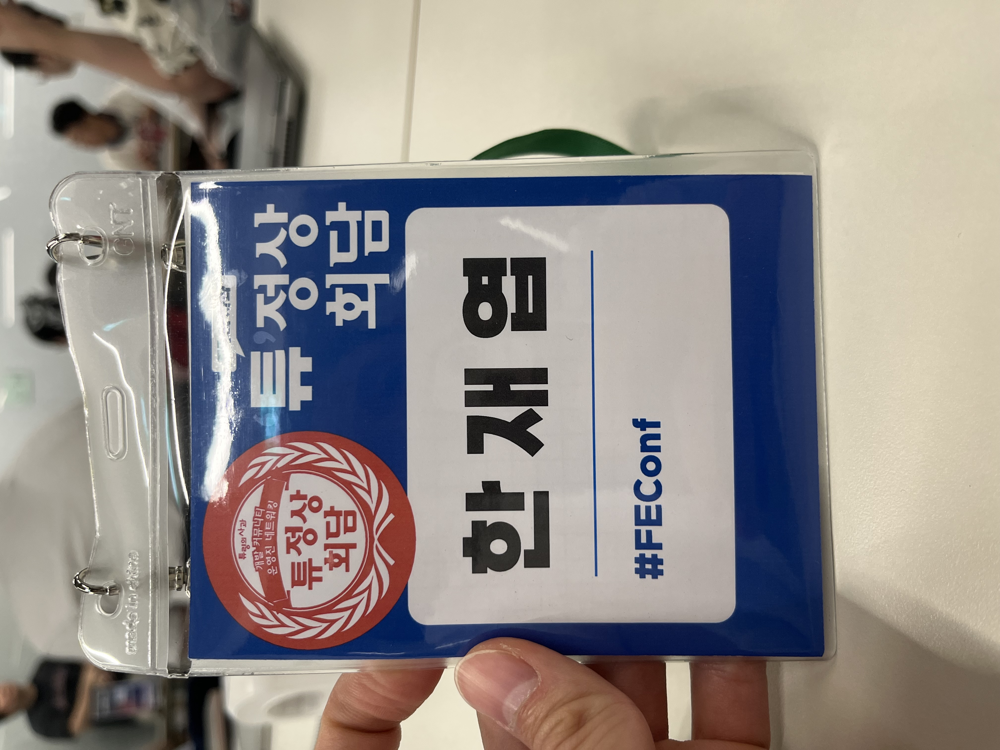
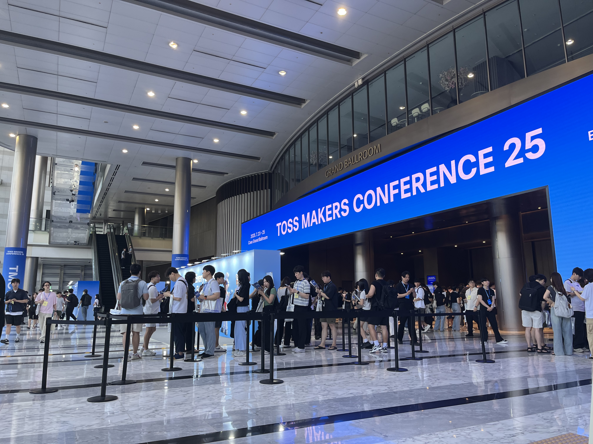
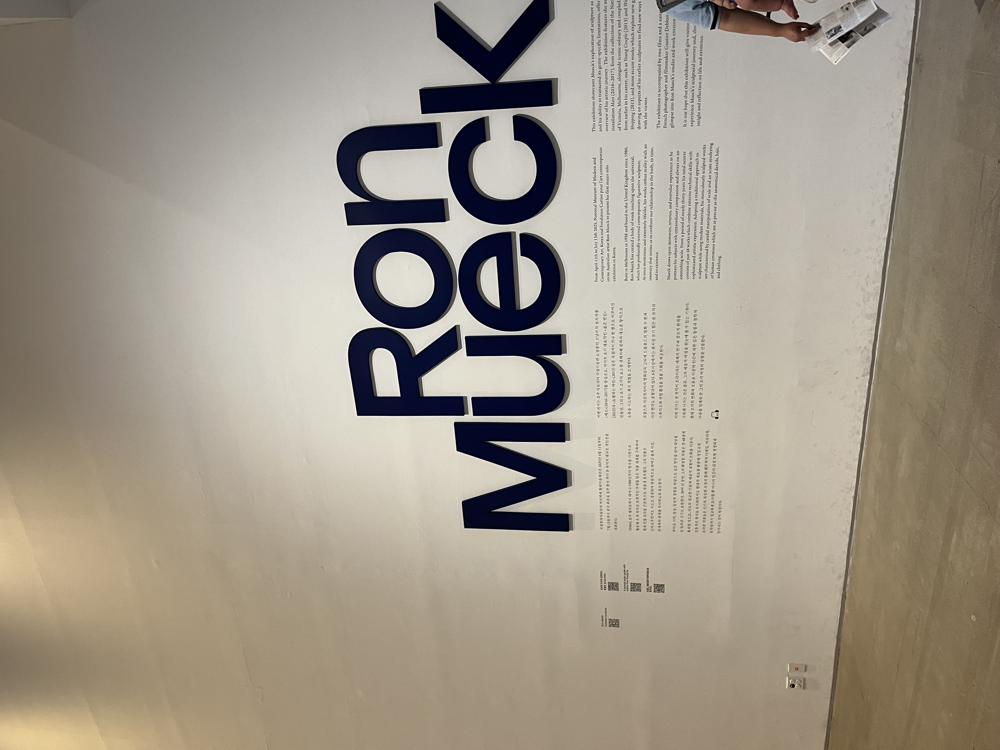
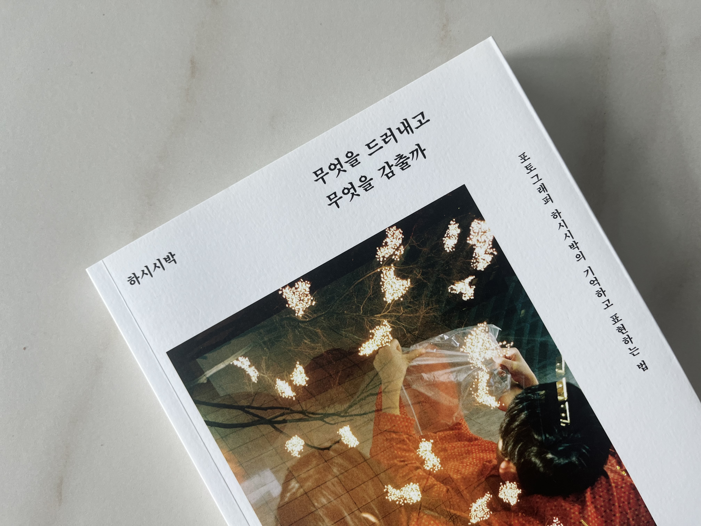

작년 7월은 조용했다. 기록을 보니 꽤 여러 책을 펼쳤다 덮었다. 올해도 크게 다르지 않았다.

알람없이 일어나고 뛰고 싶은 만큼 뛰고 배고프면 먹는다. 딱히 시간을 정해두지 않는다. 읽고 싶었던 것을 읽고 보고 싶었던 것을 챙겨본다. 끝까지 읽거나 마지막까지 보려고 하지 않는다. 쓰고 싶은 것을 쓰지만 쓰다 만 글이 더 많다.

바쁘다며 멀어진 사람을 만나고 좋아하는 사람들과 어울린다. 낯선 사람을 만나기도 한다. 다양한 이야기들이 있다.

졸리면 자고 멍 때리면서 내가 해야 하는 최소한의 것들을 지키며 여유를 흘려 보낸다. 시간을 눌러 담으려고 힘쓰지 않는다. 두달이 넘어가니 하고 싶은 것이 생긴다. 이런 생활이 에너지를 주는 것 같다. 안그래도 다음주면 백수 생활이 끝난다. 영혼이 충만해지는 이 느낌을 잃는 것이 아쉽기도 하지만 한편으론 새로운 도전에 대한 기대감으로 가득하다. 벌써 머리로는 일을 하고 있다.

## 커피챗
> 나는 내가 만난 사람의 총합이다.

일부러 낯선 사람들을 많이 만났다. 불확실성이 높은 시대인 만큼 불안을 호소하는 분이 많았다. 해줄 수 있는 것은 나 또한 불안하다는 얘기와 나의 공상 뿐이었다. 전직장 동료가 이 이야기를 듣고 불안이 실패를 두려워하는 것에서 나오는 것은 아닐까 라는 얘길해줬다. 꽤 공감이 됐고 관련해서 글도 쓰게 됐는데 누군가에게 위로가 되는 글이면 좋겠다. (이전 글, [재능을 고민한 적도 있었지](https://jbee.io/articles/essay/about-talent))

내 작은 경험이 도움을 주는 대화가 있었고 나 또한 세상에 대한 관점을 넓힐 수 있는 기회였다.

## 돌아다니기
일부러 여기 저기 돌아다녔다.

### 커뮤니티 그리고 FEConf
[튜링의 사과](https://turingapple.com/)에서 커뮤니티를 운영하는 사람들의 모임이 있다는 것을 듣고 참석했다. 법인이 아니라 겪는 세금 문제, 후원사와 연락하는 문제, 장소 대관 문제 등 여러 이야기를 나눴다. 컨퍼런스 운영의 공통적인 에로 사항은 단연 돈이다. 돈을 벌기 위해 모인 조직이 아니고 실제로 수익을 내야 하는 회사도 아닌데 이야기의 중심이 돈이었다. 역설적이었다.

행사 본질에 대한 이야기를 더 나누지 못해 아쉬웠다. 더 좋은 컨텐츠를 제공하는 법, 밋업, 컨퍼런스 형태가 아닌 다른 형태로 생태계에 기여하는 법 등 다양한 이야기를 나눴으면 어땠을까. 다음 기회엔 이런 이야기를 하면 좋겠다.

더 나아가 그들을 움직이게 하는 것이 무엇인지 궁금했다. 이토록 헌신적인 그들은 어디에서 동기부여 받을까. 해본 사람만 안다. 그들이 고작 하루 이틀 진행되는 행사에 얼마나 많은 시간을 투자하고 얼마나 깊은 고민을 하는지.

그래도 행사나 커뮤니티를 운영하시는 분들을 이렇게 한 자리에서 뵙는게 소중했고 공감의 현장이라서 즐거웠다.

### Toss MAKERS Conference
참가자 확정이 추첨이었는데 운이 좋게도 발표자 초대권을 받아 다녀왔다. 컨퍼런스를 준비하는 입장에서 여러 영감을 받기도 했지만 무엇보다 오랜만에 만나는 토스 동료들이 반가웠다. 이렇게 준비하는 것도 일이고 일이 바쁜 와중에 자신의 경험을 공유하려고 하는 발표자 분들도 멋있었다.

유명해지려고 발표하는 거냐는 한심한 생각은 이제 그만했으면 좋겠다.

### 론 뮤익 전시
조각 전시는 처음 다녀왔다. 솔직히 무언가를 느끼고 온 것은 아니다. 진짜 같네. 이정도? 근데 어떤 생각의 전과 후로 조각을 보는 시선이 달라졌는데, '내가 직접 만든다면?'이라는 생각을 하고 조각을 봤더니 조각에 새겨진 디테일 한 주름들이 눈에 들어왔다. 묘사하려고 신경 쓴 표정들이 눈에 들어왔고 시선 처리라던가 살짝 벌어진 입이라던가 하나 하나 의도가 궁금해졌다. 생각하는대로 보이는구나 싶었고 직접 해보는 것도 참 중요하겠다는 생각을 했다.

### 비효율
> 최단거리 같은거 모르는 그런 매일로 살고 싶다고 생각한다. - '생각없는 생각', 료

얼마 전 커피 원두를 사면서 비효율에 대한 이야기를 나눴다. 드립 커피는 참 커피를 내리기까지 번거로운 과정이 많다. 하지만 그만큼의 가치가 있어서 행복하다. 이런 얘기였다. '빠른 환승'을 하기 위해 몇번에서 타야하는지 계산하면서 항상 가던 길을 걷곤 한다.

우연에서 오는 행복을 많이 놓치고 있다는 생각을 했다. 러닝을 하더라도 다른 코스로 달려보고 조금은 느려질지라도 새로운 것을 발견하는 기쁨을 되찾으려고 이곳 저곳 돌아다닌 것 같다.

## 사진
문득 사진을 공부하고 싶다는 생각이 들었다. 사랑하는 것을 더 잘 담아두고 싶은 마음이다. YouTube 영상을 보기도 하고 책을 보기도 했다. 최근엔 포토 에세이를 보면서 이야기와 함께 사진을 보고 있다. 사진만 보면 잘 찍은 것 같긴 한데, 왜 이렇게 찍은지 모르겠더라. 2권의 포토 에세이를 읽었다. 카메라도 안 샀지만 사진이 품고 있는 의도를 파악하는 것이 재밌다.

> 왜 이 프레임일까 왜 이만큼만 담았을까.

직업병인지 몰라도 사진 촬영이 개발이랑 비슷하다는 생각했다. 촬영은 추상화의 과정이다. 무엇을 프레임안에 담고 무엇을 덜어낼지 결정한다. 대상을 어떤 관점으로 바라보느냐에 따라 결과물이 달라진다. 피사체를 사랑하는 만큼 좋은 결과가 나오는 것 같다. 이제서야 시작한 초보지만 많이 찍어보고 많이 수정해보려고 한다.

주변이나 사물을 괜히 관찰하게 된다. 괜히 프레임에 담아본다. 그러면서 한번 더 보게 되고 낯설게 느껴진다. 시간이 느리게 흘러간다. 이게 매력인가 싶다.

## 수영 그리고 러닝
3년 동안 꾸준히 하던 수영을 잠시 쉬려고 한다. 선수가 될 것도 아니고 더 잘해지고 싶지 않았다. 수영을 사랑하는 만큼 자주 영업하고 다녔는데 글 하나 써야겠다. 정말 좋은 운동이었는데, 러닝이라는 대체 운동을 찾아서 환승이별한다.

거의 주 5일은 꼭 뛰었다. 가벼운 마음으로 시작했는데 몸에 맞는지 꾸준히 하게 됐다. 9월엔 10km 마라톤 완주를 목표로 잡고 기록을 조금씩 올리고 있다.

## Worth the clicks
- 최성운 사고실험 - 런던베이글뮤지엄 료님 인터뷰
	- 그냥 료님의 표정 자체만으로도 이 사람이 얼마나 담금질을 많이 했는지 느껴졌다.
	- "스스로와 친구가 되어 자신만의 비법을 찾아야. 누군가의 비법은 더이상 비법이 될 수 없다."
	- "나를 감동시키기 위해 만들었더니 대중적이었더라"
	- "누군가 닮지 않은 것이 너무나 근사한 것이라는 것을 알았으면 좋겠다."
	- "온갖 수모를 겪고도 계속하는 것"
	- 영상
		- https://www.youtube.com/watch?v=dTsoGnT7Fb4
		- https://www.youtube.com/watch?v=B3-FlLuKsgE

## 마무리
정말 더운 7월이었다. 료님으로 시작하여 료님으로 끝나는 달이다. 책도 료님의 생각없는 생각을 읽었고 료님의 인터뷰도 좋았다. 이 회고로 첫 월간 회고 모임에 나간다. 킥오프 때 자기소개로 3시간을 보낸 모임이다. 얼마나 재밌는 얘기가 오가려나.

### 지난 회고

- [2025.06 Release Note](https://jbee.io/articles/essay/release-note-2025-06)
- [2025.05 Release Note](https://jbee.io/articles/essay/release-note-2025-05)
- [2025.04 Release Note](https://jbee.io/articles/essay/release-note-2025-04)
- [2025.03 Release Note](https://jbee.io/articles/essay/release-note-2025-03)
- [2025.02 Release Note](https://jbee.io/articles/essay/release-note-2025-02)
- [2025.01 Release Note](https://jbee.io/articles/essay/release-note-2025-01)
- [Release Note Beginning](https://jbee.io/articles/essay/about-release-note)
