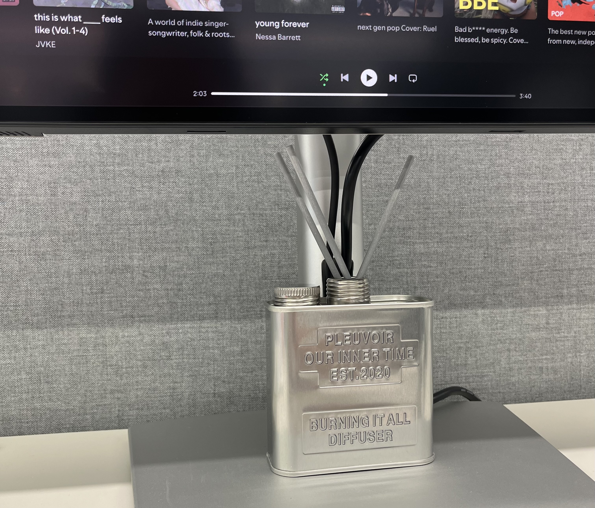
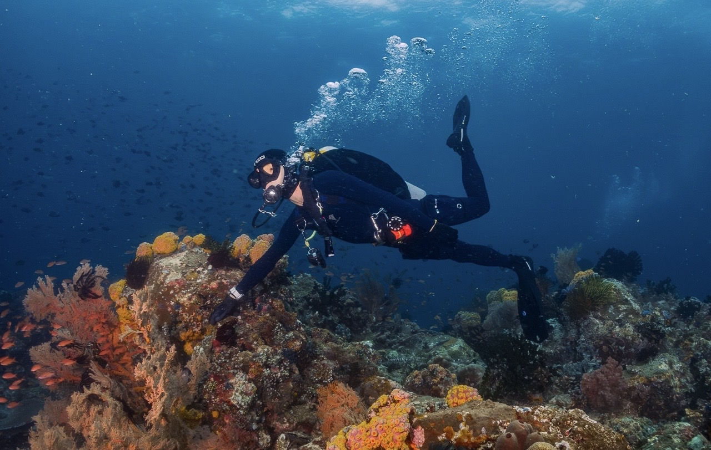

작년 이 즈음 당근이라는 새로운 팀에 합류하여 정신없어 온보딩했다. 온보딩 세션에서 따뜻한 토스냐, 차가운 당근이냐 논의를 하는게 인상깊기도 하면서 이게 뭐지 싶었다. 그리고 지금 난 토스로 돌아왔다. ([토스로 돌아온 이유](https://jbee.io/articles/career/toss-again)) 온보딩 대신 오랜만에 만난 동료들과의 인사를 하고 1주일의 여름 휴가를 다녀왔고 새로운 아침 루틴을 맞추는 달이었다.

## 크레마
다시 출근을 하고 책 읽을 시간이 줄어들면서 전자책을 다시 꺼냈다. 전자책은 편리하지만 감칠맛이 없다. 종이책 특유의 냄새가 없다. 종이에서 느껴지는 손과의 마찰에서 느껴지는 거친 질감이 없다. 한장 한장 넘기는 찰나에 들리는 소리가 없다. 종이에 손이 베일듯한 스릴이 없다. 낙서할 빈 공간이 없다.

아무리 색감을 따라해도 감성을 따라가긴 멀었나보다. 그래서 출근 전에 종이책을 읽고 출근길에선 이런 저런 글을 쓴다. 출근길에 글을 쓰면 순간이동하는 것처럼 금방 도착한다.

### 종이와 펜
요즘 가끔 종이에 글을 쓴다. 모든 것에 동시에 접근할 수 있는 노트북, 그리고 옵시디언보다 글을 쓰는데에만 집중할 수 있는 종이와 펜이 더 끌린다. 문장들을 종이에서 다듬고 옵시디언에 옮기곤 한다.

펜으로 쓰면 느리다. 느린 만큼 다음 단어를 한 번 더 생각해볼 수 있다. 지우려면 그 위에 그물을 쳐야 하기 때문에 쓰기 전에 한번 더 생각하게 된다. 타이핑과 쓰기는 같으면서도 다른 행위인듯 싶다.

## 달리기
6월 중순에 시작한 아침 러닝을 꾸준히 하고 있다. 무라카미 하루키도 내 나이 때 달리기를 시작했다고 한다. ([달리기를 말할 때 내가 하고 싶은 이야기](https://jbee.io/articles/book/what-i-talk-about-when-i-talk-about-running)) 

러닝할 때 사용할 장비 하나씩 사는 재미도 챙기고 있다. 가장 잘 샀다고 느끼는 것은 골전도 이어폰. 만족도가 매우 높다.

### (광고) 아침 러닝
아침에 뛰는 장점이 있다. 일단 아침엔 약속 잡힐 일이 거의 없다. 나만 일찍 일어나면 뛸 수 있다. 다른 일정에 방해 받지 않고 할 수 있는게 가장 큰 장점인 것 같다. 그리고 사람이 적다. 저녁에 같은 코스로 산책하면 뛰는 사람이 정말 많다. 잘 뛰는 사람보고 배울 수 있는 기회는 아쉽지만 사람이 적어 내 페이스대로 뛸 수 있다. 그리고 지금 8월 날씨 기준으로 아침이 더 시원하다. 숙제를 먼저 끝낸 상쾌함 때문인지 아침 러닝을 하고 나서 확실히 집중력이 높아졌다. 원래 아침이 골든 타임이었는데, 러닝 버프를 받았다. 

하다 보니 나만의 꿀팁이 생겼는데 러닝복을 입고 자면 더 빠르게 나갈 수 있다.

## 향
냄새. 향기. 향만으로도 기분이 꽤나 많이 전환된다. 향수에 돈을 쓰기 시작했고 디퓨저도 샀다. 섬유 탈취제도 바꾸고 룸 스프레이도 샀다.

마음에 드는 디퓨저도 찾았다. 일단 회사 자리에 해 뒀다. 이름도 마음에 든다. Burning it all.

### 여행을 기억하는 방법
정유미 배우는 여행갈 때마다 향수를 하나 사서 여행 기간동안 그 향수만 쓴다고 한다. 여행을 다녀오고 나서 그 향수를 쓰면 바로 그곳으로 여행을 갈 수 있게 된다더라. 

난 노래로 기억한 경험이 있다. 바르셀로나에 갔을 때다. 가우디의 작품들을 둘러보는 투어를 신청했는데, Ed Sheeran - Barcelona를 들으면서 이동했다. 아직도 그 노래를 들으면 바로셀로나로 이동해서 거리를 걷는 느낌이 든다.

영상, 사진, 글. 여행을 기억하는 여러 방법 중 노래와 향은 오히여 눈에 보이지 않아서 더 생생한게 아닐까.

## 8월의 영화, 히든피겨스
귀멸의 칼날(ㅋㅋㅋ)과 고민했는데, 필리핀 가는 비행기에서 우연히 만난 이 영화를 골랐다.

냉전 시대, 차별이 난무하던 시대에 세명의 여성이 NASA에서 겪는 이야기를 다뤘다. 시대를 관통하여 옳은 것을 추구하는 모습이 인상깊었다. 기존의 체제를 무너뜨리는 동시에 새로운 것을 받아들이는 모습에서 인간은 적응하며 진화하는 동물이라는 생각이 들었다.

컴퓨터가 없던 시절 모든 것을 계산하던 계산원이 포트란 프로그래밍 언어를 먼저 학습하여 새로운 변화에 적응하는 모습이 마치 지금의 상황과 크게 다르다고 느껴지진 않았다. 또 AI 얘기를 얹자면 LLM은 비결정적이며 근본 자체가 생성이기에 삭제할 수 없다. 무언가를 빼는 것, 덜어내는 것은 중요하다. 기존에 당연하다고 여겨지는 것을 과연 부정할 수 있을까.

## 다이빙
필리핀 아닐라오라는 지역에 다녀왔다. 마닐라에서 차로 3시간 정도 이동해야 하는 시골이다. 세부나 보홀과는 다른 매력이 있다. 같이 다이빙 하는 팀에게서 에너지를 받고 왔다. 더이상 다이빙을 할 때 시간이 느리게 흐르진 않는다. 그만큼 익숙해졌는데, 내 몸이 중력에 구속되는 것이 아니라 부력으로 제어할 수 있다는 점은 여전히 매력적이다. 다음 다이빙은 언제가 될지 모르겠다.

## FEConf2025
이젠 나에게 있어서 꽤나 소중해진 무언가가 됐다. 애증의 관계이기도 하다. 후기를 남기자니 할 말이 너무 많고 언급을 안 하고 넘어가기엔 서운한. 아무 사고없이 무사히 끝낼 수 있음에 감사하다. 날카로운 피드백을 받으면 여전히 마음이 아프지만 감사의 인사가 더 많기에 지속할 수 있는 것 같다. 내년이 벌써 10주년인데 참 놀랍다.

## [슬립 노 모어](https://namu.wiki/w/%EC%8A%AC%EB%A6%BD%20%EB%85%B8%20%EB%AA%A8%EC%96%B4)
이머시브 시어터, 메키탄 호텔에 다녀왔다. 호텔 6층 전체에서 공연이 동시에 진행된다. 부여받은 마스크를 착용한 채 배우를 따라다니며 극을 관람하는 형식이다. 무언극이라 대사가 없어서 그 상황과 배우의 표정에, 소품에 집중하게 되는 경험이 신선했다. 어떤 사람을 뚫어지게 쳐다보는데 그 사람은 날 신경도 쓰지 않는 이질적인 경험이었다. 그러다가 갑자기 나와 눈을 마주치더니 손을 내민다. 간택이다. 방으로 들어가서 1인극을 펼친다. 극에 참여하게 되는 순간이었다. 배우를 따라가다 놓치기도 하고 사람이 많아서 장면 장면을 제대로 보진 못했지만 이 극을 단순히 본게 아니라 몸으로 느꼈다. 왜 N회차 관람하는지 조금은 이해됐다. (가격이 조금 비싸긴 해) 나무위키를 좀 더 많이 읽고 갈걸 그랬다.

## Worth the clicks
- 예능 PD의 정상회담
    - 대한민국에서 이 두 사람의 컨텐츠를 안 본 사람은 거의 없을 정도로 역사에 남을 예능을 민들었다.
    - 그런 두 사람의 대화에서 위로도 받고 공감할 수 있는 부분도 정말 많았다.
    - 난 내가 받은 시대적 혜택을 어떻게 나눌 수 있을까.
    - 영상 링크: https://youtu.be/OC6PRiQoffY?si=5nGSQhpCOGnBCEP9

- 1인 유니콘이라는 허상
	- 100%는 아니지만 내 생각과 같다고 생각하는 글.
	- 제목이 글의 내용을 한 문장으로 요약한다.
	- 원문: https://ianpark.vc/p/1personunicorn

### 지난 회고

- [2025.07 Release Note](https://jbee.io/articles/essay/release-note-2025-07)
- [2025.06 Release Note](https://jbee.io/articles/essay/release-note-2025-06)
- [2025.05 Release Note](https://jbee.io/articles/essay/release-note-2025-05)
- [2025.04 Release Note](https://jbee.io/articles/essay/release-note-2025-04)
- [2025.03 Release Note](https://jbee.io/articles/essay/release-note-2025-03)
- [2025.02 Release Note](https://jbee.io/articles/essay/release-note-2025-02)
- [2025.01 Release Note](https://jbee.io/articles/essay/release-note-2025-01)
- [Release Note Beginning](https://jbee.io/articles/essay/about-release-note)
