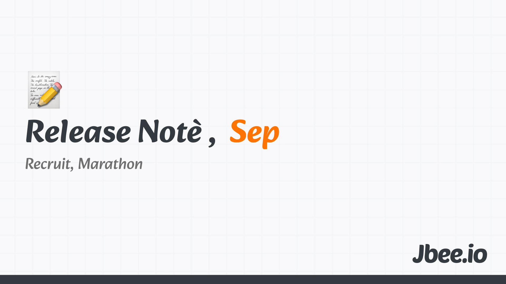

독서의 계절, 영화의 계절, 러닝의 계절, 모두의 계절, 가을. 누구도 싫어하지 않는 계절인 가을의 기분은 어떨까. 이 시기의 어둡고 시원한 날씨를 정말 좋아한다. 늦저녁 약간 서늘한 바람을 맞고 있으면 무엇이든 사랑할 수 있을 것 같다. 대차게 울어대던 매미들은 모두 제 짝을 찾았을까. 그 자리를 고요한 잠자리가 대신했다. 가을이 훌쩍 왔다. 애타게 기다린 것이 무색하게. 이러다 금방 떠날 것 같은 마음에 괜히 밖으로 나서는 9월이었다.

## 일, 공채
토스에 다시 합류한지 2달, 조금은 다른 회사가 되어버린 토스에 적응하면서 내가 담당하게 될 조직이 정해졌다. 그 중 채용이 급한 조직의 공채를 담당해서 진행하게 되었다. 모든 리드 분들이 함께 한 공채이다 보니 담당이라는 말이 무색하지만 단계별 목표 전환률, 과제 디자인 등을 담당했다. 예상보다 많은 지원이 있었고 인터뷰를 엄청 많이 봤지만 이미 목표를 초과 달성한 것은 꽤나 기분 좋은 일이다.

무엇을 없애는 것이 혁신 중 하나라는 것을 알면서도 하기 힘들다. 관성이 그만큼 무서운 것 같다.

## 일, 시니어 커리어 워크샵
N명의 다양한 사람들을 만났고 N가지의 고민을 들었다. 고민의 방향이 같은 사람도 있었고 이미 고민을 많이 하셔서 꽤 깊은 분도 계셨다. 대화를 나누다 보면 내가 무슨 말을 하지 않아도 스스로 깨닫고 돌아가시는 분이 있는가 하면 이것 저것 내 경험을 들으시면서 뭔가의 감을 잡는 분도 계셨다.

토스에 관심없던 분도 함께 하고 싶은 마음이 들게 했다.(속된 말로 지원하게 만들었다.) 사람마다 동인 요소가 다르다. 리더십 경험, 계속 개발만 하고 싶다던가, 커리어 기회가 아닌 토스 복지 제도로 관심을 갖는다던가. 어떤 것에 갈증을 느끼는 지 파악하고 그것을 팀이 제공해줄 수 있는지 고민해보는 대화도 많이 나눴다.

이번 대화 중 '코드 밖에서 다른 사람에게 도움이 되는 개발자'라는 이야기를 들었는데, 꽤나 울림있게 다가왔다.

## 10km 마라톤
첫 마라톤을 다녀왔다. 아침에 뛸 때도 10km는 한번도 안 뛰어봤는데, '어떻게든 뛰겠지' 하며 신청했다. 그리고 나쁘지 않은 기록으로 완주했다.

안내 문자를 보고 마라톤이라는 게 꽤 일찍 시작하는 거라는 걸 처음 알았다. 오전 6시 30분 집합이라고 안내되어 있었고 시간 맞춰서 갔는데, 천천히 와도 되는 거였다. 그 시간에 뭐하는 지 시간표는 좀 보고 올걸 그랬다. 하지만 일찍 갔기에 대회의 분위기를 맘껏 느낄 수 있었다. 사람이 엄청 많았다. 만 오천명이라는데 거의 99%가 사전에 기념품을 미리 전달받은 복장을 입고 왔다. 전부 까만거 입고 있는데 내 러닝복만 파란 색이었다.

## 9월의 영화, 죽은 시인의 사회
우연히 넷플릭스 추천으로 만난 이 영화는 2따봉이 아쉬울 정도로 좋았던 영화이다. 아카데미 극본상을 수상한 영화이긴 한데 이번을 계기로 넷플릭스 추천 로직을 신뢰하게 됐다. ([죽은 시인의 사회 - 피터 위어](https://jbee.io/articles/film/dead_poets_society))

## Worth the click
null

## 마무리

새로운 조직에 적응하고 일에 집중하느라 다채롭지 못했던 9월이었지만 10월 연휴가 있어서 버틸 수 있었다!

- [2025.08 Release Note](https://jbee.io/articles/essay/release-note-2025-08)
- [2025.07 Release Note](https://jbee.io/articles/essay/release-note-2025-07)
- [2025.06 Release Note](https://jbee.io/articles/essay/release-note-2025-06)
- [2025.05 Release Note](https://jbee.io/articles/essay/release-note-2025-05)
- [2025.04 Release Note](https://jbee.io/articles/essay/release-note-2025-04)
- [2025.03 Release Note](https://jbee.io/articles/essay/release-note-2025-03)
- [2025.02 Release Note](https://jbee.io/articles/essay/release-note-2025-02)
- [2025.01 Release Note](https://jbee.io/articles/essay/release-note-2025-01)
- [Release Note Beginning](https://jbee.io/articles/essay/about-release-note)

