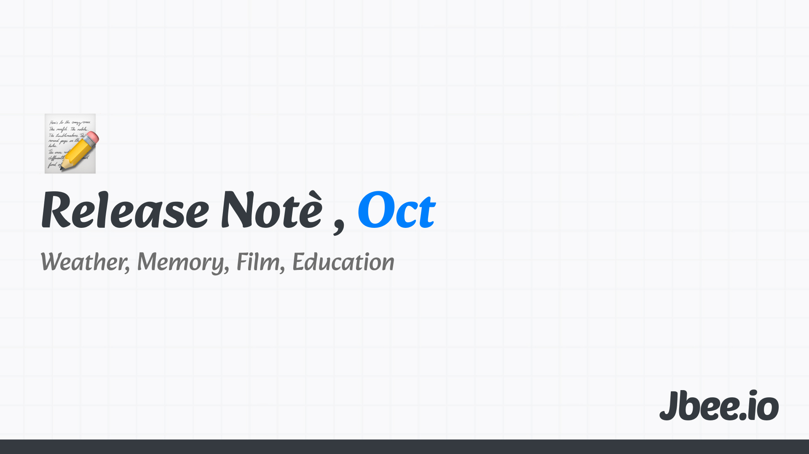

작년 10월엔 뭐가 그리 바빴는지 회고를 넘겼다. 다른 글들은 많이 쓴 것을 봤을 때, 아마 고민이 많았던 시기가 아닐까 싶다. 올해 10월은 쉬는 시간처럼 긴 연휴가 있었다. 연휴 내내 비가 왔는데 이 핑계로 괜히 어디 가지 않고 푹 쉴 수 있었다.

## 날씨
연휴가 끝나고 선선해졌다. 연휴 내내 흐려서 울적했던 기분이 서늘해진 바람에 풀어졌다. 한참 더웠다가 풀어지는 이 날씨가 좋다. 인간은 참 날씨에 많은 영향을 받는다. 온도 변화가 점점 심해지면서 더울 땐 더 덥고 추울 땐 더 추워지는 것 같다. 이러한 변화가 사는 곳에도 영향을 줄 것 같다. 앞으로는 날씨에 따라 부동산 가격이 결정되지 않을까. 좋은 날씨를 누리는 것 마저도 이젠 돈이 필요할지도.

## 기억
모든 순간을 기억하지 않는다. 강렬한 기억 몇개만 살아남는다. 그럼에도 살아가는데 문제되지 않는다. 생각보다 그렇게 많은 기억이 필요하지 않다. 오히려 다 기억하면 살아갈 수 없는 것일지도 모른다.

무엇을 기억할까? 무엇이든지 첫 경험은 강렬하다. 200번 넘게 바다에 들어갔지만 오픈 워터 자격증을 위해 들어갔던 첫 바다는 눈 앞에 그려진다. 화려한 산호가 있었던 것도 아니고 생명체도 볼 것도 없었는데 생생하게 기억난다.

수치심을 느꼈던 경험도 강렬하다. 장애가 났던 배포는 아직도 그 때의 감정이 밀려오고 부끄럽기까지 하다.

당장 떠올릴 수 있는 기억은 많이 봐야 수십가지 아닐까? 모든 유년 시절, 학창 시절이 기억나지 않기 때문에 얼마 안 되는 기억으로 사람은 구성된다.

> 우리는 몸을 매개로 삶을 읽는다. 보고 듣고 만지고 맛보고 향을 맡으며 세상을 이해한다. 기술의 진보도 이 근원을 흔들 수 없다. 결국 우리는 감각의 동물이다.
> - '감각의 설계자들' 책에서

### 망각
잘 외우는 방법은 있어도 잘 잊는 방법은 없다. 분명 기억을 지우고 싶을텐데. 왜 이런 장치는 없을까? 지우개라도 있으면 좋으련만 그런건 없다. 장기 기억에 각인된 기억은 오랫동안 꺼내지 않아도 남아있다.

## 불운
지난 달 회고를 빼고는 거의 매달 회고에 등장하는 최성운의 사고실험. 이번 달에 올라온 영상 중 '암과 책의 오디세이' 김새섬 대표 영상을 봤다. 항상 좋았던 영상을 가져왔지만 이번 영상은 개인적으로 아쉬웠다. 그 중 '불운'에 대한 이야기가 와닿지 않았다.

‘Why not me?’. Why me? '왜 나야'가 아니라 '왜 내가 아니어야 하는데.' 라고 생각을 바꾸면 어떠냐는 이야기를 나눴다. 아쉽게도 위로되지도 납득할 수도 없었다. 이렇게 생각하면 잠시나마 마음이 편해지긴 하지만 상대적으로 마음이 편해질 뿐이다. 절대적인 기준에선 나에게 좋지 않은 일이 발생한건데 말이다.

## 영화
[어쩔수가없다](https://jbee.io/articles/film/no-other-choice)를 시작으로 박찬욱 감독님 영화를 많이 봤다. 봤던 것을 또 보기도 하고 처음 보는 영화도 있었다. 감상평 같은 것을 쓰긴 했지만 영화를 완상한 느낌이 들지 않아 여러 해설들을 칮아보곤 하는데, 그 때마다 아는 만큼 보인다는 것을 느낀다. 유독 영화를 많이 본 달이었는데, 그러다보니 영화를 좀 더 잘 이해하고 싶어졌고 자연스럽게 영화와 관련된 YouTube 영상을 많이 봤다. 선물받은 상품권으로 영화와 관련된 책도 3권 샀는데 아직 펼치지 않았다.

## 교육과 생태계
회사에서 교육에 관심있는 분들과 가까이 앉아있다 보니 교육과 관련된 이런 저런 생각을 많이 하게 된다. 중요한 것은 이건데 왜 엉뚱한 것을 공부하고 있을까? 왜 잘못된 글들이 유행하는 것일까? 조금만 생각해보면 잘못된 내용이라는 것을 알텐데 왜 토론하지 않고 그대로 받아들이는 것일까? 의문이 들기 시작했다.

인터뷰를 보다 보면 정말 열심히 하는 분인데 중요한 부분은 빼먹고 상대적으로 덜 중요한 것을 좇는 경우를 많이 본다. 왜 이런 현상이 벌어지는 것일까? 교육은 어디에서부터 바로 잡아야 할까. 생각을 가끔 하게 된다.

## Worth the clicks
- Vite documentary
	- 프론트엔드 생태계를 평정한 vite에 대한 다큐멘터리.
	- snowpack과 vite의 차이는 무엇이었을지 고민하게 만드는 영상이었다.
    - https://www.youtube.com/watch?v=bmWQqAKLgT4
- Why Next.js falls short on software engineering
	- Next.js를 비판하는 내용이지만 오히려 프레임워크라는 것에 대해 다시 생각하게 된 글이다.
	- https://blog.webf.zone/why-next-js-falls-short-on-software-engineering-d3575614bd08

## 마무리
어떤 인사이트가 있었다던가 특별한 일이 없었던 고요한 한달이어서 회고 내용도 슴슴하다.

- [2025.09 Release Note](https://jbee.io/articles/essay/release-note-2025-09)
- [2025.08 Release Note](https://jbee.io/articles/essay/release-note-2025-08)
- [2025.07 Release Note](https://jbee.io/articles/essay/release-note-2025-07)
- [2025.06 Release Note](https://jbee.io/articles/essay/release-note-2025-06)
- [2025.05 Release Note](https://jbee.io/articles/essay/release-note-2025-05)
- [2025.04 Release Note](https://jbee.io/articles/essay/release-note-2025-04)
- [2025.03 Release Note](https://jbee.io/articles/essay/release-note-2025-03)
- [2025.02 Release Note](https://jbee.io/articles/essay/release-note-2025-02)
- [2025.01 Release Note](https://jbee.io/articles/essay/release-note-2025-01)
- [Release Note Beginning](https://jbee.io/articles/essay/about-release-note)

