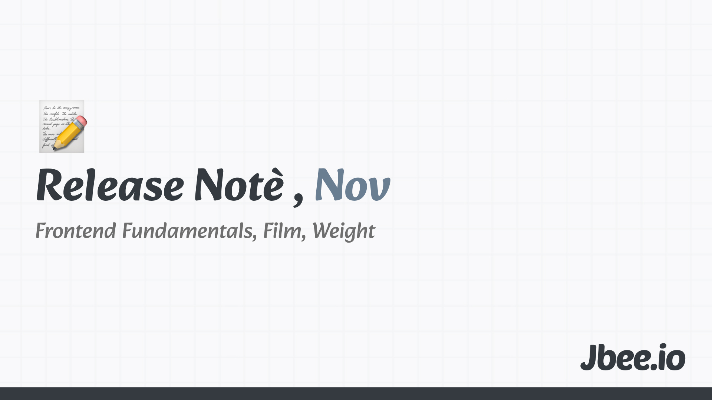

12월이 다 되서야 11월 회고를 썼다. 작년 이 맘 때는 혼자 사업을 해보느라 잠도 안 자면서 이것 저것 해봤을 시기다. 여러 AI들을 동시에 쓰며 제품을 찍어내기 바빴다. 올해는 반대로 입사한 회사에 적응하느라 정신없었다.

## Frontend Fundamentals 모의고사
어느 날 저녁, Velog라는 블로그 플랫폼에 들어가봤다. 요즘엔 어떤 글들이 올라오는지 살펴봤다. 트렌딩에 올라 여러 개의 좋아요를 받고 있는 글들을 살펴봤다. 잘못된 내용이 있었다. 뭔가 잘못되고 있다고 생각했다.

나도 블로그를 운영하고 있지만 최근엔 기술과 관련된 글을 쓰지 않고 있다. 토스는 Frontend Fundamentals라는 지침서를 내놓았다. 정말 좋은 내용이고 이를 기반으로 AI 코드리뷰를 하기도 하지만 뭔가 부족한 것 같다.

커피챗을 하다가 토스 프론트엔드 과제에 떨어진 사람들이 모여 있는 단톡방에서 이런 저런 추측이 오간다는 얘길 들었다. 엉뚱한 추측과 액션 아이템들이 만들어졌고 이를 기반으로 엉뚱한 곳에 집중하고 계셨다. 과제가 정말 많이 들어오다보니 하나 하나 피드백을 드릴 수 없었는데 이런 사태가 발생한 것 같다. 문제가 있었다.

직접 올바른 컨텐츠를 만들 계획을 세우고 어떻게 하면 효과적으로 전달될 수 있을지 고민했다. 그동안 블로그를 운영했고 좋은 자료는 이미 많다. 단방향 전달엔 한계가 있다고 생각했다. 참여가 중요했다. 구체적으로 어떻게 참여해야 효과적일까. 동일한 요구사항을 서로 어떻게 접근하는지 비교할 수 있도록 각자 깊게 고민해보고 이야기를 해보는 것이 중요하다고 생각했다.

### 과제 공개
괴거 채용에서 사용했고 더이상 쓰지 않는 과제를 공개하기로 했다. 모의고사 형태로 공개하여 참여자를 모집하고 직접 과제를 풀어보도록 했다. 그리고 나서 해당 과제에 대한 해설 강의를 하기로 했다. 참여자 모집은 50명 정도로 계획했는데, 참여 링크 공개 당일 순식간에 100명이 참여했다. 디스코드 초대 링크가 공개되고 나서 100분이 들어오시는데 까지 1분이 채 걸리지 않았다. Frontend Fundamentals라는 브랜드에 힘입은 성과이지 않을까 싶다.

과제 제출은 GitHub PR을 등록하는 방식이었는데 디스코드에 들어오신 분들 중 74분이 과제를 풀어주셨다. Discussion도 올라와서 여러 이야기를 나누시던데 인상 깊었다. 해설 강의도 열심히 준비했다. 첫 해설 강의라 욕심이 과해 시간을 넘기기도 했다. 라이브코딩을 말하면서 하려니 쉽지 않기도 했다. 단순히 회의실에서 방송을 켜고YouTube Live로 진행했던 어설픈 해설 강의였지만 많은 분들이 참여해주셔서 반응해주셨고 재밌게 진행했다.

강의 후에는 제대로 된 정보가 퍼질 수 있도록 모의고사 후기를 잘 남길 수 있도록 신경썼다. 올라오는 후기들을 보면서 정말 뿌듯했다. 반응이 별로면 다음 모의고사는 하지 않으려고 했는데 이 정도 반응이면 준비해야 할 것 같다. 아마 3월에 하지 않을까 싶다.

이번 모의고사를 준비하면서 한국코딩평가원이란 얘기도 들었는데, 이 생태계의 개발자들이 중요한 것에 집중하길 바라는 마음이다.

## 영화, 터미널, 머티리얼리스트
터미널. 동료들을 만나고 영웅이 되면서도 약간의 멜로가 섞여있는 블랙 코미디 영화. 꽤 오래 전에 나온 작품인데 정말 재밌게 봤다. 작은 나라의 국민이 비행기를 타고 미국에 오자 마자 나라가 망해서 입국도 출국도 불가능해 공항에 갇히는 내용이다. 스토리부터 재밌는데 구성은 더 좋다. 문제를 제대로 해결하지 못하는 관료주의를 비판하며 한정된 일자리를 두고 벌어지는 일들, 미국인들을 풍자하는 등 재미 요소가 많았다. 

머티리얼리스트. 샐린 송 감독님의 작품이며 이전 영화인 패스트 라이브를 인상깊게 봐서 많은 기대를 하고 본 작품이다. 예고편도 아예 안보고 보기 시작했는데 결정사 내용이었다. 키 크려고 다리 수술하고 서로 눈이 높아 아무도 매칭되지 못하는 등 현실적인 내용이었고 딱히 감흥은 없었다.

## 다시 배우기 시작한 웨이트
오른쪽 아킬레스건을 다치고 나서 러닝을 못하게 된 김에, 날씨가 추워진 김에 자연스럽게 러닝을 중단했다. 사실 가장 큰 이유는 체중 감소였다. 무슨 부러운 얘기냐 하겠지만 살이 잘 안 찌는 체질이라 체중을 유지해야 했다. 그래서 웨이트를 다시 시작했다. 다행히 PT 선생님을 잘 만나서 재밌게 배우고 있고 주 5회 열심하 웨이트 중이다. 바로 4kg가 쪘다. 회사 건물에 헬스장 있는게 진짜 편하다.

## 마무리
토스에 돌아온 지 4개월이 됐다. 11월 말부터 조직 개편을 준비하고 새로운 팀을 운영하는데 정신이 없었다. 자연스럽게 출근-운동-집이 반복됐다. 일에 집중하느라 다른 것을 시도해보지 못했는데, 연말이고 방학도 있고 하니 게임과 여행 이것 저것 시도할 예정이다. 미리 비행기 표도 다 준비해뒀고 닌텐도 스위치2도 구매해뒀다!

- [2025.10 Release Note](https://jbee.io/articles/essay/release-note-2025-10)
- [2025.09 Release Note](https://jbee.io/articles/essay/release-note-2025-09)
- [2025.08 Release Note](https://jbee.io/articles/essay/release-note-2025-08)
- [2025.07 Release Note](https://jbee.io/articles/essay/release-note-2025-07)
- [2025.06 Release Note](https://jbee.io/articles/essay/release-note-2025-06)
- [2025.05 Release Note](https://jbee.io/articles/essay/release-note-2025-05)
- [2025.04 Release Note](https://jbee.io/articles/essay/release-note-2025-04)
- [2025.03 Release Note](https://jbee.io/articles/essay/release-note-2025-03)
- [2025.02 Release Note](https://jbee.io/articles/essay/release-note-2025-02)
- [2025.01 Release Note](https://jbee.io/articles/essay/release-note-2025-01)
- [Release Note Beginning](https://jbee.io/articles/essay/about-release-note)

