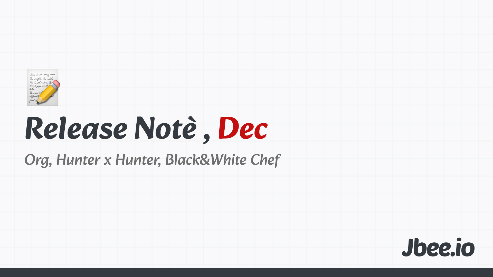

12월 몇일 인지도 기억 안나는데, 퇴근길에 문득 '로맨틱겨울'이라는 노래가 들리는 듯 했다. 연말이면 괜히 붕 뜬다.

## 조직 개편

11월 말부터 진행된 조직 개편. 토스 코어에서의 조직 개편은 처음이었는데 쉽지 않았다. 여러 가지 요소를 복합적으로 고려해 의사결정을 내려야 하다 보니 고민의 시간이 길어졌다. 의사결정을 내렸는데 앞선 의사결정이 번복되는 바람에 고민을 처음부터 해야 하는 경우도 많았다. 너무 잘하려고 하는건가? 싶은 생각이 들 정도로 고민의 시간이 길어지는 탓에 조직 개편을 제외하곤 다른 업무가 거의 마비되는 수준이었다. 되돌아보면 잘 한 것 같지만 분명 더 잘 할 수 있는 지점도 많았을 것 같다. 이해관계자가 많은 전사 조직개편인 만큼 충분히 맥락이 공유되지 못한 면도 있었을테고 모두가 만족하는 조직 이동은 아니었을텐데, 다음 물량막기는 어떻게 할지 고민이 된다.

## 헌터x헌터

넷플릭스 추천으로 뜬 애니메이션. 자기 전 아무 생각없이 눌렀는데, 지금 10화까지 봤다. 중간 중간 의미심장한 메세지를 던져주는게 있는데, 이 부분에 이끌려 계속 보게 됐다. 내가 받은 메세지 중 하나는 양자택일과 관련된 이야기였다. 양자택일인줄 알았던 상황에서 벗어나 다른 옵션을 생각해보면 다른 세상이 열린다. 다른 옵션을 고민할 수 있게 되는 순간 더 나은 의사결정을 할 수 있게 된다는 내용이었다. 옵션이 2개 뿐이었던 상황은 여러 암묵적인 가정을 했을 것이다. 이러한 여러 숨은 가정들에 의문을 가져야 하고 파훼할 수 있는 것을 도출해내는 것이 중요하다. 근본적으론 비판적인 사고가 바탕이 되어야 하는 것이다. 우연히 본 애니메이션에서 꽤나 임팩트있는 메세지를 받게 됐는데 새로운 경험이었다.

## 흑백요리사 시즌2
시즌 1을 정말 재밌게 봤고 최현석 셰프님의 팀전을 보고 리더십에 대한 글도 썼다. 이번 시즌2도 역시나 재밌게 보고 있다.

### 상상
그러던 중 1년 전에 올라온 김학민 PD와의 이종범 캠장님의 인터뷰를 우연히 보게 됐다. 스토리캠프 채널의 열렬한 팬인데, 이 영상을 이제서야 본게 이상했다. 음식의 맛과 향을 전달할 수 없는 한계에 대해서 나눈 이야기가 인상깊었다. 오히려 시청자들이 느낄 수 없기 때문에 오로지 심사위원의 심사만으로 맛과 향을 상상해야 한다. 상상력을 자극하는 것이 포인트였다고 생각한다. 공백과도 연결되지 않을까. 패스트 라이브즈 영화에서는 침묵을 정말 잘 사용해서 인상적인 장면을 만들었는데, 무언가를 전달하지 않음으로 인해 메세지를 전달하는 방식은 강력한 것 같다.

### 대세
편집 기술에 대해서도 이야기를 했는데 그 중  '대세에 지장없다.'라는 말이 인상깊었다. 고전적인 편집 기술, 오프닝 영상 등 기존의 프로들이 늘 하던 것들을 하지 않게 됐다고 한다. 악마는 디테일에 있다는데, 심지어 같은 내용을 담고 있는 텍스트는 동일한 폰트를 써야 한다는 구시대적 규칙까지 흑백요리사에서는 중요하게 생각하지 않는다고 한다. 대세에 지장없기 때문이다.

세상이 변하고 있다. 어느 순간 내 머릿속에 들어와서 끊임없이 나야, OOO하던 것이 있다 이젠 더이상 중요해지지 않은 무언가, 한 단어로 정리하기 어려운데 계속해서 뭔가 바뀌고 있다는 부분이다. 우리가 중요하다고 생각했던 많은 것들이 이젠 더이상 중요하지 않을 수 있다. 이 부분을 뾰죡하게 알아차려야 할 것 같다.

송출의 시대에서 재생의 시대로 넘어온 요즘, AI 시대의 새로운 대세는 무엇인가?

### 서늘한 감정
출연하는 셰프 분들과도 어느 정도 거리를 둔다는 얘길 했다. 이종범 캠장은 이를 '서늘한 감정'이라고 표현했는데, 정말 와 닿았다. 챕터 구성원 분들과 정말 친해지고 싶고 몇몇은 친해진 분도 있다고 생각하지만 어느 정도 거리를 둬야 하는 관계이기도 하다. 이것이 어떻게 보면 서늘한 감정일 수 있지 않을까 싶다. 너무 덥지도 춥지도 않은 그렇다고 시원한 긍정적인 것보단 서늘하다는 부정적인 느낌도 함께하는. 서늘하다는 적절한 표현이었다고 생각했는지 꽤 인상깊었다.

## Worth the clicks
- 흑백요리사는 어떻게 한국을 뒤흔들었을까? | 흑백요리사 김학민PD 초대석 1부
	- https://www.youtube.com/watch?v=GoWwe4BZBx0
- 흑백요리사가 한국 방송계에 남긴 것들 | 흑백요리사 김학민PD 초대석 2부
	- https://www.youtube.com/watch?v=29D6h6MlLFs

- [2025.11 Release Note](https://jbee.io/articles/essay/release-note-2025-11)
- [2025.10 Release Note](https://jbee.io/articles/essay/release-note-2025-10)
- [2025.09 Release Note](https://jbee.io/articles/essay/release-note-2025-09)
- [2025.08 Release Note](https://jbee.io/articles/essay/release-note-2025-08)
- [2025.07 Release Note](https://jbee.io/articles/essay/release-note-2025-07)
- [2025.06 Release Note](https://jbee.io/articles/essay/release-note-2025-06)
- [2025.05 Release Note](https://jbee.io/articles/essay/release-note-2025-05)
- [2025.04 Release Note](https://jbee.io/articles/essay/release-note-2025-04)
- [2025.03 Release Note](https://jbee.io/articles/essay/release-note-2025-03)
- [2025.02 Release Note](https://jbee.io/articles/essay/release-note-2025-02)
- [2025.01 Release Note](https://jbee.io/articles/essay/release-note-2025-01)
- [Release Note Beginning](https://jbee.io/articles/essay/about-release-note)

