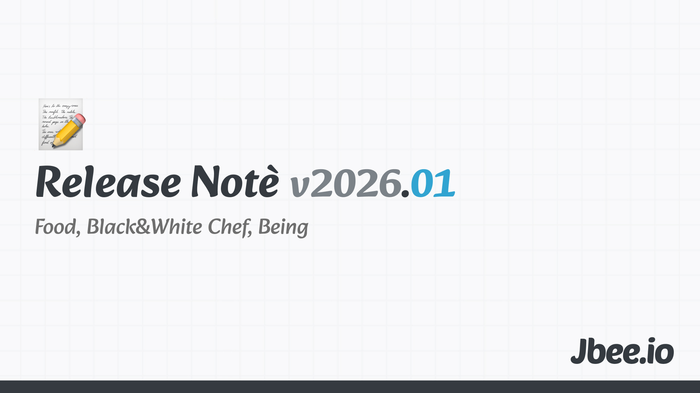

벌써 한달이 다 지나갔다는 식상한 말로 시작할 수 밖에 없을 정도로 시간이 빠르게 흘러갔다. 24년의 1월을 되돌아보면서 25년 1월을 회고한게 아직도 생생하다. 지난 1월엔 니체에 푹 빠져 이것 저것 살펴봤고 또 시간이 빠르게 지나갔다며 호들갑이었다. 매년 회고를 하다 보니 1월은 매번 빠르다는 말로 시작을 하는게 보인다. 이젠 인정해야 한다. 1월은 원래 빠르게 지나간다.

## 음식
디핀이라는 와인바에 다녀왔다. 원래의 나라면 이렇게 예약이 힘들거나 귀찮거나 줄을 서야 하는 음식점엔 잘 가지 않았다. 옆에 있는 사람 덕에 바뀌었다. 강릉에 놀러가서도 대기가 100팀이 넘는 치즈순두부쫄면을 먹고 왔다. 매끼를 맛있게 먹을 수 없겠지만 되도록 많은 끼니를 맛있게 먹는 것도 좋은 것 같다. 이번 겨울, 여름이 제철인 포도가 유난히 먹고 싶었는데, 제철일 때 제대로 즐겨야 겠다.

## 흑백요리사 시즌2, 최강록 요리사
시즌1도 재밌게 봤고 시즌2도 재밌게 봤다. 같으면서도 다른 새로운 전개가 즐거웠고 보고 배울 셰프 분들도 참 많았다. 후덕죽 요리사님을 보고 장인정신이 무엇인지 배웠고 요리괴물로부터 프로페셔널을 배웠다.

무엇보다 시즌2를 우승한 최강록 셰프로부터 배운 점이 많다. 결승전에서 본인의 요리에 내보이며 했던 말 중 '척'이라는 단어가 귀에 들어왔다. 얼마나 많은 가면을 쓰며 살아가고 있는지 되돌아 보게 되었다. 그냥 모른다고 하면 될 일을 아는 척 하느라 애썼던 경험, 당황했지만 그렇지 않은 척하고 임기응변을 통해 그럴싸한 말로 대처한 경험 등 여러 일들이 스쳐지나갔다.

## Being
미래의 소재로 살아가는 것을 멈추고 현재에 살기가 생각보다 어렵다. 진화론 관점에서 보면 인간의 뇌는 생존해야 한다는 것이 기저에 깔려있다. 그렇기 때문에 미래를 대비하지 않는 것은 곧 '죽음'을 의미하기 때문에 미래를 끊임없이 고민하고 시뮬레이션 돌려봐야 한다. 불안은 여기에서 온다. 새로운 AI 기술들이 쏟아지면서 "지금 아무것도 안 하면 뒤처진다"는 공포(FOMO)를 주입받는다.

매 주말을 다양한 공부와 활동, 사이드 프로젝트로 빼곡히 채우면서 나 자신을 성장시키기 위한 시간으로만 사용했다면 점점 그러지 않고 있다. 연차가 쌓이면서 꺾였다는 인상으로 보여질 수 있겠지만 한편으론 성숙해지는 과정이라고 볼 수 있다.

지금을 온전히 보내기 위해서는 생산성을 완전히 버릴 수 있어야 한다. 버릴 수 있는 용기가 필요하다.

## Worth the clicks
- 포스팅 하지 않는 것에 대한 노트
	- 존재적 권태감에 대한 내용이다. 블로그를 오래 쓰다 보면 관성에 의해서 남들의 기대를 충족시키기 위해서 글을 쓰는 자신을 발견한다. 내 블로그는 내 이야기였다가 점점 미디어 자체에 대한 이야기가 되어간다.
	- 계속해서 인정받고 싶다는 불안감과 더이상 얽매이지 않아도 된다는 속 시원함이 공존한다.
	- 놀랍게도 이번달엔 X와 링크드인을 많이 들여다보지 않았다. 바빠서 인 것도 있지만 내가 포스팅을 하지 않기 때문이기도 하다.
	- 본문: https://www.workingtheorys.com/p/notes-on-not-posting
- 개발자는 AI에게 대체될 것인가
	- 이 글을 읽고 나도 하고 싶은 이야기가 생겨서 하나 썼다. [AI, 개발자의 뉴노멀](https://jbee.io/articles/essay/ai-and-new-normal)
	- 본문: https://toss.tech/article/44377

## 마무리
불확실성이 높은 날이 계속 되면 가만히 있는다. 미래를 감히 예측하지 않는다. 섣부르게 행동하지 않고 오히려 가만히 있는다. 정말 가만히 있는게 아니라 나에게 집중한다. 내가 뭘 좋아하는지, 뭘 잘하는지, 어디에서 에너지를 받는지 돌아보면서 불공평한 이점을 찾아보곤 한다.

테세우스의 배. 과연 이 배는 이전과 같은 배인가? 사람도 마찬가지이다. 육체는 그 사람일 수 없다. 끊임없이 새로운 세포로 교체되니까. 그 사람의 기억, 경험만이 그 사람을 구성한다. 그렇기 때문에 어떤 사람에게 영향을 미친다는 것은 그 사람에게 어떤 경험을 선사하느냐이다. 선한 영향력이란 사람들이 더 나은 삶을 살아갈 수 있도록 어떠한 경험하게 하는 것이 아닐까. 회고 모임을 마무리 하면서 했던 말로 마무리.
