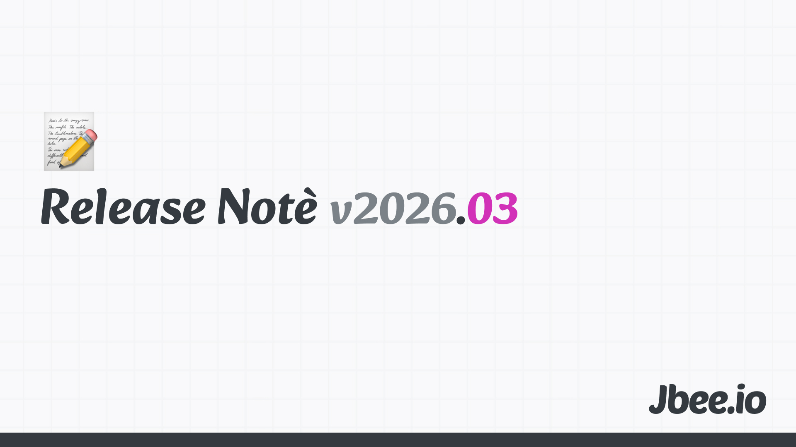

항상 그랬듯이 예고없이 따뜻해졌다. 재작년에도 작년에도 이맘때쯤 비슷한 감정을 느꼈다. 차갑던 공기가 선선해지면서 괜히 기분이 좋아지고 괜히 집에 있기 싫은 느낌. 이러는 것을 보면 나는 4월로 넘어가는 3월을 좋아하는 것 같다. 계절이 바뀌는 문턱에서 오는 에너지 같은 것이 있다. 다만 올해 3월은 진짜 바빴다.

## 삶, 뮤지컬 홍련
바쁜 이야기 하기 전에 그래도 몇 가지 챙겼는데, 뮤지컬 홍련을 보고 왔다. 라이브 공연의 매력은 사람을 빤히 쳐다볼 수 있다는 것이다. 일상에서 누군가를 빤히 쳐다보는 경험은 쉽게 할 수 없다. 모르는 사람이면 인사는 커녕 눈도 잘 안 마주치는 나라 아닌가. 배우긴 하지만 낯선 사람을 신경쓰지 않고 빤히 쳐다보는 것 자체로 새로웠다.

당연하게도 스크린으로 보는 것과는 달랐다. 사람이 눈 앞에서 감정을 쏟아내는 것을 목격할 수 있었다. 생생함이 주는 묘미 때문에 라방이 인기가 많은게 아닐까?

다른 면에서 충격적인 것은 관람객 대부분이 여성이었다는 점이다. 성비가 98:2 정도로 남자가 적었다. 이게 도대체 무슨 현상이지 싶었다. 뮤지컬 홍련이 특별히 여성향인 것도 아닌데 왜 이런 것이지. 뮤지컬이라는 장르 자체가 그런 것인지, 아니면 내가 모르는 다른 이유가 있는 것인지 궁금했다. 남자들은 다 어디에서 뭘 하고 있는 것일까. 나를 돌아보니 나도 성인이 되어 뮤지컬을 보러 온 것은 거의 처음이었다.

## 삶, 왕사남 그리고 돌사남
왕과 사는 남자 영화에 대해선 할 말이 없다. 개인적으로 아쉬운 점이 많았던 영화이기 때문이다. 불필요한 전투씬, 급작스럽게 진행되는 감정선 등 개인적으론 에휴 하며 넘겨야 하는 부분이 많았다. 몰입을 방해하는 요소가 많으면 결국 감정이입이 안 된다. 앞선 뮤지컬과 비교했을 때 몰입도만 보자면 차원이 달랐따.

영화의 완성도가 흥행과 연결되지 않는다는 것은 당연하기에 인정한다. 완성도가 높은 영화가 망하기도 하고, 그렇지 않은 영화가 대박을 치기도 한다. 그렇다면 이 영화가 왜 흥행했는지는 궁금해졌다. 사람들이 영화를 보러 가는 이유가 완성도 때문이 아니라면, 무엇 때문일까. 익숙한 배우, 화제성, 함께 보러 가는 경험 자체?

돌사남이라는 별명을 얻은 프로젝트 헤일미리. 오랜만에 샤롯데가서 봤는데 이런 저런 얘기 하면서 편하게 봤다. 영화 자체도 재밌었지만 편하게 누워서 보는 재미가 있었다. 어쩌면 영화를 보는 행위의 본질은 영화 그 자체가 아닐 수도 있겠다는 생각이 들었다.

## 일, 동료
동료들로부터 힘을 얻었던 달이다. 함께 AI 제품을 만드는 동료들의 엄청난 몰입과 실행력에 자극을 많이 받았다.

한 제품의 Leader로써, 그리고 챕터의 AI 활용을 주도하는 팀의 리더로써 공부할 것이 많았고 부담이 많았던 달이다. AI 기술은 매일 새로운 것이 나오고, 이것을 제품에 어떻게 녹여야 하는지 판단하는 것은 다른 차원의 일이다.

## 채용이 만사다
작년에 입사한 신규 입사자들의 활약으로 내가 담당하고 있는 조직에 긍정적인 변화가 만들어지고 있다. 좋은 사람을 뽑는 것이 리더가 할 수 있는 가장 임팩트 있는 일이라는 것을 다시 한번 느꼈다. 시스템을 바꾸는 것보다, 프로세스를 개선하는 것보다, 좋은 사람 한 명이 만들어내는 변화가 크다.

AI로 지치거나 방황하는 것 없이 좋은 제품을 만들기 위해 고민하고 즐겁게 일할 수 있을지 고민하는 팀이 됐다. 이 문장을 쓰면서도 뿌듯하다. 기술의 변화에 휩쓸리지 않고 본질에 집중하는 팀. 채용이 만사다라는 말이 과장이 아니라는 걸, 올해 들어 체감하고 있다.

## 마무리
이렇게 일에 집중하고 싶었지만 조금은 쉬어야겠다는 경각심이 들었다. 다행히 포코피아라는 귀여운 게임이 나와서 주말을 재밌게 보냈다.

### 지난 회고
- [1월](https://jbee.io/articles/essay/release-note-2026-01)
