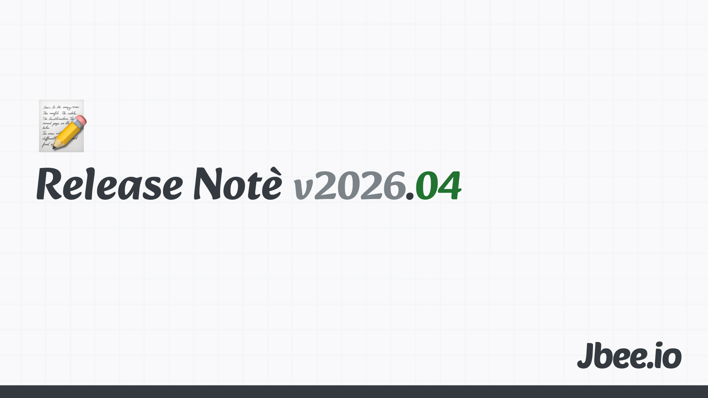

3월에 이어 4월도 정신없이 지나갔다. 일에 끌려가는 달이었다고 정리할 수 있겠다. 그래도 짬을 내서 챙긴 것들이 몇 가지 있고, 그 사이에서 새롭게 알게 된 내 모습도 있다. 작년 4월엔 이사를 했었는데 우연의 일치로 이사갈 집을 알아보고 있다.

## 돌아온 사고실험
신기하게도 작년 4월 회고에 이 채널에 대한 언급이 있었는데, 올해 4월도 채널에 대한 이야기를 한다. 팬심을 1년 동안 유지했다니.

최근 최성운의 사고실험이 한로로 편으로 복귀했다. 한로로 노래로부터 위로를 많이 받아왔던 터라 개인적으론 최애의 조합이었다.

영상 중에 "말로 표현하면서 얘기하면서 영감을 얻는 편이다"라는 말이 나왔는데 묘하게 공감이 됐다. 가만히 앉아서 글을 쓰는 일은 수렴, 정리에 가까운 행위인 것 같다. 발산을 하려면 결국 나를 벗어난 곳에서 예상치 못한 질문이 들어와야 한다. 실제로 커피챗을 하다 보면 새로운 아이디어가 생기거나 기존 생각에서 아쉬웠던 부분이 채워지는 경험을 자주 한다. 다양한 사람을 만나 다양한 관점을 듣다 보면 내 관점도 함께 다양해진다. 글로 정리하기 전에 누군가에게 말로 풀어보는 단계를 더 의식적으로 챙겨야겠다.

## 앵거 매니지먼트
화가 많아졌다. 부정적인 화라기 보단 긍정적인 편이다. 다만 관리가 필요하다.

최근 프로젝트를 진행하면서 조금 더 구체적인 레벨의 매니징 업무를 담당하게 됐는데, 그러면서 화가 쌓였다. 내가 바라는 이상적인 모습이 있는데, 현실이 그렇지 않고 오히려 내 발목을 잡을 때가 종종 생긴다. 이 간극을 보통 문제로 정의하고 해결하는 편인데, 해결해야 하는 문제가 끊임없이 보였다. 원래 하려고 했던 것을 하기 위해 주변의 문제를 먼저 해결해야 하는 상황이 반복됐다.

문제를 잘 정의하고 해결하는 것이 일이라고 믿어왔지만, 문제만 보이는 시기는 사람을 지치게 한다. 정작 본질에 닿기 전에 에너지가 다 빠져버리는 느낌이다. 어디까지가 내가 풀어야 할 문제이고, 어디까지는 흘려보내도 되는지 분간하는 연습이 필요해 보인다. 화는 보통 기준이 분명한 사람에게 찾아온다는데, 기준을 낮추는 것이 아니라 기준을 다루는 법을 익혀야 하는 것 같다.

## 앱인토스 출시
회사에서 앱인토스 해커톤을 진행했다. 토스 앱 안에 미니 앱을 만들 수 있는데, 이걸 사내 해커톤으로 풀어낸 것이다. 제품을 비교적 쉽게 만들 수 있고 광고도 쉽게 붙일 수 있어서 수익까지 이어지는 구조다.

총 6개를 출시했고, 그 중 1개가 살아남았다. 유입을 만드는 일이 생각보다 쉽지 않았다. 앱인토스 앱스킴이 SNS에서 링크로 인정받지 못해 바로 눌리지 않다 보니, 공유 스킴을 통한 유입을 만들기도 어려웠다.

내가 직접 쓰는 앱도 아니고, 초반 아이디어로 시작해 출시까지 끌고 간 뒤에도 계속 신경 쓰는 일이 쉽지 않았다. 만들고 나서가 진짜 시작이라는 말이 새삼 와닿았다. 제품을 기획하고 리딩하시는 분들이 풀어야 할 문제를 끝없이 발굴해내는 것도 만만치 않은 스트레스겠구나 싶었다. 평소 옆에서 보던 그 부담의 결을 한 번 직접 겪어본 셈이다. 반대 입장도 마찬가지겠지.

## 2번의 발표
발표를 두 번 했다.

사내에서는 AI Surf Day라는 행사가 있다. AI를 가지고 이것저것 시도해보는 날이고, 금요일 오후마다 진행한다. 삼삼오오 모여 진행하는 Club 활동도 함께 굴러간다. Surf라는 단어는 "이 파도에 휩쓸리지 말고 서핑하라"는 뜻이지 않을까 짐작해본다. 이 자리에서 Frontend AI Guild가 만든 tap이라는 제품을 소개했다. 'Turn tactic to Tangible'이라는 새로운 Core value를 그대로 구현해본 제품이라 발표하는 입장에서도 의미가 컸다.

외부 웨비나에서도 AI를 주제로 발표했다. tap 제품과 함께 앞으로 무엇을 하려는지, 그리고 전사적으로 시도하고 있는 인프라까지 간단히 풀어 소개했다. 같은 주제를 안과 밖에서 한 번씩 이야기해보니 듣는 사람이 누구냐에 따라 전달의 결이 꽤 달라진다는 걸 느꼈다. 내부에선 "왜 이걸 하는가"에 대한 공감대가 있는 상태에서 시작하지만, 외부에선 그 출발선부터 함께 그려야 한다.

## 화이트 와인을 좋아하네
입문은 레드였다. 레드가 좀 더 와인스럽달까. 2월 호주 여행에서 와이너리를 방문한 것을 계기로 여러 와인을 먹어봤다. 피노 누아, 카쇼, 그리고 스테이크와 함께 먹었던 쉬라로 와인을 좋아하게 됐다.

귀국해서 가볍게 먹을 와인을 찾다 보니 자연스럽게 화이트 위주로 마시게 됐다. 식사와 곁들일 땐 샤도네이가 땡겼고, 식후엔 좀 더 가벼운 쇼비뇽 블랑이 좋았다. 신기하게도 나는 이 둘 사이 어딘가의 화이트를 좋아하는 것 같다.

종류도 많고 가격도 천차만별인 와인. 이제서야 입문했는데, 공부하면서 먹어보는 재미가 있다. 좋아하는 것이 하나 더 생긴 달이다.

## 마무리
화가 많았던 한편으로, 좋아하는 것을 하나 더 발견한 달이기도 했다. 일이 무겁게 누르는 시기엔 일과 무관한 작은 즐거움 하나가 의외로 큰 균형을 잡아준다. 5월에는 일을 좀 덜어내고 그 자리에 다른 것들을 놓아보려고 한다.

### 지난 회고
- [3월](https://jbee.io/articles/essay/release-note-2026-03)
- [1월](https://jbee.io/articles/essay/release-note-2026-01)
