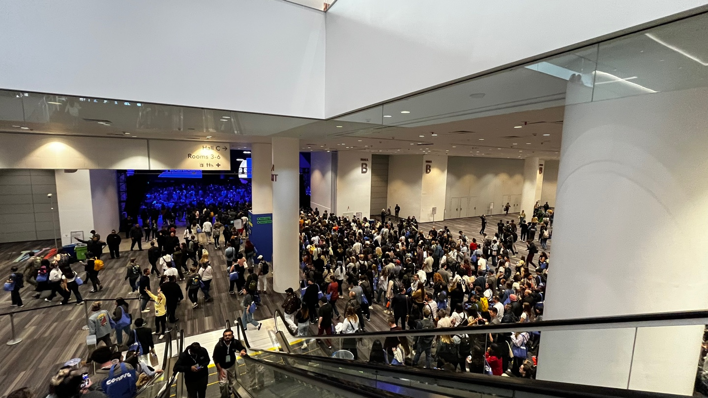
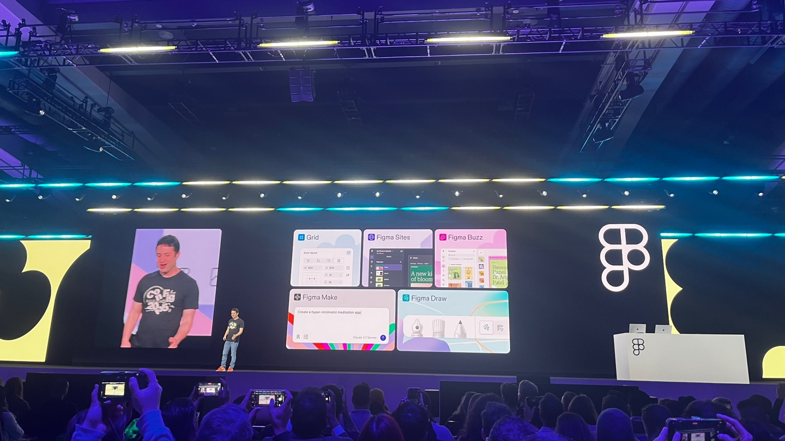

Figma 컨퍼런스 Config 2025 내돈내산 후기입니다. 다들 회사 지원으로 가는데, 사비 탈탈 털어 다녀왔습니다. 그만큼 이 시대에 Figma라는 제품의 행보가 중요하다고 생각해요. 귀국행 비행기에서 감흥이 채 사라지기 전에 쓰느라 bullet 형식으로 써봤어요. 행사 후기, 세션 후기 그리고 개발자가 바라본 Figma에 대한 짧은 생각들을 7개씩 다룹니다. (번외로 샌프란시스코 방문 후기도 있어요.)

## Config 2025, 행사 후기 (7)
1. 샌프란시스코에서 열리는 컨퍼런스 참석은 이번이 두번째다. 약 6년 전 Meta(그 시절엔 Facebook)에서 주최한 F8 이후, 오랜만에 참여하는 행사인데, 스케일이 볼만하다. 총 네 개의 층과 야외까지 쓰면서 3일동안 진행됐다.
2. 스태프 분들의 다양성이 눈에 띄었다. 겉으로 보이는 모습으로만 봤을 때, 은퇴하셨을 것 같은 시니어 분들도 많이 계셨다. 스태프분들이 전부 친절하시고 열정적으로 컨퍼런스에 참여하시던데, 자원봉사일지 어떤 전문 업체를 통해 운영하는 것인지 궁금했다.
3. 생각보다 한국인 비율이 매우 적다. 외국에서 들리는 한국말은 아무리 작은 소리여도 귀에 박히는데 거의 안들렸다. 내가 디자인 직군이 아니라서 더 잘 마주하지 못했을지도.
4. 서로 원래 아는 사이인지 모르겠지만 (아닐 것이라 생각) 삼삼오오 오며 떠드는 것이 굉장히 자연스럽다. 네트워킹이 이렇게 자연스러울 수 있을까. 행사 측에서 네트워킹을 위한 준비는 딱히 하지 않았지만 알아서 음료 하나씩 들고 모이는 모습이 인상적이었다. 나고 자란 문화가 큰 차이를 만든다.
5. 아무래도 디자인 컨퍼런스라서 그런지 눈에 보이는 모든 것이 아름다웠다. 눈이 즐거웠다. 색종이 느낌의 도형만으로 이렇게 다채로운 비주얼을 연출했다는 것이 멋지다.
6. F8에서는 이런 저런 굿즈도 많이 받고(오큘러스...!) 후원사 부스에서 참여할 수 있는 활동도 많았는데, Config는 생각보다 적었다. 행사 고인물에게 즐길 컨텐츠가 부족하달까... Airbrush 티셔츠 만들기, 폴라로이드 사진찍기, 주머니 던지기 게임(?) 정도였다. 몇몇 굿즈를 Store에서 팔기도 했다. 모자, 후드, 맨투맨, 키링, 에코백 등 여느 행사에서 마주할법한 굿즈들이었다. 이미지를 생각해서인지 미국 물가를 고려하지 않아도 꽤나 합리적은 가격에 팔더라. 근데 아쉽게도 후드 집업이 없었다.
8. 앱으로 시간표 보고 미리 스케줄 잡아보고 밥 먹으라고 푸시보내고 운영 측면에서 배울 점이 많았다. rainfocus라는 Event Management 서비스를 이용했더라.

## Config 2025, 세션 후기 (7)
1. Config처럼 메이커 모두가 즐길 수 있는 축제가 또 있을까? 디자이너는 물론 PM, Engineer까지 제품을 만드는 직군이라면 관심있게 들을만한 발표 주제가 많아서 그런지, 참가자들의 스펙트럼이 참 넓은 행사인 것 같다.
2. 이건 완전 개인적인 감상인데, 옆 Stripe Session엔 Zuckerberg, Jensen Huang, Jony Ive 유명 인사분들이 많이 오셨더라. 그에 비해 Config는 메이커들이 소소하게 모여서 '우리 이렇게 제품 만들었어.', '이런 고민 있었어', '이렇게 리브랜딩했어.' 등 공감할 수 있는 이야기를 다뤘다.
3. 솔직히 세션 내용의 일부는 약간 자기계발 강의 같은 느낌도 있었다. 이 Scene에 몇년 있다보면 한번쯤은 들어봤을 법한 이야기들을 한다. Thinking in System, Define Impact, Trust building... 들으면 뻔한 그런 이야기들이 있기도 했다. 차이는 결국 결단과 실행인 것 같은데 직접 이야기를 들을 수 있어서 좋았다.
4. ==Craft==에 대해 공감하고 중요하다고 이야기하는 몇 안 되는 공간과 시간이었다. Taste가 중요해지는 이 시기에 Craft의 중요성이 더 부각되지 않을까?
5. 발표자 분들의 발표 퀄리티가 평균적으로 굉장히 높다. 나도 발표에 대한 거부감은 없는 편인데, 멋진 발표들을 듣고 나니 스피치 강의를 듣고 싶어졌다. 발표 장표는 물론 전달력과 발표 구성까지 배울 점이 많았다. 언젠가 영어로 이런 자리에서 발표할 날을 상상해봤다.
6. 아무래도 오프닝 키노트에서 새로운 제품을 소개하는 발표가 제일 재밌었다. 그 외에는 Coinbase의 ==Trust==에 대한 이야기도 좋았고 Anthropic Head of Design의 ==metaphor==에 대한 이야기도 좋았다.
7. Linear 싸장님이 나오셔서 ==Quality==에 대한 이야기를 하셨다. Linear는 꾸준히 Quality에 대해 이야기 한다. ([https://linear.app/quality](https://linear.app/quality)) 멋지다!

## Config 2025, Figma에 대한 생각 (7)
1. Figma는 ==Idea Application==이라는 브랜드를 내세운다. 더이상 디자이너들만의 툴이 아닌 Maker 모두를 위한 제품이라는. Figjam에서부터 브레인 스토밍을 위한 툴을 만들더니 점점 확장해나가더니 정체성을 잡은 것 같다.
2. 이번에 새로 발표된 제품들에서 처음보는 제품은 없었다. 원래 피그마란 제품이 처음 보는 제품은 아니었다. 기존에 존재하던 제품을 잘 만들어서 시장을 장악했다. 이번에 새로 출시된 제품들은 써봐야 알겠지만 피그마니까. 피그마면 다르지 않을까? 하는 근거 없는 기대감이 있다. 이것이 브랜딩일까?
3. 다른 이벤트에서 만난 어떤 팀은 피그마를 안쓰고 v0로 바로 제품을 개발하는 것을 시범적으로 운영하고 있다더라. 피그마는 끝났어요 라길래 피그마도 Make라는 제품을 만들어다고 알려줬다. 기존에 제품을 만들던 역할의 경계가 무너지는 것이 느껴진다. 새로운 프로세스를 정의해야 하지 않을까.
4. 그래도 ==전문성==이라는게 쉽게 대체되긴 어려워보인다. 평균적으로 잘해내고 그것을 바탕으로 비약적인 생산성 향상이 있다는 것은 명백한 사실이나 그래서 엄청 잘하는가?라는 질문에선 물음표다. 아직까진.
5. 디자인이 Single source of truth가 되어 제품이 개발되면 어떨까? 제품을 만드는 과정에 도구는 적게 사용할수록 좋지 않을까. 도구를 적극적으로 활용해야 하지만 그 개수가 많아지면 피곤해진다. 피그마라는 도구에서 코드 에디터라는 다른 도구로 제품의 중심이 이동하는 과정에서 필연적으로 손실이 발생한다. 밀가루를 손으로 옮기는 것과 비슷하다. 이후 변경이 발생했을 때 이를 반영하는 과정에서도 마찬가지다. 그동안 잘 옮기는 데에 집중했다면 옮길 필요없게 해야 하지 않을까?
6. 피그마에서 바로 배포도 가능하게 됐으니 완성된 디자인에 JavaScript가 snippet으로 추가되는 역전도 생각해봤다. Figma에 코드 조각이 등록되고 배포되어 디자인을 기반으로 제품이 개발되는 것이다. 마치 옛날에 Server rendering 되는 JSP에 jQuery를 끼워넣었던 것처럼 자바스크립크의 역할이 다시 작아지진 않을까 하는 생각. Framer site가 잘 풀지 못한 뭔가를 잘하면 되지 않을까.
7. [YC Requests for Startups, Summer 2025](https://www.ycombinator.com/rfs)의 2번째 내용이 'More Design Founders'이다. Design으로 중심이 이동하고 있는 것 같다.

## 6년만에 방문한 San Francisco (7)
1. ==분위기==에 취했다. 기분 탓인지 모르겠는데, 한국보다 태양이 뜨겁다. 공기가 정말 좋다. 거리가 예전보다 깨끗해졌다.
2. 컨퍼런스 외 일정으로는 Meta, Google, Vercel 오피스에 다녀왔다. 알고는 있었는데 직접 보니까 스케일이 와 닿았다. 우연히 EO 하우스 Farewell 파티에도 초대되어 다녀왔다. 영상으로만 보던 연예인 분들을 많이 만났다. 이사가시는 곳에서도 승승장구 하시길!
3. [Internet Archieve](https://archive.org/)에서 열리는 the intersection of art & technology 행사에 다녀왔다. 예술에 정말 관심이 많은 와이프의 추천으로 기대반 억지반으로 다녀왔는데 기대 이상이었다. 정말 다양한 예술가들이 기술을 접목하여 자신만의 예술을 하고 있었다. 무용과 기술, DJeing과 기술 폴라로이드 사진기와 기술 등 다양한 분야와의 시너지를 공유받았다. 관심있는 사람은 이 링크([https://www.tiat.place/](https://www.tiat.place/))를 참고하면 된다.
4. 웨이모를 타고 이상한 기분이 들었다. 일단 생각보다 운전을 잘한다. 차 안에서 마음껏 떠들어도 되고 노래 내맘대로 바꿀 수 있고 온도 조절도 내 맘대로 할 수 있다. 그동안 얼마나 억압된 상태로 택시를 탔는지 역체감된다.
5. 골든게이트는 다시 봐도 멋지다. 자전거를 탄다면 꼭 전기자전거를 빌릴 것. 가격 때문에 잠깐 고민했는데, 정말 재밌었다. 거의 스쿠터 같아서 소살리토까지 자전거로 다녀왔다.
6. 물가가 살벌하다. 거의 3배 정도인 것 같다. 관광지인 소살리토에서 먹은 햄버거와 타코는 합쳐서 8만원이었다. 지내는 동안 밥을 제대로 못 먹었다. 비싼 것도 비싼 건데 가격에 비해 맛이 없다.
7. 옥외 광고판이라던가 버스 정류장에 있는 광고판이라던가 광고가 있을 수 있는 곳들에 Saas 광고 뿐이었다. 다 아는 회사들이었는데, 어떤 광고 효과를 노리고 광고하는지 이해가 잘 안 됐다. 그 중 Notion의 광고 문구가 눈에 띄었다. 'Software should be beautiful'.

> You said it.

