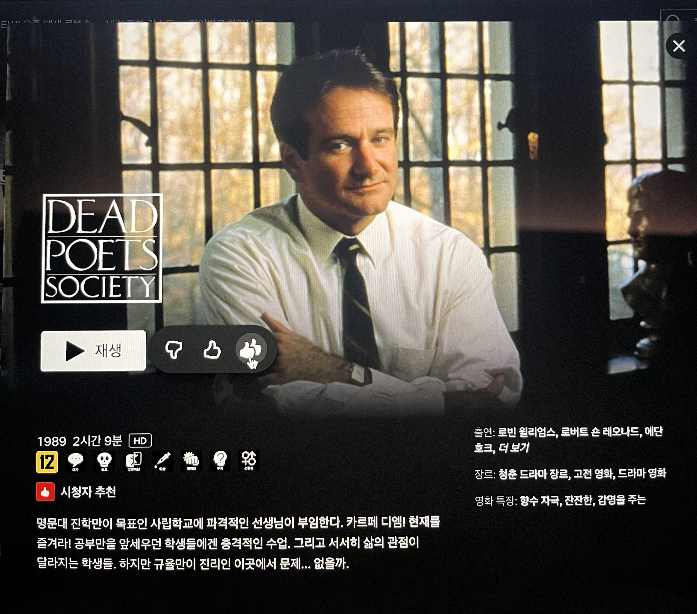

> 오 캡틴 마이 캡틴

우연히 넷플릭스 추천으로 만난 이 영화는 2따봉이 아쉬울 정도로 좋았던 영화이다. 아카데미 극본상을 수상한 영화이긴 한데 이번을 계기로 넷플릭스 추천 로직을 신뢰하게 됐다.

아이비리그를 가장 많이 배출하는 명문 고등학교에서 벌어지는 이야기다. 배경만 1950년대 미국이지 현 대한민국과 크게 다르지 않다. 사실 한국 배경의 영화라고 해도 무방할 정도로 동일하다.

> 작가의 의도만 중요하게 생각하지마. 네 생각이 무엇인지 찾아

이 영화가 나에게 유독 의미있던 이유는 내가 가지고 있는 교육에 대한 ==사명== 때문일 것이다.

새로운 선생님이 부임하면서 이야기를 시작한다. 로빈 윌리엄스 배우가 연기했다. 이름은 키팅. 국어를 가르친다. 그런데 원래 있던 선생님들과는 뭔가 다른 수업을 한다.

첫 수업 땐 교실을 벗어나 자신을 소개하며 캡틴이라 불러도 좋다고 이야기한다. 두번째 수업 땐 교과서를 펴고 우리가 흔히 아는 일반적인 수업을 진행하는가 싶더니 시 소개 부분을 찢으라고 한다. 부정하는 것을 넘어선 행동임은 명확하다.

> 언어와 생각은 세상을 바꾼다.

시를 공부하는 것이 아니라 사유하는 것, 생각하는 방법을 가르친다. 시를 분석해 리포트를 쓰는게 아니라 자작시를 써오는 과제를 내는가 하면 교실 밖으로 나가 각자의 걸음으로 걷는 방법을 알려준다. 내성적인 성격을 가진 학생에게 시를 끄집어 내는 장면은 전율을 일으킨다.

>아는 것 같아도 다른 방법으로 볼 필요가 있어. 웃기고 이상해 보여도 시도해봐야 해.

경험이 쌓이면서 가장 경계하고 있는 것은 “해봤는데”라는 태도다.

뇌는 경제적으로 동작한다. 아는 것을 기반으로 의사결정 내린다. 효율적으로 동작하기 때문에 편견, 선입견이 생긴다. 저장된 경험은 나를 구성하지만 새로운 시도를 방해하고 회의적인 태도를 갖게 한다.

키팅은 교단 위로 올라간다. 자신의 책상도 아니고 선생님의 영역이라고 생각되었던 위치에서 교단 위로 올라오라고 한다. 머뭇거리던 학생들은 하나둘 생각해보지 못했던 행동을 한다.

> 오 캡틴 마이 캡틴

닐의 죽음. 스스로 목숨을 끊는 사건으로 인해 키팅이 희생양이 되었다. 결국 학교에서 물러나게 되었지만 그의 교육 철학은 교실에 남았다. 책상위에 올라가 캡틴이라 부르며 교실을 떠나는 키팅을 기리는 모습이 이를 보여준다.

키팅도 이 고등학교를 졸업했는데, 졸업 후 어떤 일이 그를 이렇게 만들었는지 궁금해진다.

제대로 된 교육이 사회의 많은 문제를 근본적으로 해결한다고 믿는다. 하고 싶은 일을 찾고 그 일을 통해 행복해질 수 있지 않을까. 알이즈웰 영화가 다시 보고 싶어졌다.
