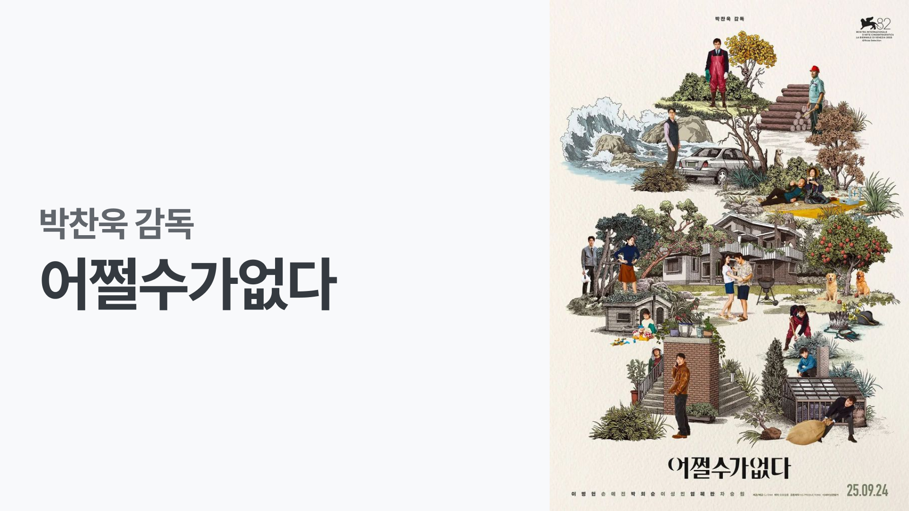

생각할 여유가 있는 영화를 좋아한다. 내 해석이 들어갈 여지가 있는 영화. 애매모호한 결말을 좋아하는 것 같기도 한데, '어쩔수가없다' 영화도 크레딧이 올라갈 때 여러 가지 생각을 하게 만들었다. 영화 제목처럼 과연 어쩔 수가 없는 것일까?

## 1. 영화에 대한 해석을 보기 전,
들었던 이런 저런 단편적인 생각들.

### 제목
'어쩔 수가 없다'는 것은 더이상 뭘 하고자 하는 의지가 사라진 (또는 내려놓은), '해볼 것은 다 해봤으니 받아들여야 해'라는 상황을 표현하기 위해 존재한다.

'어쩔 수가 없다'라는 표현에 긍정적인 면과 부정적인 면이 동시에 있다고 생각한다. 정말 어쩔 수가 없는 경우가 있다. 이런 경우엔 하려는 시도가 희망 고문이 될 수 있고 발버둥 치는게 꼴이다. 한편으로는 현실적으로 모든 것을 다 고려하기엔 어렵기 때문에 '이쯤하면 됐지.' 하며 체념하는 모습도 담고 있다. 인간은 자신이 하게 되는 어리석은 행동을 합리화 하곤 한다. 자신이 내린 결정이 옳기를 바라며, 어쩔 수 없었다며 결론짓는 것이다.

이 영화는 '어쩔 수가 없다'라는 것을 꽤나 부정적으로 표현하고 있다고 생각했다. 해고 노동자들이 자신들의 영광을 잊지 못한채 어리석은 결정(살인, 알코올 중독 등)을 내리는 모습을 보여준다. 그리고 그들은 어쩔 수 없어. 난 그렇게 살아야. 이런 운명이야. 라는 말을 반복한다.

영화를 관통하여 계속해서 되새김질 할 수 있는 제목이 좋은 영화 제목이라고 생각한다. 등장인물들의 의사결정들이 과연 어쩔 수 없는 것인가? 질문하게 만들었다.

### 메세지
하고 싶은 메세지가 노동과 관련된 것이라는 것은 줄거리만 봐도 알 수 있다. 굳이 'AI'를 붙이지 않아도 된다. 역사적으로 꾸준히 있었던 일을 소재로 한다. 러다이트 운동, 각종 자동화로 인한 대량 해고. 사회에는 직업이 사라지고 새로운 직업이 등장했다. 점점 더 노동자를 소외시키는 방향으로 발전했다. 사전 인터뷰에서 어느 시대의 사람이나 공감할 수 있는 이야기라는 이야기를 박찬욱 감독이 했는데, 바로 이해했다.

고용과 해고 문제는 노사간의 문제인데, 노동자끼리 갈등을 겪는다. 고용주는 제대로 다루지 않는다. 스크린에 나오는 시간은 아주 잠깐이며 그 마저도 햇빛을 통해 잘 보여주지 않는다. 가해자를 조명하지 않고 피해자끼리의 갈등을 강조함으로써 하고 싶은 이야기가 있는 것이 아닐까.

### 농담
적나라한 현실을 너무 어둡지 않게 유머를 섞어 표현했다. 영화를 보면서 현실 웃음이 터져나오긴 오랜만이었다. 그 정도로 영화에 등장하는 '농담'은 재밌었다. 무대인사에서 박희순 배우가 웃어야 할지 말아야 할지 모르겠다면 그냥 웃으라고 말했는데, 이게 어떤 의미인지 알았다. 박찬욱 감독님도 사전 인터뷰에서 자신의 영화 중에서 가장 웃긴 영화라고 말했는데, 개인적으로 보통의 코미디 영화보다 훨씬 더 웃을 수 있는 영화였다.

하려고 하는 얘기가 너무 무거워서 가끔 어떤 조치를 하면 좋겠다는 생각을 한다. 분위기를 좋게 만들고 재미 요소를 고려하다 보면 농담을 섞게 된다. 같은 메세지라도 누가 하느냐, 어떻게 하느냐에 따라 그 전달력이 달라진다. 우화가 존재하는 이유 그렇다. 직설적인 표현보다 돌아가는 이야기가 더 널리 퍼질 수 있는 것처럼 농담은 그만큼 강력하다.

## 2. 해석을 보고 나서,
궁금했던 부분이 많이 해소됐다. 마치 연극을 보는 듯한 연출과 눈을 자극하는 강렬한 색감 때문에 인상이 깊어 당분간 재관람은 없을 것이라 생각했는데 기회가 된다면 한번 더 볼 수 있지 않을까 생각이 들었다. 2회차 땐 편집과 카메라 구도에 집중하면서 보고 싶다.

### 과거, 현재 그리고 미래
범모랑 만수가 좀 비슷하다. 정도로 생각을 하긴 했는데, 범모가 만수의 과거를 대변하는 역할이라는 구성이 마음에 들었다. 펄프상을 수상할 정도의 전문가이면서 알코올 중독의 과거부터 하나 하나 살펴보면 과거 그 자체이다. 범모에겐 자녀가 없는데 과거이기 때문이라는 해석도 있다. 범모를 죽이기 위해 꾸준히 관찰하게 되는데, 결국 이해하게 되는 모습에서 '헤어질 결심'이라는 영화가 떠올랐다.

시조는 현재를 대변한다. 구두 가게에서 판촉 활동을 하며 재취업을 도전하는 시조의 모습은 마트에서 일하며 면접을 보러 다니는 만수와 닮았다. 딸이 있는 것도 같다. 딸의 나이로 봤을 때 시조는 만수의 현재이자 가까운 미래를 암시한다. 약간의 망설임이 있었지만 범모를 죽이려 할 때보다 체계적으로 진행했으며 결국 성공까지 하게 된다. 난 내가 원하는 자리로 가겠다는 의지를 보여주는 것 같기도 하다.

선출은 문 제지라는 회사에서 일하고 있다. 만수가 차지하고 싶은 그 역할이다. 앞선 두명은 잠재적 경재자였다면 선출은 직접적인 이해관계자라는 부분이 약간 다르다. 조금 더 만수의 삶에 영향을 줄 것이다. 선출의 삶이 만수가 동경하는 삶이며 미래를 암시한다는 것을 통해 영화 이후에 펼쳐질 만수 삶을 어느 정도 엿볼 수 있다. 선출은 직장을 떠나선 아내와 이혼하고 혼자 살고 있다. 주위에는 아무도 남지 않았다. 선출에게 어떤 과거가 있는지는 모르겠지만 겉으로는 화려하지만 외로운 삶을 살고 있다. 만수는 결국 혼자 남게 되지 않을까? 만수가 가족을 지키기 위해 했던 행동들이 가족을 파괴하는 결말을 가져오지 않을까. 만수 또한 다른 누군가 또는 기계로 대체되지 않을까?

### 영상통화
만수와 미리는 왜 영상 통화를 할까? 영상 통화는 꽤나 자신의 상황을 많이 노출시키는 의사소통 수단이다. 비용이 많이 들어가는 수단이기 때문에 난 거의 사용하지 않는다. 그러나 둘은 통화를 할 일이 있으면 거의 영상 통화를 한다. 영화를 보면서 들었던 의문이다. 뜬금없는 의문이지만 이런 설정을 한 데에는 이유가 있지 않을까 싶었고, 그 답을 해석 영상에서 찾았다.

미리는 오진호 치과의사와 불륜 관계일까? 범모의 부인인 아라의 불륜은 대놓고 드러낸 반면에 미리의 불륜은 애매하게 그려냈다. 관객에 따라 해석할 여지를 남겨둔 것이다. 미리의 이혼한 과거나 불륜과 관련된 그 어떤 내용도 영화에서 드러나지 않았다. 그러나 범모가 만수의 과거를 표현했다는 점으로 봤을 때 미리는 오진호가 아니었어도 과거에 불륜을 했던 행적이 있을 것이다. 만수와 미리는 이런 과거가 있기 때문에 서로의 신뢰를 중요시 하고 서로 항상 영상 통화를 하자는 규칙이 만들어지지 않았을까?

### 노동
액스 (The Ax)라는 소설이 원작이라고 한다. 도끼. 해고에 대한 미국식 표현이다. 도끼는 보통 나무를 팰 때 사용하는 도구로 인식된다. 벌목, 제지 회사라는 배경도 이런 과정에서 탄생하지 않았을까?

'사람은 넷, 자리는 하나'라는 문장은 영화 줄거리를 관통한다. 문제를 잘 들여다보면 해결 방법은 여러 가지가 있을 수 있는데, 보통 자리를 늘리는 것 대신 사람을 줄이는 방향으로 진행된다. 영화도 마찬가지이며 그 과정을 유쾌하게 그려낸다.

만수는 문 제지라는 회사엔 지원도 하지 않은 2명을 경쟁자라고 판단하고 어리석은 행동을 저지른다. 정작 본인은 자신의 가족을 지키기 위해선 어쩔 수 없다며 잘못됐다고 생각하지 않는다. 첫 살인은 어설펐으며 실패했다. 대상이 결국 죽긴 했지만 직접 죽이지 못했다. 살인하는 과정에서 대상자와의 어느 정도 교감이 있었다. 두번째 살인은 이전의 살인보다 계획적으로 진행됐으며 직접적으로 결과를 만들었다. 세번째 살인은 그 방법이 더욱 치밀해졌으며 잔인해졌다. 점점 더 체계적이고 쉽게 진행되는 해고의 현실을 반영한게 아닐까.

## 마무리
나의 삶은 노동자의 삶과 꽤나 가까이 있었다. 나 또한 노동자이고 아버지 또한 노동자의 삶을 길게 유지해오고 계시기 때문이다. 대부분의 사람이 노동자였거나 노동자이기 때문에 꽤 많은 사람들이 공감할 수 있는 이야기라고 생각했다. 영화를 보기 전 혹평을 꽤 많이 보고 들었는데 왜 그들은 이 이야기에 공감하지 못했을까 궁금하기도 했다. 대부분의 비평은 시나리오의 개연성이었다. 만수의 행동을 관객들이 납득하기 어려웠던 것이다. 근데 이게 영화적 허용(?)이란게 있어야 하는게 아닐까 싶다.

한편으론 '박찬욱 감독이니까 별로라고 말 못하는거지?' 와 같은 반발심도 있는 것 같다. 그만큼 훌륭한 감독인 것은 맞지만 '아는 척'을 경계하는 '솔직함'의 부상으로 인한 현상같다. 훌륭한 감독의 영화는 별로였으면 괜히 내가 잘 이해하지 못한거야. 라는 생각을 버리는 것 같다. 난 오히려 거장의 영화를 좋지 않다고 하면 더 있어보이는 것도 한몫 한다고 생각한다.

그런 의미에서 이 영화가 그토록 현학적이며 예술적이고 어려운 영화인가 하면 또 그렇지 않다. 여러 개연성을 감안하면 정말 웃긴 영화이고 짜임새 있는 영화라고 생각한다. 대충 보면 추석을 타겟한 삼류 코미디 영화라고 볼 수도 있다. 영화의 완성도보다 초반의 분위기가 영화의 흥행 성과를 좌지우지 하곤 하던데, 분위기가 이상하게 휩쓸리는 것 같아 안타깝다. 이번 영화는 홍보도 엄청 많이 하던데, 박찬욱 감독님도 이 영화를 통해 천만을 달성했으면 하는 작은 바람이 있다.
