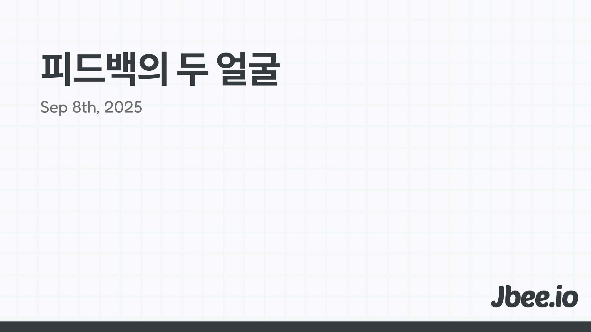

피드백을 참 못하는 구성원이자 리더였다. 지금도 노력하고 있다. 그렇기에 피드백에 대한 책도 읽고 따로 공부도 하며 피드백에 대한 피드백을 받곤 했다. 피드백을 잘한다고 생각하는 사람에게 도움을 요청하기도 했다. 그러면서 피드백 프레임워크를 만들었고 피드백 하는 사람(Giver)의 입장에서 신경써야 하는 부분과 피드백을 통해 개선될 수 있는 상황에 대한 기준이 정리됐다.

## 피드백
피드백이라고 하면 유독 아쉬운 부분을 개선하고자 하는 행위로만 인식된다. 누군가의 행동을 개선하기 위한 것이라고 생각하는 것이다. 물론 이것만 피드백인 것은 아니지만 보통 피드백이란 단어는 이 의도로 사용한다.
### 피드백의 다른 면
피드백의 일반적인 부분을 살펴보기 전에 다른 면을 먼저 살펴보려고 한다. 어쩌면 피드백은 약점을 부각시킬 수 있다. 대적자 역할을 거뜬히 수행해내는 [레콘도 물을 무서워한다.](https://namu.wiki/w/%EB%A0%88%EC%BD%98#s-3.1) 누구에게나 강점과 약점이 있는 것인데 강점보다 우선 약점에 초점을 맞추는 면이 있다.

몇몇 사람은 피드백을 받으면 반사적으로 방어적인 태도를 취한다. 자신의 약점을 이야기 하기 때문이다. 이 과정에서 피드백이 잘못 전달되면 당사자는 약점에만 신경쓰게 되며 갖고 있던 강점마저 약해진다. 약점을 개선하고자 했던 피드백이 강점을 약화시키는 것이다.

궁극적으로 잘못된 피드백은 조직 전반의 생산성을 떨어뜨린다. 이런 관점에서 강점을 강화하는 것도 피드백 일 수 있다.

## 강화 피드백
약점을 개선하는 피드백을 주고 받기 전에 ==강점==을 인정해주는 것 또한 중요한 피드백이라고 생각한다.

이전 팀에서 '칭찬합니다' 문화를 만들어보려고 했다. 이름은 계속 바뀌었다. 칭찬이라는 단어가 상급자가 하급자를 칭찬하는 것 같아서 '감자합니다.'로 바꿨다. 칭찬대신 감사를 표현하는 것이다. 감사를 감자로 바꿔 감자튀김 이모지를 가진 워크플로우였다. 이를 조금 더 확장해서 구성원 간에 존중을 표하면 좋겠다는 생각을 했고 '샤라웃(Shout out to someone)' 문화를 구성하려고 했다.

우린 서로를 인정하는 것에 있어서 꽤 인색하다. 사소한 일이라도 개인의 시간과 노력이 들어가 있기 때문에 가까운 사람이 이를 인정하고 존중하고 널리 알리는 것은 중요하다.

## 올바른 피드백
사람은 고쳐 쓰는게 아니라는 말이다. 이 말은 반은 맞고 반은 틀린데, 사람은 스스로 변할 수 있는 존재이다. 단, 남이 바꿀 수 없다는 의미에서 동의한다.

피드백으로 개선했다. 피드백을 받아 성장했다. 피드백과 관련된 좋은 말들이 많다. 적절한 '상황'에서 '올바르게' 전달한 피드백은 긍정적인 변화를 만들고 좋은 결과를 만들어낸다. 그러나 좋은 결과를 만들어 내려면 여러 ==선제== 조건이 필요하기 때문에 피드백이 어렵다.

상황, 타이밍, 관계. 조직의 문화와 피드백을 받는 사람의 개인적인 상태, 그리고 피드백을 주고 받는 두 사람의 관계까지가 준비됐을 때, 올바른 피드백을 주고 받을 수 있다. '올바른'이란 표현이 애매하지만 이는 전적으로 피드백을 주는 사람(Giver)의 ==관찰== 역량에 달렸다.

### 관찰
우선 주변 동료들의 강점과 약점을 명확히 이해해야 한다. 당연히 쉽지 않다. 충분히 관찰하고 대화를 나눠야 한다. 관찰한 내용에는 주관적인 가치 판단이 들어가면 안 된다. ==사실==을 기반으로 해야 하며 내가 관찰한 이 사실이 피드백을 받는 당사자도 동일하게 인지하는지 합을 맞춰가는 과정이 필요하다. 동일 선상에서 피드백을 주고 받아야 오해가 없고 올바른 피드백을 할 수 있다.

### 상황
상황을 분위기, ==문화==라는 단어로 치환을 해도 좋겠다. 피드백을 주고 받는 것이 자연스러운 문화는 피드백이 잘 동작하기 위한 최소한의 조건이다. 최소 조건이지만 어렵다. 가면을 쓰고 있는게 기본인 세상에서 서로가 솔직하게 표현한다는 것은 어려운 일이다. 좋은 영화를 보고도 평론가가 별로라고 하면 괜히 별로인 것처럼 느껴지곤 한다.

리더가 피드백을 받고 이를 통해 변하는 모습을 보여주고 조직에서 추구하는 가치가 제대로 정립되고 퍼져야 한다. 문화는 하루 아침에 만들어지지 않는다.

### 타이밍
피드백을 받는 사람도 심리적으로 ==안정==된 상태여야 한다. 현생에 치이고 일에서 의미를 찾기 힘들 때 피드백을 받으면 누구나 방어적인 태도를 취하게 되고 그 피드백은 아무리 옳은 피드백이라 할지라도 제대로 동작하기 힘들다. 적절한 시점을 기다리는 것도 피드백을 하는 과정의 일부이다.

### 관계
피드백을 주고 받는 두 사람의 관계에 있어서도 라포가 필요하다. 잘 알지도 못하는 사람이 나의 약점을 콕 짚어 이야기 한다고 했을 때, 감사한 마음을 갖고 개선하려고 하는 사람이 몇이나 될까?

관계를 만들어가는데에는 ==시간==이 필요하다. 만나자마자 속 얘기를 하면서 잘 지낼 수 있는 사람은 거의 없을 것이다. 서로를 알아가고 신뢰를 형성하려면 적당한 시간이 필요하다.

## 수용성
피드백을 받는 사람의 입장은 어떨까?

### 먼저 요청하기
피드백을 받는 사람이 먼저 요청하는 것이 가장 쉽고 피드백이 효율적으로 동작한다. 더 나아가 받는 사람이 피드백 받고 싶은 부분을 명확히 하면 효과는 배가 된다.

### 구체적이고 객관적인 지표
잘 관찰하고 좋은 타이밍이라고 생각하는 시점에 가까운 동료로서 진심을 담아 피드백을 했는데, 달라지지 않을 수 있다. 이런 방어적인 태도, 비수용적 태도는 무엇으로부터 기인하는가?

같은 단어도 사람마다 다르게 인식한다. 하물며 추상적인 문장은 너도 나도 다르게 해석한다. 구체적인 상황에 대해서 객관적인 지표로 커뮤니케이션 해야 한다. 해석을 같게 하려면 뜬구름 잡는 이야기 보다는 좀 더 낮은 문장으로 평가 항목을 만들고 그 평가 항목을 좋게 받으려면 어떻게 해야 하는지 동일하게 그려져야 한다.

## 리더의 피드백
조금 더 발화자에 집중을 해보면 리더의 피드백이 있을 수 있다. 물론 피드백은 리더만 할 수 있는 것은 아니지만 상대적으로 경험이 많고 이미 조직에서 신뢰받고 있는 리더가 주로 하게 된다.

리더는 ==연민==의 감정을 갖고 구성원들을 대해야 한다. 상대방의 상황을 이해하고 그에 맞는 피드백을 전달해야 한다. 기본적으로 구성원의 강점을 강화하는데 중점을 둔다. 개선 사항에 대한 피드백은 그 다음이다.

### 모범
간접적으로 피드백을 주는 것도 방법이 될 수 있다. 핵심은 스스로 약점을 깨닫고 개선하게 끔 하는 것이다. 사람은 다른 사람에 의해 쉽게 교정되지 않는다. 고쳐져야 하는 부분은 어떻게 하는 것이 좋은 것인지 직접 보여주면서 스스로 되돌아보게 유도하는 것이다.

이것의 전제는 팀원들이 스스로 되돌아보며 회고할 수 있는 사람이어야 한다. 또한 관찰력이 뛰어나서 주변 사람들로부터 배워야 할 것과 반면교사 삼을 수 있는 사람이어야 한다. 고정 마인드셋이 아니라 성장 마인드셋을 갖고 있어서 회고와 관찰이 습관이 된 사람이어야 한다. 좋은 환경에 있는 것만으로 성장하는데 이런 이유 때문이며 이런 사람들은 보통 메타인지가 높다.

## 피드백 프레임워크, AAAAA
실제로 피드백에 사용하고 끊임없이 개선하고 있는 피드백 프레임워크를 간단히 소개하며 글을 마무리 하려고 한다.

### Awareness
> 알아차림. 외부로부터의 자극을 알아차린다.

- Feelings: 이 느낌, 감정 뭐지? 무언가 잘못됐다를 감정을 통해 알아차림.
- Facts: 어떤 상황이지? 판단이 아닌 사실 중심의 나열.
- Needs: 내 안에 있는 어떤 욕구가 이 상황에 반하는가? 나는 무엇을 원하는가? 정리

### Action
> 그래서 무엇을 해야 하는가?

- 상대방이 해야 하는 구체적인 행동 고민하기
- 내가 취해야 하는 행동 고민하기

### Arrange
> 정렬

- {Fact}는 이런데, 나는 {Needs}을 중요하게 생각해서 {Feeling}를 느꼈다.
    - Fact에서 개인적인 판단, 분석, 비판, 비교는 없었는지 살펴본다.
    - 근본적인 Needs인지 생각해본다.
    - Feeling이 충분히 구체적인지 되돌아보고 더 풍부한 표현이 없을지 고민해본다.
- {Action}를 해줬으면 좋겠는데, 그래줄 수 있니?
    - 대상에게 요구하는 Action이 충분히 구체적인지 바로 실행에 옮길 수 있는 것인지 살펴본다.
    - 거절했을 때 이를 받아들일 수 있는 행동인지 생각한다.

### Ask / Achieve
> 즉시 요청하거나 적당한 타이밍을 위해 기록해두거나

- 대상이 나 자신이면 고민없이 즉시 전달한다
- 되도록 피드백 내용을 즉시 전달한다.
    - 이 때 요청(Ask) 형식으로 전달한다.
- 한번 더 회고가 필요하다고 판단되면 기록해 둔다.
